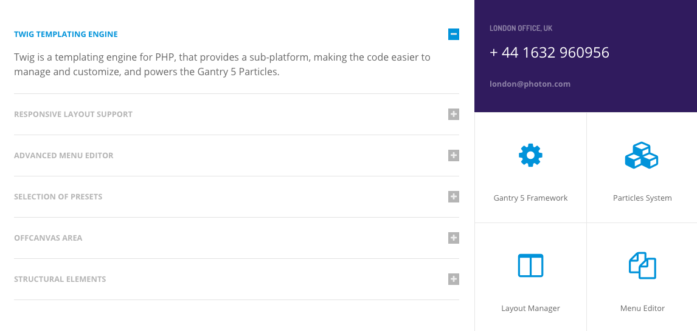
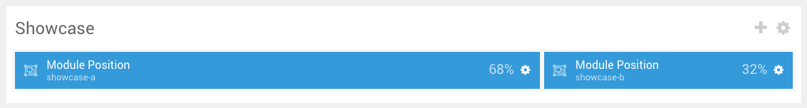
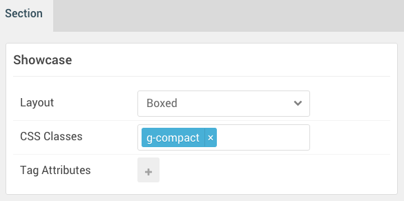

## Introduction

:   1. **Accordion** [8%, 5%, se]
    2. **Custom HTML** [8%, 70%, se]
    3. **Grid Content** [40%, 70%, se]

The **Showcase** section includes three particles: **Accordion**, **Custom HTML**, and **Grid Content**. The **Accordion** particle is assigned to the **showcase-a** module position, while the **Custom HTML** and **Grid Content** particles are assigned to the **showcase-b** module position.

Here is a breakdown of the module(s) and particle(s) that appear in this section:

* [Accordion (particle)](#accordion-(particle))
* [Custom HTML (particle)](#custom-html-(particle))
* [Grid Content (Particle)](#grid-content-(particle))

## Section Settings

| Option           | Setting     |
| :--------------- | :---------- |
| Layout           | Boxed       |
| CSS Classes      | `g-compact` |
| Tag Attributes   | Blank       |

## Accordion (Particle)

The **Accordion** particle is a **Gantry 5 Particle** module placed within the **showcase-a** module position. Adding a particle to a module position can be done by creating a **Gantry 5 Particle** module, adding the particle using the settings found in the section below, and assigning it to the position.

### Module Position Particle Settings

#### Particle Settings

| Option        | Setting         |
| :-----        | :-----          |
| Particle Name | `FP Showcase A` |
| Key           | `showcase-a`    |
| Chrome        | `gantry`        |

#### Block Settings

| Option         | Setting   |
| :-----         | :-----    |
| CSS ID         | Blank     |
| CSS Classes    | Blank     |
| Variations     | Blank     |
| Tag Attributes | Blank     |
| Fixed Size     | Unchecked |
| Block Size     | `68%`     |

### Accordion Particle Settings

#### Particle Settings

| Option                | Setting                                                                                                                                                 |
| :-----                | :-----                                                                                                                                                  |
| Particle Name         | `Accordion`                                                                                                                                             |
| CSS Classes           | Blank                                                                                                                                                   |
| Title                 | Blank                                                                                                                                                   |
| Item 1 Name           | `Twig Templating Engine`                                                                                                                                |
| Item 1 Description    | `Twig is a templating engine for PHP, that provides a sub-platform, making the code easier to manage and customize, and powers the Gantry 5 Particles.` |
| Item 1 Button Label   | Blank                                                                                                                                                   |
| Item 1 Button Link    | Blank                                                                                                                                                   |
| Item 1 Target         | Self                                                                                                                                                    |
| Item 1 Button Classes | Blank                                                                                                                                                   |

## Custom HTML (Particle)

The **Custom HTML** particle is a **Gantry 5 Particle** module placed within the **showcase-a** module position. Adding a particle to a module position can be done by creating a **Gantry 5 Particle** module, adding the particle using the settings found in the section below, and assigning it to the position.

### Module Position Particle Settings

#### Particle Settings

| Option        | Setting         |
| :-----        | :-----          |
| Particle Name | `FP Showcase B` |
| Key           | `showcase-b`    |
| Chrome        | `gantry`        |

#### Block Settings

| Option         | Setting               |
| :-----         | :-----                |
| CSS ID         | Blank                 |
| CSS Classes    | Blank                 |
| Variations     | No Margin, No Padding |
| Tag Attributes | Blank                 |
| Fixed Size     | Unchecked             |
| Block Size     | `32%`                 |

### Custom HTML Particle Settings

#### Particle Settings

| Option             | Setting       |
| :-----             | :-----        |
| Particle Name      | `Custom HTML` |
| Process Twig       | Unchecked     |
| Process Shortcodes | Unchecked     |

**Custom HTML**

~~~ .html
<h4>London Office, UK </h4>

+ 44 1632 960956

<a href="mailto:london@photon.com" class="email">london@photon.com</a>

~~~

## Grid Content (Particle)

The **Grid Content** particle is a **Gantry 5 Particle** module placed within the **showcase-b** module position. Adding a particle to a module position can be done by creating a **Gantry 5 Particle** module, adding the particle using the settings found in the section below, and assigning it to the position.

### Module Position Particle Settings

#### Particle Settings

| Option        | Setting         |
| :-----        | :-----          |
| Particle Name | `FP Showcase B` |
| Key           | `showcase-b`    |
| Chrome        | `gantry`        |

#### Block Settings

| Option         | Setting               |
| :-----         | :-----                |
| CSS ID         | Blank                 |
| CSS Classes    | Blank                 |
| Variations     | No Margin, No Padding |
| Tag Attributes | Blank                 |
| Fixed Size     | Unchecked             |
| Block Size     | `32%`                 |

### Grid Content Particle Settings

#### Particle Settings

| Option             | Setting              |
| :-----             | :-----               |
| Particle Name      | `Grid Content`       |
| CSS Classes        | Blank                |
| Title              | Custom               |
| Description        | Blank                |
| Readmore Text      | Blank                |
| Readmore Link      |                      |
| Readmore Style     | Style 3              |
| Grid Column        | 2 Columns            |
| Item 1 Name        | `Gantry 5 Framework` |
| Item 1 Icon        | `fa fa-cog`          |
| Item 1 Icon Color  | Accent Color 1       |
| Item 1 Description | Blank                |
| Item 1 Link        | Blank                |
