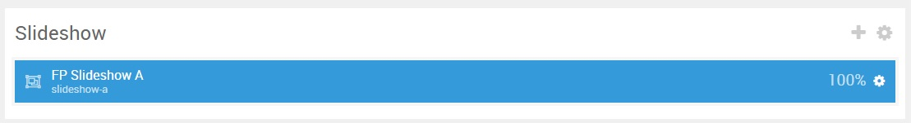
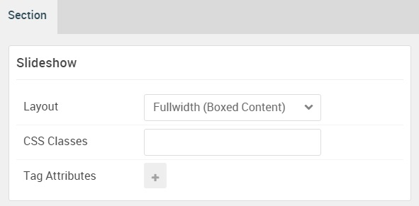

## Introduction

The **Slideshow** section includes one **News Slider** particle. This particle is placed within the **Slideshow A** module position.

Here is a breakdown of the module(s) and particle(s) that appear in this section:

* [News Slider (particle)](#news-slider-(particle))

## Section Settings

| Option           | Setting                     |
| :--------------- | :----------                 |
| Layout           | Fullwidth (Flushed Content) |
| CSS Classes      | Blank                       |
| Tag Attributes   | Blank                       |

## News Slider (Particle)

The **News Slider** particle is a **Gantry 5 Particle** module placed within the **slideshow-a** module position. Adding a particle to a module position can be done by creating a **Gantry 5 Particle** module, adding the particle using the settings found in the section below, and assigning it to the position.

### Module Position Particle Settings

#### Particle Settings

| Option        | Setting          |
| :-----        | :-----           |
| Particle Name | `FP Slideshow A` |
| Key           | `slideshow-a`    |
| Chrome        | `gantry`         |

#### Block Settings

| Option         | Setting                            |
| :-----         | :-----                             |
| CSS ID         | Blank                              |
| CSS Classes    | `nomarginbottom` `nopaddingbottom` |
| Variations     | Blank                              |
| Tag Attributes | Blank                              |
| Fixed Size     | Unchecked                          |
| Block Size     | `100%`                             |

### News Slider Particle Settings

#### Particle Settings

| Option              | Setting                                  |
| :-----              | :-----                                   |
| Particle Name       | `News Slider`                            |
| Autoplay            | Enable                                   |
| Autoplay Delay      | `5000`                                   |
| CSS Classes         | Blank                                    |
| Title               | Blank                                    |
| Item 1 Name         | `Corporate & Business Oriented Template` |
| Item 1 Description  | Blank                                    |
| Item 1 Button Label | `Read More`                              |
| Item 1 Button Link  | `#`                                      |
| Target              | Self                                     |
| Button Class        | `button-2`                               |