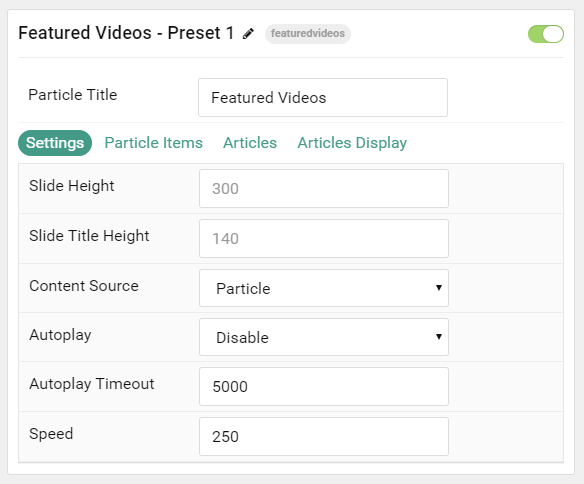
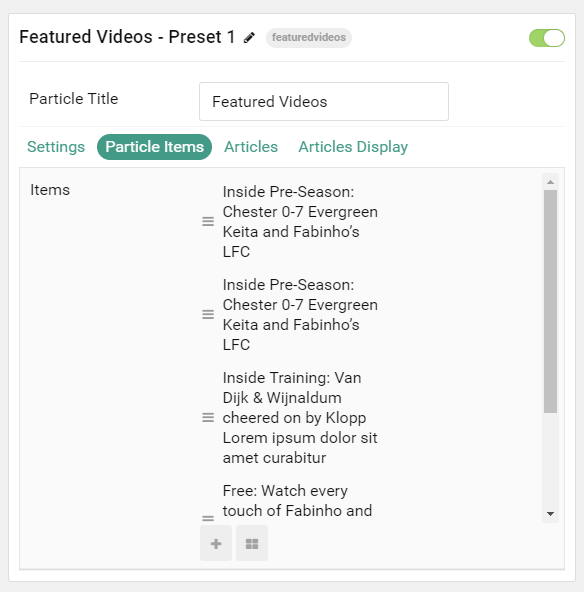
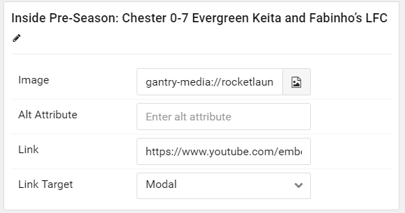

## Introduction

The **Featured Videos** particle makes your latest videos appear in a stylish slider.

Here are the topics covered in this guide:

* [Configuration](#configuration)
    - [Main Options](#settings)
    - [Item Options](#particle-item-options)
    - [Articles](#articles)
    - [Display](#display)

## Configuration

### Settings 

These options affect the main area of the particle, and not the individual items within. You can set the title of the particle, as well as give it an introductory paragraph here.

| Option             | Description                                                                                         |
| :-----             | :-----                                                                                              |
| Particle Name      | This is the name of the particle used for back end management. It does not appear on the front end. |
| Content Source     | Choose between **Particle** and **Joomla** as the Content Source.                                   |
| Slide Height       | Set the height (in pixels) for the slides.                                                          |
| Slide Title Height | Set the height (in pixels) for the slide's titles.                                                                                                    |
| Autoplay           | **Enable** or **Disable** autoplay for the particle.                                                |
| Autoplay Timeout   | Set the timeout (in milliseconds) for the autoplay.                                                 |
| Speed              | Set the transition speed (in milliseconds) for the particle.                                        |

### Particle Item Options

These items make up the individual featured items in the particle. Items in this section will only appear if **Particle** is selected as the **Content Source**.

| Option        | Description                                                                      |
| :-----        | :-----                                                                           |
| Item Name     | This is the name of the item. This appears as the item's title on the front end. |
| Image         | Set an image to appear as the video thumbnail.                                   |
| Alt Attribute | Set an alternative attribute for the item.                                       |
| Link          | Set a URL for the item to take visitors to (YouTube requires /embed/ url).       |
| Link Target   | Set the target for the URL to open in.                                           |

### Articles

| Option             | Description                                                                                                     |
| :-----             | :-----                                                                                                          |
| Categories         | Select the categories of articles this particle will display.                                                   |
| Articles           | Select the number of articles you would like the particle to fetch.                                             |
| Featured Articles  | Choose how Featured Articles should be filtered. Choose between **Include**, **Exclude**, or **Only Featured**. |
| Number of Articles | Enter the maximum number of articles to display.                                                                |
| Start From         | Enter offset specifying the first article to return. The default is '0' (the first article).                    |
| Order By           | Choose the type of factor to order by.                                                                          |
| Ordering Direction | Choose between **Ascending** and **Descending** as the article ordering method.                                 |

### Display

This section configures how articles are displayed.

| Option         | Description                                                     |
| :-----         | :-----                                                          |
| Particle Title | Set a title for the particle.                                   |
| Title          | **Show** or **Hide** the article's title.                       |
| Title Limit    | Enter the maximum number of characters in the title to display. |
| Title Link     | Set a URL for the title to link to.                             |
| Target         | Set a target window for the read more link.                     |
