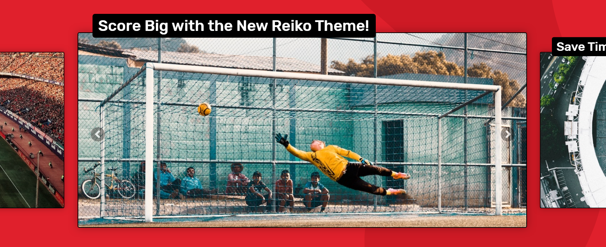
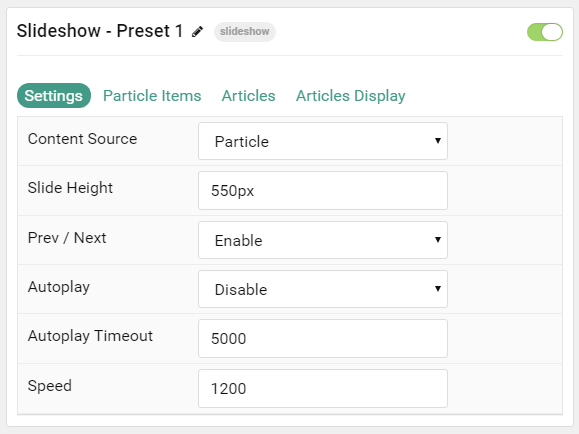
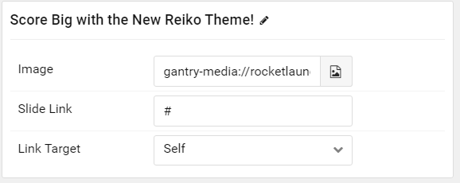
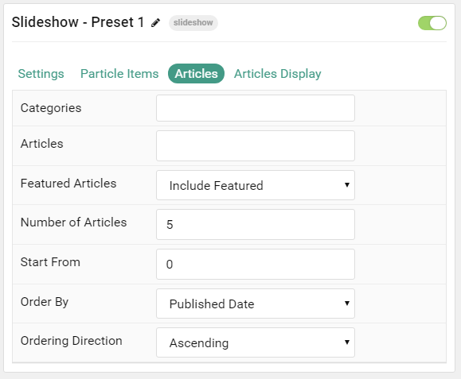
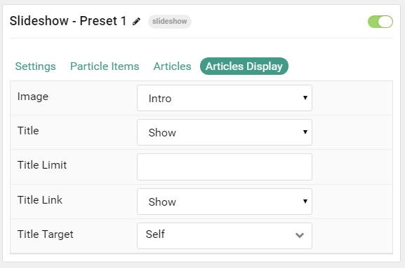

## Introduction

The **Slideshow** particle creates beautiful image slideshows that work perfectly at the top of your page.

Here are the topics covered in this guide:

* [Configuration](#configuration)
    - [Main Options](#settings)
    - [Item Options](#particle-item-options)
    - [Articles](#articles)
    - [Display](#display)

## Configuration

### Settings 

These options affect the main area of the particle, and not the individual items within. You can set the title of the particle, as well as give it an introductory paragraph here.

| Option           | Description                                                                                            |
| :-----           | :-----                                                                                                 |
| Particle Name    | This is the name of the particle used for back end management. It does not appear on the front end.    |
| Content Source   | Choose between **Particle** and **Joomla** as the content source for the particle.                     |
| Slide Height     | Set the height of each slide (in pixels)                                                               |
| Prev / Next      | Add prev/next navigation to the slideshow.                                                             |
| Autoplay         | **Enable** or **Disable** autoplay for hte particle.                                                   |
| Autoplay Timeout | Set the time (in milliseconds) between slides in autoplay mode.                                        |
| Speed            | Set the transition speed (in milliseconds).                                                            |

### Particle Item Options

These items make up the individual featured items in the particle. Items in this section will only appear if **Particle** is selected as the **Content Source**.

| Option        | Description                                                                            |
| :-----        | :-----                                                                                 |
| Item Name     | This is the name of the item. This becomes the headline for the item on the front end. |
| Image         | Set an image for the item. This is the main image.                                     |
| Slide Link    | Enter a link for the image to send users to.                                           |
| Link Target   | Enter a target window for the link.                                                    |

### Articles

| Option             | Description                                                                                                     |
| :-----             | :-----                                                                                                          |
| Categories         | Select the categories of articles this particle will display.                                                   |
| Articles           | Select the number of articles you would like the particle to fetch.                                             |
| Featured Articles  | Choose how Featured Articles should be filtered. Choose between **Include**, **Exclude**, or **Only Featured**. |
| Number of Articles | Enter the maximum number of articles to display.                                                                |
| Start From         | Enter offset specifying the first article to return. The default is '0' (the first article).                    |
| Order By           | Choose the type of factor to order by.                                                                          |
| Ordering Direction | Choose between **Ascending** and **Descending** as the article ordering method.                                 |

### Display

This section configures how articles are displayed.

| Option         | Description                                                        |
| :-----         | :-----                                                             |
| Title          | **Show** or **Hide** the article's title.                          |
| Title Limit    | Enter the maximum number of characters in the title to display.    |
| Title Link     | **Show** or **Hide** the Title link.                               |
| Title Target   | Choose whether to have the link open in a new tab or the same tab. |
| Button Classes | Enter any CSS class(es) you wish to have apply to the button.      |