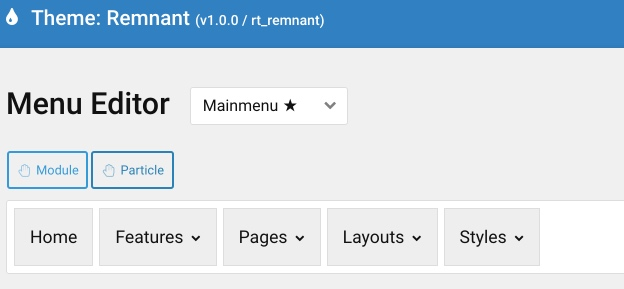

Introduction
-----

Recreating features of the demo site used to show off some of the more interesting aspects of Remnant can be done fairly easily. All you need is the right extensions and settings, and you should be able to reproduce most (if not all) of the elements found in our demo site.

Below, we will break down some of these elements and give you the information you need to know to recreate them on your own site using the Remnant Template.

Keep in mind that a lot of the detail that makes our demos look so good is the result of many hours of hard work by our team, and some of them will require a moderate level of experience working with the Joomla back end. We have added most of these elements into the template's core files in order to make them easily accessible without having to edit any code.

>> NOTE: We recommend downloading a copy of the RocketLauncher whenever you are attempting to replicate demo content. This allows easy referencing, whether on your site in a subdirectory, development server, or on a localhost. This will allow you to see all of our demo content in context, making it easier to replicate.

Module and Particle Settings
-----

Below, you will find the module placement and settings for the various module positions as they appear on the front page of our demo. Not all of these position assignments are unique to the front page.

:   1. **Navigation** Logo (Particle) [1%, 15%, se]
    2. **Navigation** Menu (Particle) [1%, 55%, se]
    3. **Slideshow** Custom HTML (Particle) [4%, 10%, se]
    4. **Header** Simple Content (Particle) [12%, 10%, se]
    5. **Header** Simple Content (Particle) [12%, 50%, se]
    6. **Header** Audio Player (Particle) [14%, 10% se]
    7. **Header** Event List (Particle) [14%, 50%, se]
    8. **Above** Simple Content (Particle) [25%, 10%, se]
    9. **Above** Video Grid (Particle) [26%, 10%, se]
    10. **Showcase** Simple Content (Particle) [34%, 30%, se]
    11. **Showcase** Image Grid (Particle) [38%, 1%, se]
    12. **Showcase** Image Grid (Particle) [38%, 50%, se]
    13. **Expanded** Custom HTML (Particle) [53%, 10%, se]
    14. **Expanded** Custom HTML (Particle) [53%, 55%, se]
    15. **Bottom** Simple Content (Particle) [67%, 30%, se]
    16. **Bottom** Mini Player (Particle) [71%, 15%, se]
    17. **Footer** Simple Content (Particle) [84%, 30%, se]
    18. **Footer** Owl Carousel (Particle) [88%, 10%, se]
    19. **Copyright** Simple Menu (Particle) [94%, 10%, se]
    20. **Copyright** Simple Menu (Particle) [94%, 25%, se]
    21. **Copyright** Simple Menu (Particle) [94%, 38%, se]
    22. **Copyright** Simple Menu (Particle) [94%, 50%, se]
    23. **Copyright** Simple Menu (Particle) [94%, 65%, se]
    24. **Copyright** Simple Menu (Particle) [94%, 79%, se]
    25. **Copyright** Branding (Particle) [99%, 10%, se]
    26. **Copyright** Social (Particle) [99%, 80%, se]

Not pictured here is an **Offcanvas** position which hosts the mobile menu. You can find out more about the Offcanvas position in the [Gantry 5 documentation](http://docs.gantry.org/gantry5/configure/layout-manager#offcanvas-section).

Particles
-----

Here is a list of particles that are available in Remnant, as well as links to documentation to help you get started:

* Template Particles
    * [Owl Carousel](particle_owl.md)
    * [Video Grid](particle_video.md)
    * [Audio Player](particle_audio.md)
    * [Mini Player](particle_mini.md)
    * [Event List](particle_event.md)
    * [Pricing Table](particle_pricing.md)
    * [Joomla Articles](particle_joomla.md)
    * [Block Content](particle_block.md)
    * [Info List](particle_info.md)
    * [Grid Statistic](particle_grid.md)
    * [Simple Content](particle_simple.md)
    * [Image Grid](particle_image.md)
    * [Simple Weather](particle_weather.md)
* Core Particles (Documented on [Gantry's Website](http://gantry.org)):
    * [Logo](http://docs.gantry.org/gantry5/particles/logo)
    * [Menu](http://docs.gantry.org/gantry5/particles/menu-control)
    * [To Top](http://docs.gantry.org/gantry5/particles/to-top)
    * [Social](http://docs.gantry.org/gantry5/particles/social)
    * [Module Positions](http://docs.gantry.org/gantry5/particles/position)
    * [Spacer](http://docs.gantry.org/gantry5/particles/spacer)
    * [Mobile Menu](http://docs.gantry.org/gantry5/particles/mobile-menu)
    * [Custom HTML](http://docs.gantry.org/gantry5/particles/custom-html)
    * [Module Instance](http://docs.gantry.org/gantry5/particles/module-instance)
    * [Page Content](http://docs.gantry.org/gantry5/particles/page-content)
    * [System Messages](http://docs.gantry.org/gantry5/particles/system-messages)

Recommended Extensions
-----

Here is a list of RocketTheme extensions used to create the demo version of Remnant:

* [Gantry 5 Theme Framework](http://gantry.org/)
* [RokBox](http://www.rockettheme.com/joomla/extensions/rokbox)
* [RokBooster](http://www.rockettheme.com/joomla/extensions/rokbooster)

Many of these extensions are included with the Remnant RocketLauncher, and can be downloaded and installed individually by going to the RocketTheme website.

Recreating the Front Page
-----

The front page of the Remnant demo sits apart from the rest of the page layouts in that it features the latest and greatest features of the template. It is because of this that several module and layout overrides were done. In this section, we will break down the settings you will need to recreate elements present in the front page of the Remnant demo.

Home Page Layout Presets
-----

In order to make it really easy to replicate the home page, we included two layout presets for the home page with the theme. The first, **Home - Particles** (included in the standalone package) includes all of the particle-based home page demo content so you can hit the ground running with a copy of our demo to work from loaded directly into the layout. If you downloaded the theme and not a RocketLauncher, this is the best option for you if you want a copy of the front page with minimal effort.

The other preset is called **Home - Positions** and this is used in our demo by default in the RocketLauncher. This option creates module positions which give you a little more flexibility to swap out demo particles with standard Joomla modules. Keep in mind that this Layout Preset will not fill in the **Gantry 5 Particle** modules, only the module positions we used in the layout for the demo. We've included this documentation to help you recreate specific elements if you opt to go with this layout preset on an existing site.

You can access the presets by selecting **Load** in the **Layout Manager**.

Menu Editor
-----

Remnant has its own built-in Menu Editor which takes full advantage of Joomla's menu system, taking your Joomla menus and enhancing them before passing them to visitors on the front end. Any changes made in the Menu Editor will only affect the way it appears to the visitor, and not the way Joomla sees or uses it.

You can access the Gantry Menu Editor by navigating to **Administrator > Components > Gantry 5 Themes > Remnant > Menu**. You can find out more about navigating and using the Gantry Menu Editor [in our documentation](http://docs.gantry.org/gantry5/configure/menu-editor).

Assignments
-----

Assignments are also managed in the Gantry Administrator. This administrative panel enables you to assign theme outlines to specific menu items, pages, and other areas of your site. By navigating to **Administrator > Components > Gantry 5 Themes > Remnant** and selecting an outline other than the **Base Outline**, you will be able to assign that outline by navigating to the **Assignments** panel. Simply switch any menu items to on (green) that you want to assign that outline to. In the case of the Home page, this would be your default Home page in your default (main) menu.
