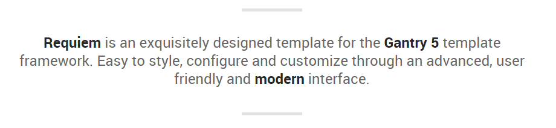
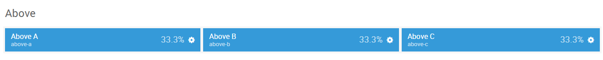
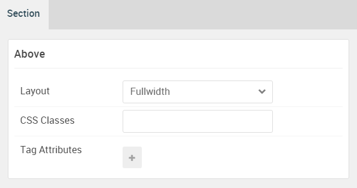
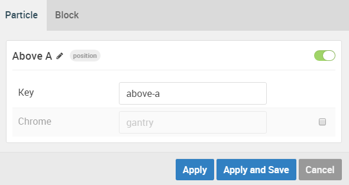
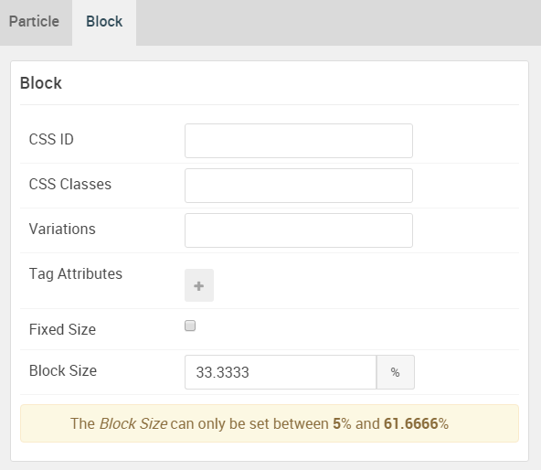
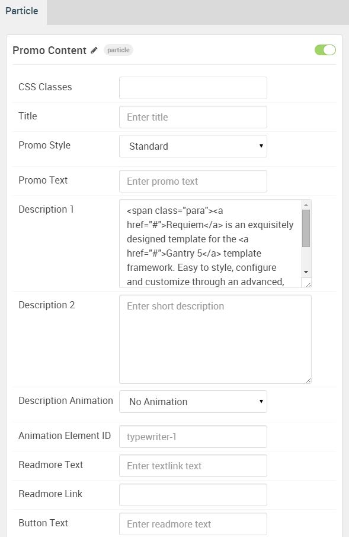
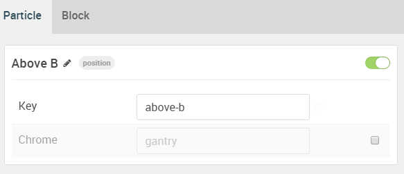
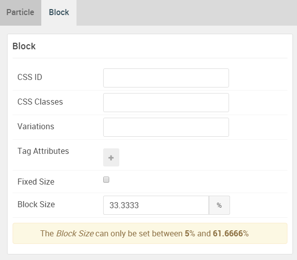
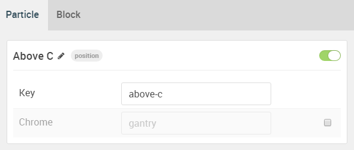
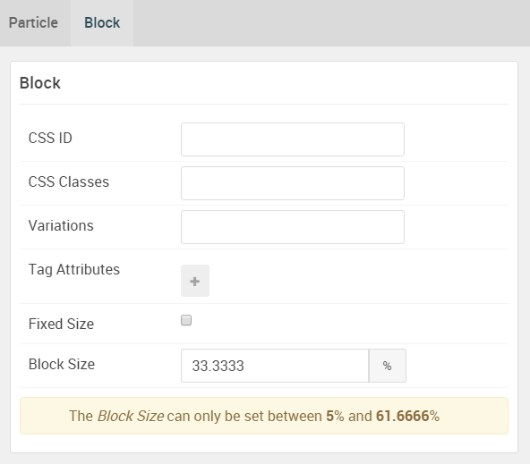

## Introduction

The **Above** section includes three module positions, `above-a`, `above-b`, and `above-c`. 

Here is a breakdown of the module(s) and particle(s) that appear in this section:

* [Above A (module position)](#above-a-(module-position))
    - [Promo Content (particle)](#gantry-5-particle-(promo-content))
* [Above B (module position)](#above-b-(module-position))
* [Above C (module position)](#above-c-(module-position))

## Section Settings

| Option         | Setting   |
| :-----         | :-----    |
| Layout         | Fullwidth |
| CSS Classes    | Blank     |
| Tag Attributes | Blank     |

## Above A (module position)

#### Particle Settings

| Option | Setting   |
| :----- | :-----    |
| Key    | `above-a` |
| Chrome | gantry    |

#### Block Settings

| Option         | Setting    |
| :-----         | :-----     |
| CSS ID         | Blank      |
| CSS Classes    | Blank      |
| Variations     | Blank      |
| Tag Attributes | Blank      |
| Block Size     | `33.3333%` |

### Assigned Module(s)

#### Gantry 5 Particle (Promo Content)

We added a **Promo Content** particle to the `above-a` position. This was done by creating a **Gantry 5 Particle** module and selecting the **Promo Content** particle in the module's settings. 

You will find the particle settings used in this particle below:

##### Particle Settings

| Option                | Setting                                                                                                                                                                                                                                                      |
| :-----                | :-----                                                                                                                                                                                                                                                       |
| CSS Classes           | Blank                                                                                                                                                                                                                                                        |
| Title                 | Blank                                                                                                                                                                                                                                                        |
| Promo Style           | Standard                                                                                                                                                                                                                                                     |
| Promo Text            | Blank                                                                                                                                                                                                                                                        |
| Description 1         | `<a href="#">Requiem</a> is an exquisitely designed template for the <a href="#">Gantry 5</a> template framework. Easy to style, configure and customize through an advanced, user friendly and <a href="#">modern</a> interface.` |
| Description 2         | Blank                                                                                                                                                                                                                                                        |
| Description Animation | No Animation                                                                                                                                                                                                                                                 |
| Animation Element ID  | `typewriter-1`                                                                                                                                                                                                                                               |
| Readmore Text         | Blank                                                                                                                                                                                                                                                        |
| Readmore Link         | Blank                                                                                                                                                                                                                                                        |
| Button Text           | Blank                                                                                                                                                                                                                                                        |
| Button Link           | Blank                                                                                                                                                                                                                                                        |
| Button Style          | Block                                                                                                                                                                                                                                                        |
| Tags                  | Blank                                                                                                                                                                                                                                                        |

## Above B (module position)

#### Particle Settings

| Option | Setting   |
| :----- | :-----    |
| Key    | `above-b` |
| Chrome | gantry    |

#### Block Settings

| Option         | Setting    |
| :-----         | :-----     |
| CSS ID         | Blank      |
| CSS Classes    | Blank      |
| Variations     | Blank      |
| Tag Attributes | Blank      |
| Block Size     | `33.3333%` |

## Above C (module position)

#### Particle Settings

| Option | Setting      |
| :----- | :-----       |
| Key    | `above-c` |
| Chrome | gantry       |

#### Block Settings

| Option         | Setting    |
| :-----         | :-----     |
| CSS ID         | Blank      |
| CSS Classes    | Blank      |
| Variations     | Blank      |
| Tag Attributes | Blank      |
| Block Size     | `33.3333%` |
