## Introduction

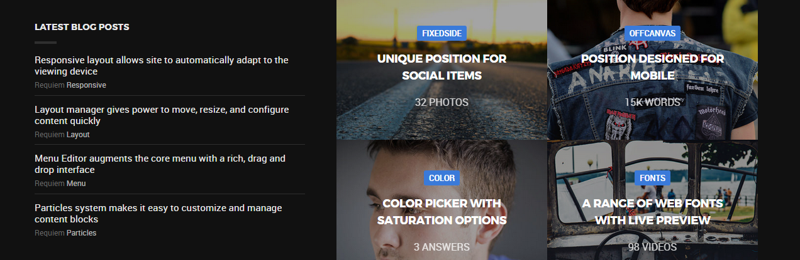

The **Expanded** section includes five module positions, `expanded-left`, `expanded-right`, `expanded-a`, `expanded-b`, and `expanded-c`. These positions are spread across two rows, with the first row containing the `expanded-left` and `expanded-right` positions.

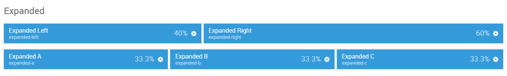

Here is a breakdown of the module(s) and particle(s) that appear in this section:

* [Expanded Left (module position)](#expanded-left-(module-position))
    - [Info List (particle)](#gantry-5-particle-(info-list))
* [Expanded Right (module position)](#expanded-right-(module-position))
    - [Grid Promo Gallery (particle)](#gantry-5-particle-(grid-promo-gallery))
* [Expanded A (module position)](#expanded-a-(module-position))
* [Expanded B (module position)](#expanded-b-(module-position))
* [Expanded C (module position)](#expanded-c-(module-position))

## Section Settings

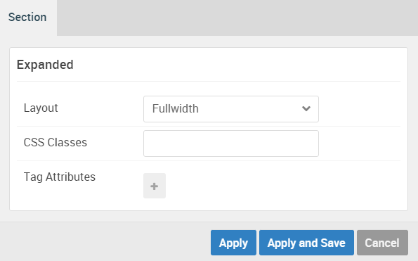

| Option         | Setting   |
| :-----         | :-----    |
| Layout         | Fullwidth |
| CSS Classes    | Blank     |
| Tag Attributes | Blank     |

## Expanded Left (module position)

#### Particle Settings

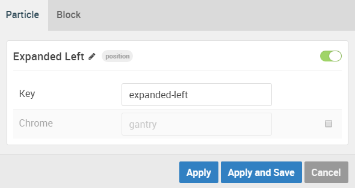

| Option | Setting         |
| :----- | :-----          |
| Key    | `expanded-left` |
| Chrome | gantry          |

#### Block Settings

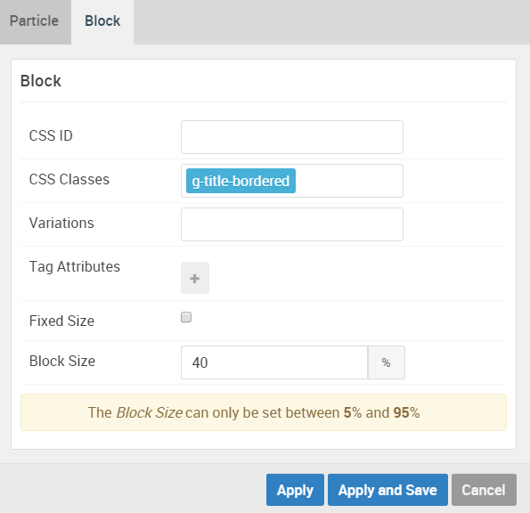

| Option         | Setting            |
| :-----         | :-----             |
| CSS ID         | Blank              |
| CSS Classes    | `g-title-bordered` |
| Variations     | Blank              |
| Tag Attributes | Blank              |
| Block Size     | `40%`              |

### Assigned Module(s)

#### Gantry 5 Particle (Info List)

We added a **Info List** particle to the `expanded-left` position. This was done by creating a **Gantry 5 Particle** module and selecting the **Info List** particle in the module's settings. 

You will find the particle settings used in this particle below:

##### Particle Settings

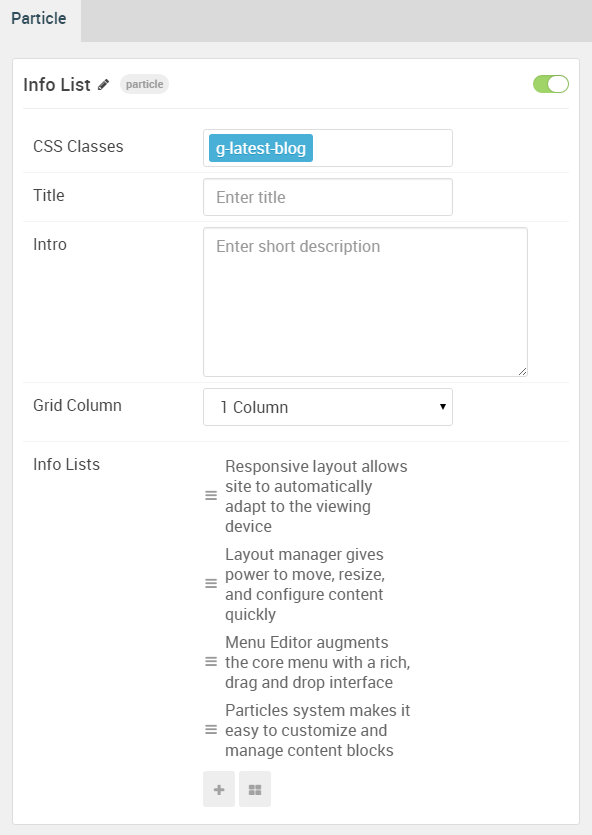

| Option                              | Setting                                                                      |
| :-----                              | :-----                                                                       |
| CSS Classes                         | `g-latest-blog`                                                              |
| Title                               | Blank                                                                        |
| Intro                               | Blank                                                                        |
| Grid Column                         | 1 Column                                                                     |
| Info Lists Item 1 Name              | `Responsive layout allows site to automatically adapt to the viewing device` |
| Info Lists Item 1 Image             | Blank                                                                        |
| Info Lists Item 1 Image Location    | Left                                                                         |
| Info Lists Item 1 Text Style        | Compact                                                                      |
| Info Lists Item 1 Image Style       | Compact                                                                      |
| Info Lists Item 1 Description       | `Requiem <a href="#">Responsive</a>`                                         |
| Info Lists Item 1 Tag               | Blank                                                                        |
| Info Lists Item 1 Sub Tag           | Blank                                                                        |
| Info Lists Item 1 Label             | Blank                                                                        |
| Info Lists Item 1 Link              | `#`                                                                          |
| Info Lists Item 1 Icon              | Blank                                                                        |
| Info Lists Item 1 Read More Classes | Blank                                                                        |

## Expanded Right (module position)

#### Particle Settings

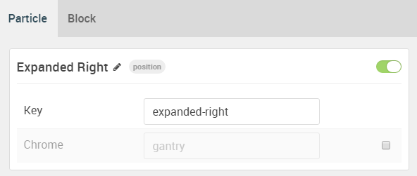

| Option | Setting          |
| :----- | :-----           |
| Key    | `expanded-right` |
| Chrome | gantry           |

#### Block Settings

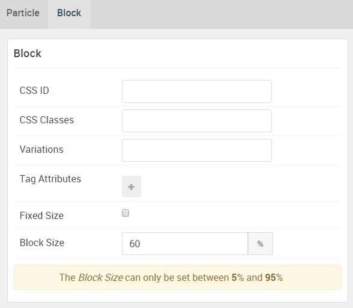

| Option         | Setting |
| :-----         | :-----  |
| CSS ID         | Blank   |
| CSS Classes    | Blank   |
| Variations     | Blank   |
| Tag Attributes | Blank   |
| Block Size     | `60%`   |

### Assigned Module(s)

#### Gantry 5 Particle (Grid Promo Gallery)

We added a **Grid Promo Gallery** particle to the `expanded-right` position. This was done by creating a **Gantry 5 Particle** module and selecting the **Grid Promo Gallery** particle in the module's settings. 

You will find the particle settings used in this particle below:

##### Particle Settings

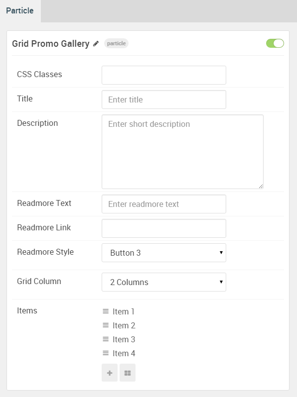

| Option                                      | Setting                            |
| :-----                                      | :-----                             |
| CSS Classes                                 | Blank                              |
| Title                                       | Blank                              |
| Description                                 | Blank                              |
| Readmore Text                               | Blank                              |
| Readmore Link                               | Blank                              |
| Readmore Style                              | Button 3                           |
| Grid Column                                 | 2 Columns                          |
| Grid Promo Gallery Item 1 Name              | `Item 1`                           |
| Grid Promo Gallery Item 1 Image             | Custom                             |
| Grid Promo Gallery Item 1 Tag               | `FixedSide`                        |
| Grid Promo Gallery Item 1 Title             | `Unique position for social items` |
| Grid Promo Gallery Item 1 Description       | `32 Photos`                        |
| Grid Promo Gallery Item 1 Link              | `#`                                |

## Expanded A (module position)

#### Particle Settings

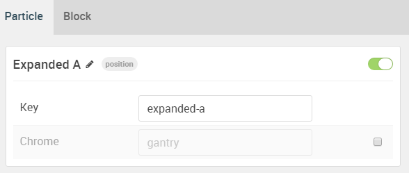

| Option | Setting     |
| :----- | :-----      |
| Key    | `expanded-a` |
| Chrome | gantry      |

#### Block Settings

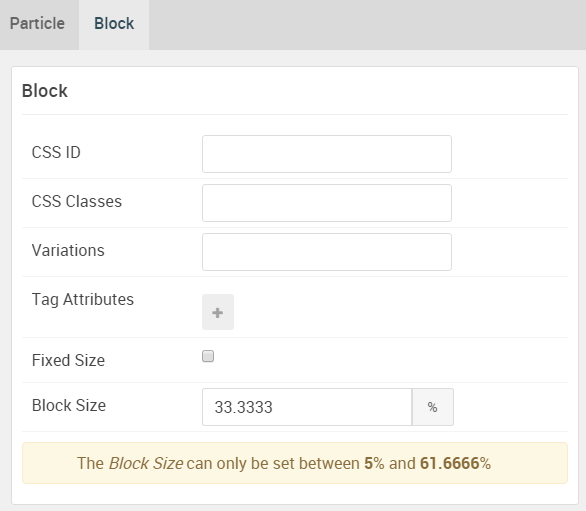

| Option         | Setting    |
| :-----         | :-----     |
| CSS ID         | Blank      |
| CSS Classes    | Blank      |
| Variations     | Blank      |
| Tag Attributes | Blank      |
| Block Size     | `33.3333%` |

## Expanded B (module position)

#### Particle Settings

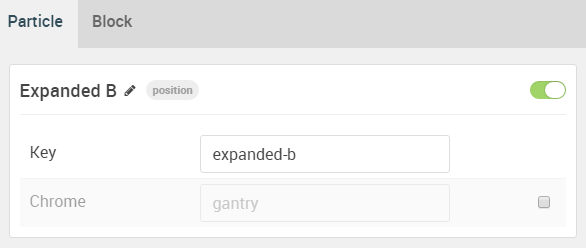

| Option | Setting   |
| :----- | :-----    |
| Key    | `expanded-b` |
| Chrome | gantry    |

#### Block Settings

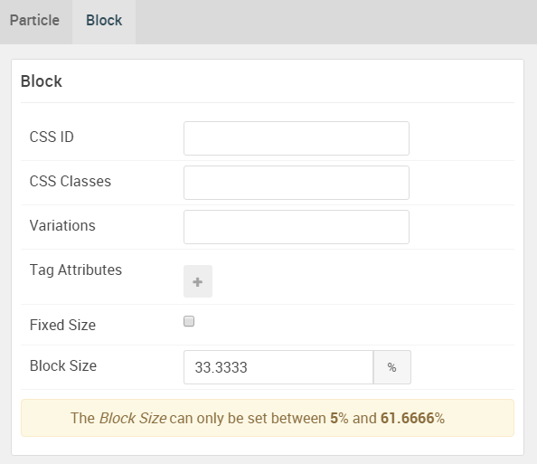

| Option         | Setting    |
| :-----         | :-----     |
| CSS ID         | Blank      |
| CSS Classes    | Blank      |
| Variations     | Blank      |
| Tag Attributes | Blank      |
| Block Size     | `33.3333%` |

## Expanded C (module position)

#### Particle Settings

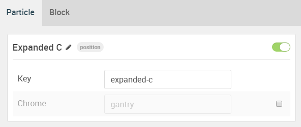

| Option | Setting      |
| :----- | :-----       |
| Key    | `expanded-c` |
| Chrome | gantry       |

#### Block Settings

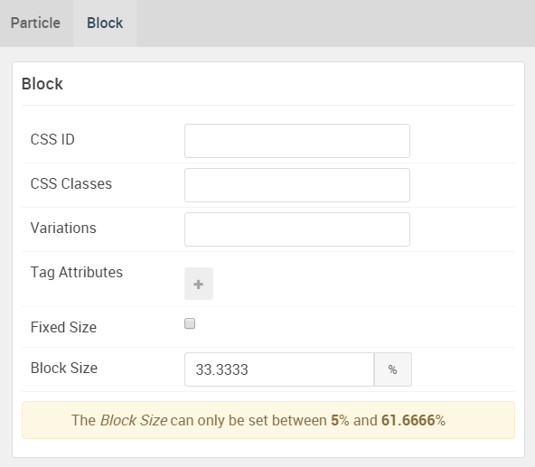

| Option         | Setting    |
| :-----         | :-----     |
| CSS ID         | Blank      |
| CSS Classes    | Blank      |
| Variations     | Blank      |
| Tag Attributes | Blank      |
| Block Size     | `33.3333%` |
