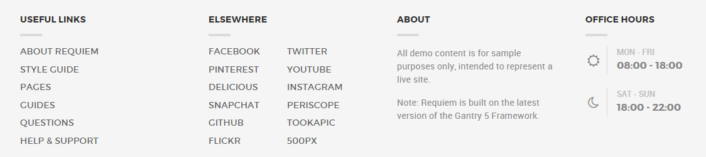
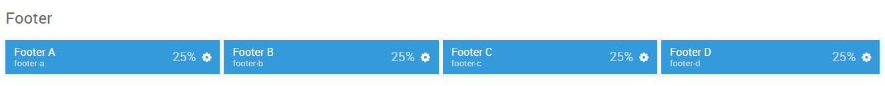
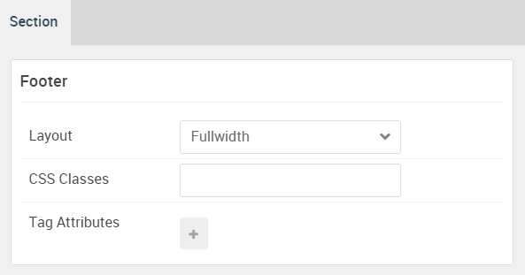

## Introduction

The **Footer** sections include four module positions, `footer-a`, `footer-b`, `footer-c`, and `footer-d`. These module positions are created using the Layout Manager.

Here is a breakdown of the module(s) and particle(s) that appear in this section:

* [Footer A (module position)](#footer-a-(module-position))
    - [Info List (particle)](#gantry-5-particle-(info-list)-1)
* [Footer B (module position)](#footer-b-(module-position))
    - [Info List (particle)](#gantry-5-particle-(info-list)-2)
* [Footer C (module position)](#footer-c-(module-position))
    - [Custom HTML (module)](#custom-html-(module))
* [Footer D (module position)](#footer-d-(module-position))
    - [Contact (particle)](#gantry-5-particle-(contact))

## Section Settings

| Option         | Setting   |
| :-----         | :-----    |
| Section Width  | `100%`    |
| Layout         | Fullwidth |
| CSS Classes    | Blank     |
| Tag Attributes | Blank     |

## Footer A (module position)

#### Particle Settings

| Option | Setting    |
| :----- | :-----     |
| Key    | `footer-a` |
| Chrome | gantry     |

#### Block Settings

| Option         | Setting            |
| :-----         | :-----             |
| CSS ID         | Blank              |
| CSS Classes    | `g-title-bordered` |
| Variations     | Blank              |
| Tag Attributes | Blank              |
| Block Size     | `25%`              |

### Assigned Module(s)

#### Gantry 5 Particle (Info List) 1

We added a **Info List** particle to the `footer-a` position. This was done by creating a **Gantry 5 Particle** module and selecting the **Info List** particle in the module's settings. 

You will find the particle settings used in this particle below:

##### Particle Settings

| Option                             | Setting                                               |
| :-----                             | :-----                                                |
| CSS Classes                        | `g-gridmenu`                                          |
| Title                              | Blank                                                 |
| Intro                              | Blank                                                 |
| Grid Column                        | 1 Column                                              |
| Info List Item 1 Name              | `About Requiem`                                       |
| Info List Item 1 Image             | Blank                                                 |
| Info List Item 1 Image Location    | Left                                                  |
| Info List Item 1 Text Style        | Compact                                               |
| Info List Item 1 Image Style       | Compact                                               |
| Info List Item 1 Description       | Blank                                                 |
| Info List Item 1 Tag               | Blank                                                 |
| Info List Item 1 Sub Tag           | Blank                                                 |
| Info List Item 1 Label             | Blank                                                 |
| Info List Item 1 Link              | `http://www.rockettheme.com/joomla/templates/requiem` |
| Info List Item 1 Icon              | Blank                                                 |
| Info List Item 1 Read More Classes | Blank                                                 |

## Footer B (module position)

#### Particle Settings

| Option | Setting    |
| :----- | :-----     |
| Key    | `footer-b` |
| Chrome | gantry     |

#### Block Settings

| Option         | Setting |
| :-----         | :-----  |
| CSS ID         | Blank   |
| CSS Classes    | Blank   |
| Variations     | Blank   |
| Tag Attributes | Blank   |
| Block Size     | `25%`   |

### Assigned Module(s)

#### Gantry 5 Particle (Info List) 2

We added a **Info List** particle to the `footer-b` position. This was done by creating a **Gantry 5 Particle** module and selecting the **Info List** particle in the module's settings. 

You will find the particle settings used in this particle below:

##### Particle Settings

| Option                             | Setting      |
| :-----                             | :-----       |
| CSS Classes                        | `g-gridmenu` |
| Title                              | Blank        |
| Intro                              | Blank        |
| Grid Column                        | 2 Columns    |
| Info List Item 1 Name              | `Facebook`   |
| Info List Item 1 Image             | Blank        |
| Info List Item 1 Image Location    | Left         |
| Info List Item 1 Text Style        | Compact      |
| Info List Item 1 Image Style       | Compact      |
| Info List Item 1 Description       | Blank        |
| Info List Item 1 Tag               | Blank        |
| Info List Item 1 Sub Tag           | Blank        |
| Info List Item 1 Label             | Blank        |
| Info List Item 1 Link              | `#`          |
| Info List Item 1 Icon              | Blank        |
| Info List Item 1 Read More Classes | Blank        |

## Footer C (module position)

#### Particle Settings

| Option | Setting    |
| :----- | :-----     |
| Key    | `footer-c` |
| Chrome | gantry     |

#### Block Settings

| Option         | Setting            |
| :-----         | :-----             |
| CSS ID         | Blank              |
| CSS Classes    | `g-title-bordered` |
| Variations     | Blank              |
| Tag Attributes | Blank              |
| Block Size     | `25%`              |

### Assigned Module(s)

#### Custom HTML (module)

We added a **Custom HTML** module to the `footer-c` module position. 

You will find the settings used in this module below:

##### Module Settings

| Option               | Setting           |
| :-----               | :-----            |
| Title                | `About`           |
| Show Title           | Show              |
| Position             | `footer-c`        |
| Status               | Published         |

**Custom HTML**

~~~ .html

All demo content is for sample purposes only, intended to represent a live site.

Note: Requiem is built on the latest version of the Gantry 5 Framework.

~~~

##### Advanced Settings

| Option              | Setting   |
| :-----              | :-----    |
| Module Class Suffix | `g-about` |

## Footer D (module position)

#### Particle Settings

| Option | Setting    |
| :----- | :-----     |
| Key    | `footer-d` |
| Chrome | gantry     |

#### Block Settings

| Option        | Setting            |
| :-----        | :-----             |
| CSS ID        | Blank              |
| CSS Classes   | `g-title-bordered` |
| Variations    | Blank              |
| Tag Attribute | Blank              |
| Block Size    | `25%`              |

### Assigned Module(s)

#### Gantry 5 Particle (Contact)

We added a **Contact** particle to the `footside-c` position. This was done by creating a **Gantry 5 Particle** module and selecting the **Contact** particle in the module's settings. 

You will find the particle settings used in this particle below:

##### Particle Settings

| Option               | Setting             |
| :-----               | :-----              |
| CSS Classes          | `g-office-hours`    |
| Title                | Blank               |
| Contact Item 1 Name  | `Monday - Friday`   |
| Contact Item 1 Icon  | `fa fa-sun-o fa-fw` |
| Contact Item 1 Value | `08:00 - 18:00`     |
| Map Position         | Top                 |
| Maps                 | Blank               |