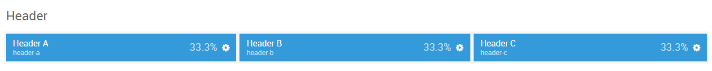
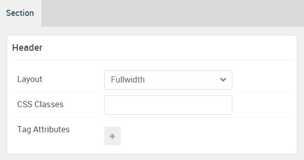

## Introduction

The **Header** section includes three module positions, `header-a`, `header-b`, `header-c`. These module positions are created using the Layout Manager.

Here is a breakdown of the module(s) and particle(s) that appear in this section:

* [Header A (module position)](#header-a-(module-position))
    - [Promo Content (particle)](#gantry-5-particle-(promo-content))
* [Header B (module position)](#header-b-(module-position))
* [Header C (module position)](#header-c-(module-position))

## Section Settings

| Option         | Setting   |
| :-----         | :-----    |
| Layout         | Fullwidth |
| CSS Classes    | Blank     |
| Tag Attributes | Blank     |

## Header A (module position)

#### Particle Settings

| Option | Setting    |
| :----- | :-----     |
| Key    | `header-a` |
| Chrome | gantry     |

#### Block Settings

| Option         | Setting    |
| :-----         | :-----     |
| CSS ID         | Blank      |
| CSS Classes    | Blank      |
| Variations     | Blank      |
| Tag Attributes | Blank      |
| Block Size     | `33.3333%` |

### Assigned Module(s)

#### Gantry 5 Particle (Promo Content)

We added a **Promo Content** particle to the `header-a` position. This was done by creating a **Gantry 5 Particle** module and selecting the **Promo Content** particle in the module's settings. 

You will find the particle settings used in this particle below:

##### Particle Settings

| Option                | Setting                                                 |
| :-----                | :-----                                                  |
| CSS Classes           | Blank                                                   |
| Title                 | Blank                                                   |
| Promo Style           | Promo                                                   |
| Promo Text            | `Requiem`                                               |
| Description 1         | `Exquisitely designed template for Gantry 5 framework.` |
| Description 2         | A rich, highly flexible and visually diverse template.  |
| Description Animation | Type Writer                                             |
| Animation Element ID  | `typewriter-1`                                          |
| Readmore Text         | `Learn More`                                            |
| Readmore Link         | `#`                                                     |
| Button Text           | `button-3`                                              |
| Button Link           | `#`                                                     |
| Button Style          | Block                                                   |
| Tags                  | Blank                                                   |

## Header B (module position)

#### Particle Settings

| Option | Setting    |
| :----- | :-----     |
| Key    | `header-b` |
| Chrome | gantry     |

#### Block Settings

| Option         | Setting    |
| :-----         | :-----     |
| CSS ID         | Blank      |
| CSS Classes    | Blank      |
| Variations     | Blank      |
| Tag Attributes | Blank      |
| Block Size     | `33.3333%` |

## Header C (module position)

#### Particle Settings

| Option | Setting    |
| :----- | :-----     |
| Key    | `header-c` |
| Chrome | gantry     |

#### Block Settings

| Option         | Setting    |
| :-----         | :-----     |
| CSS ID         | Blank      |
| CSS Classes    | Blank      |
| Variations     | Blank      |
| Tag Attributes | Blank      |
| Block Size     | `33.3333%` |