## Introduction

The **Navigation** section includes two rows of module positions, including one directly-placed particle. The first row consists of the `mainnav-left` and `mainnav-right` module positions, as well as the **Menu** particle. The second row contains `navigation-a`, `navigation-b`, and `navigation-c`.

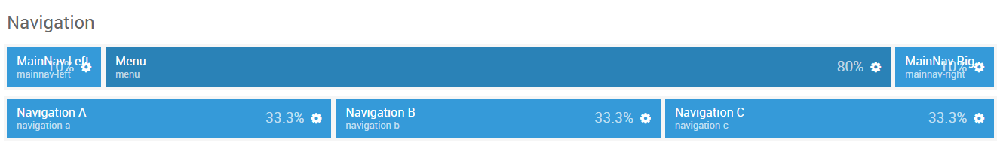

Here is a breakdown of the module(s) and particle(s) that appear in this section:

* [MainNav Left (module position)](#mainnav-left-(module-position))
    - [Icon Menu (particle)](#gantry-5-particle-(icon-menu))
* [Menu (particle)](#gantry-5-particle-(menu))
* [MainNav Right (module position)](#mainnav-right-(module-position))
    - [Icon Menu (particle)](#gantry-5-particle-(icon-menu)-2)
* [Navigation A (module position)](#navigation-a-(module-position))
* [Navigation B (module position)](#navigation-b-(module-position))
* [Navigation C (module position)](#navigation-c-(module-position))

## Section Settings

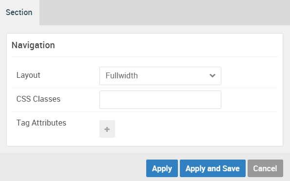

| Option         | Setting   |
| :-----         | :-----    |
| Layout         | Fullwidth |
| CSS Classes    | Blank     |
| Tag Attributes | Blank     |

## MainNav Left (Module Position)

#### Particle Settings

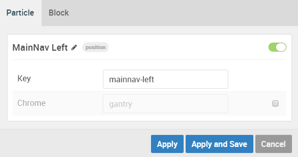

| Option        | Setting        |
| :-----        | :-----         |
| Key           | `mainnav-left` |
| Chrome        | gantry         |

#### Block Settings

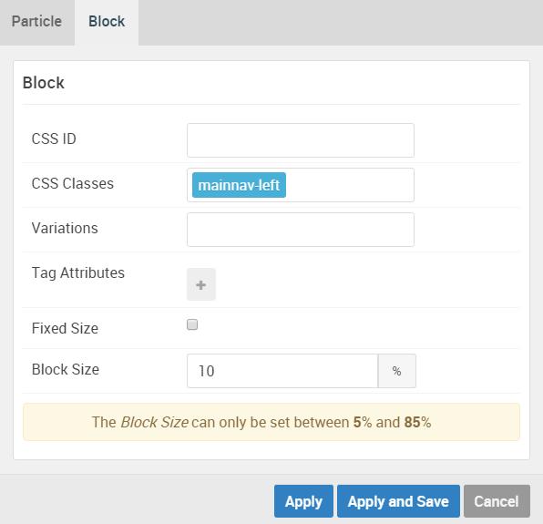

| Option         | Setting        |
| :-----         | :-----         |
| CSS ID         | Blank          |
| CSS Classes    | `mainnav-left` |
| Variations     | Blank          |
| Tag Attributes | Blank          |
| Fixed Size     | Unchecked      |
| Block Size     | `10%`          |

### Assigned Module(s)

#### Gantry 5 Particle (Icon Menu)

We added a **Icon Menu** particle to the `mainnav-left` position. This was done by creating a **Gantry 5 Particle** module and selecting the **Icon Menu** particle in the module's settings. 

You will find the particle settings used in this particle below:

##### Particle Settings

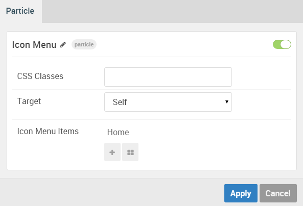

| Option                | Setting            |
| :-----                | :-----             |
| CSS Classes           | Blank              |
| Target                | Self               |
| Icon Menu Item 1 Name | Home               |
| Icon Menu Item 1 Icon | `fa fa-home fa-fw` |
| Icon Menu Item 1 Text | Blank              |
| Icon Menu Item 1 link | Custom             |

## Gantry 5 Particle (Menu)

We added a **Menu** particle directly in the **Layout Manager** to make up the main menu at the top of the page.

You will find the particle settings used in this particle below:

### Particle Settings

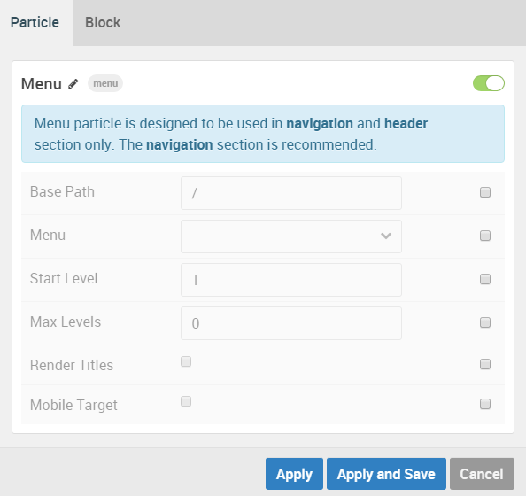

| Option        | Setting   |
| :-----        | :-----    |
| Base Path     | `/`       |
| Menu          | Custom    |
| Start Level   | `1`       |
| Max Levels    | `0`       |
| Render Titles | Unchecked |
| Mobile Target | Unchecked |

### Block Settings

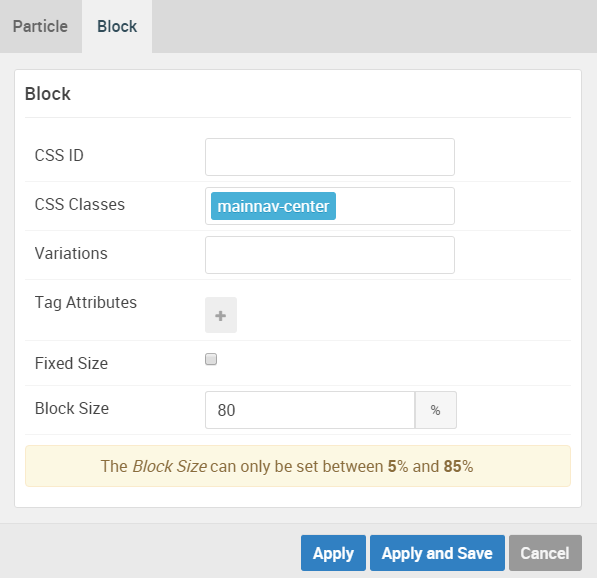

| Option         | Setting          |
| :-----         | :-----           |
| CSS ID         | Blank            |
| CSS Classes    | `mainnav-center` |
| Variations     | Blank            |
| Tag Attributes | Blank            |
| Fixed Size     | Unchecked        |
| Block Size     | `80%`            |

## MainNav Right (Module Position)

#### Particle Settings

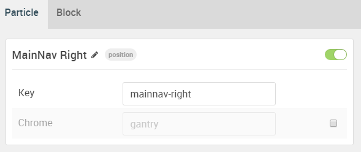

| Option | Setting         |
| :----- | :-----          |
| Key    | `mainnav-right` |
| Chrome | gantry          |

#### Block Settings

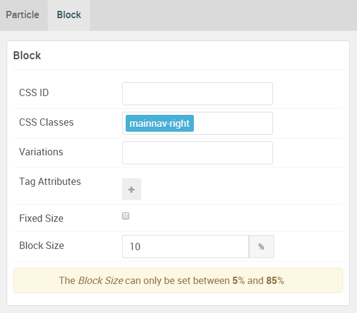

| Option         | Setting         |
| :-----         | :-----          |
| CSS ID         | Blank           |
| CSS Classes    | `mainnav-right` |
| Variations     | Blank           |
| Tag Attributes | Blank           |
| Fixed Size     | Unchecked       |
| Block Size     | `10%`           |

### Assigned Module(s)

#### Gantry 5 Particle (Icon Menu) 2

We added a **Icon Menu** particle to the `mainnav-right` position. This was done by creating a **Gantry 5 Particle** module and selecting the **Icon Menu** particle in the module's settings. 

You will find the particle settings used in this particle below:

##### Particle Settings

| Option                | Setting              |
| :-----                | :-----               |
| CSS Classes           | Blank                |
| Target                | Self                 |
| Icon Menu Item 1 Name | `Demo`               |
| Icon Menu Item 1 Icon | `fa fa-rocket fa-fw` |
| Icon Menu Item 1 Text | Blank                |
| Icon Menu Item 1 link | Custom               |

## Navigation A (Module Position)

#### Particle Settings

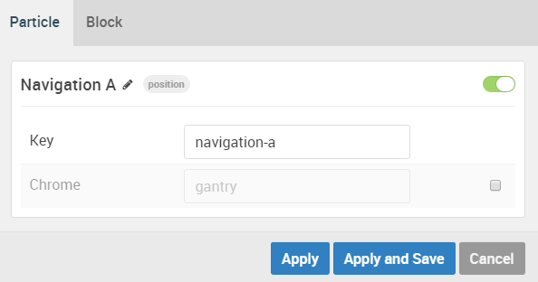

| Option | Setting        |
| :----- | :-----         |
| Key    | `navigation-a` |
| Chrome | gantry         |

#### Block Settings

| Option         | Setting    |
| :-----         | :-----     |
| CSS ID         | Blank      |
| CSS Classes    | Blank      |
| Variations     | Blank      |
| Tag Attributes | Blank      |
| Fixed Size     | Unchecked  |
| Block Size     | `33.3333%` |

## Navigation B (Module Position)

#### Particle Settings

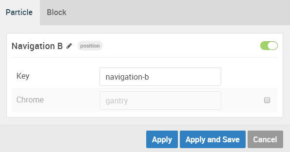

| Option | Setting        |
| :----- | :-----         |
| Key    | `navigation-b` |
| Chrome | gantry         |

#### Block Settings

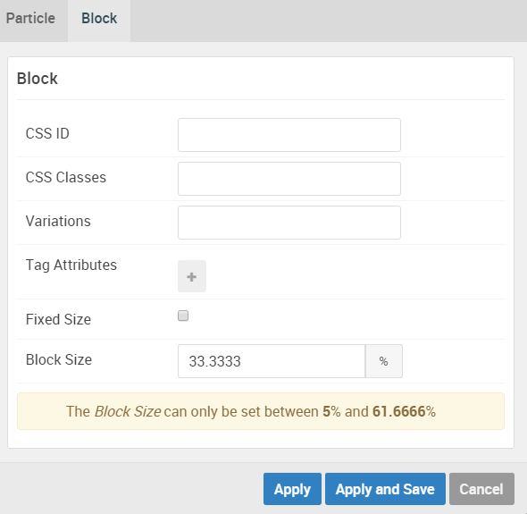

| Option         | Setting    |
| :-----         | :-----     |
| CSS ID         | Blank      |
| CSS Classes    | Blank      |
| Variations     | Blank      |
| Tag Attributes | Blank      |
| Fixed Size     | Unchecked  |
| Block Size     | `33.3333%` |

## Navigation C (Module Position)

#### Particle Settings

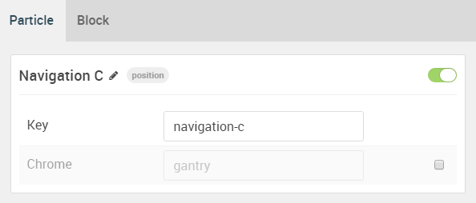

| Option | Setting        |
| :----- | :-----         |
| Key    | `navigation-c` |
| Chrome | gantry         |

#### Block Settings

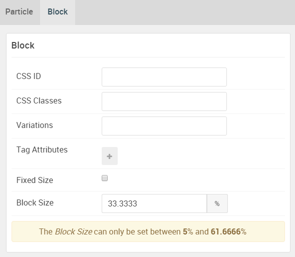

| Option         | Setting    |
| :-----         | :-----     |
| CSS ID         | Blank      |
| CSS Classes    | Blank      |
| Variations     | Blank      |
| Tag Attributes | Blank      |
| Fixed Size     | Unchecked  |
| Block Size     | `33.3333%` |