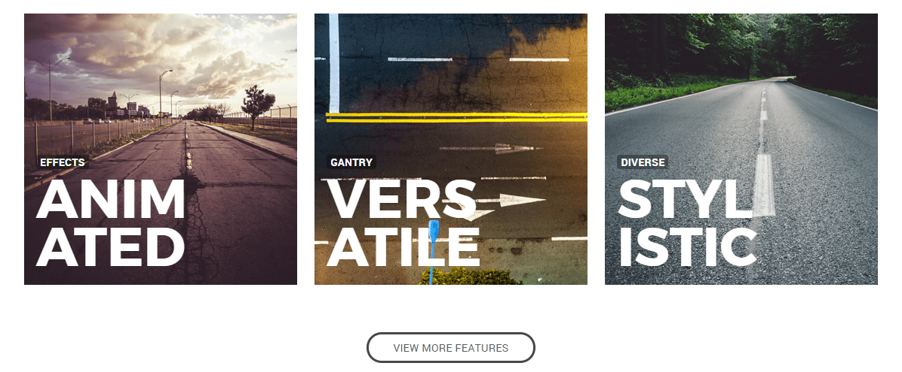
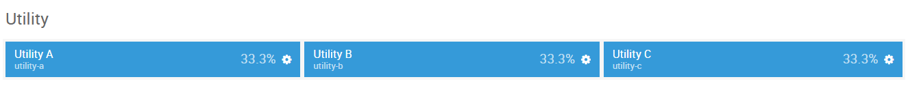
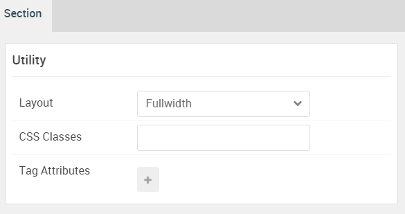
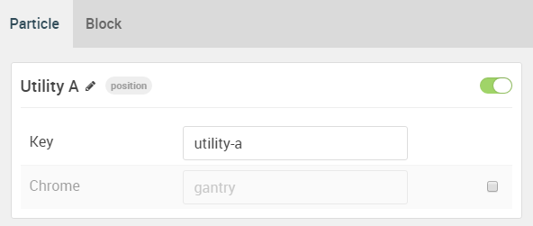
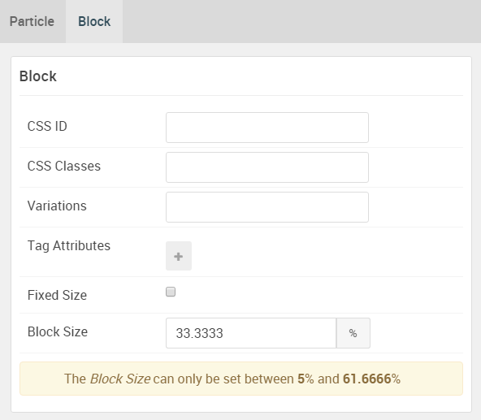
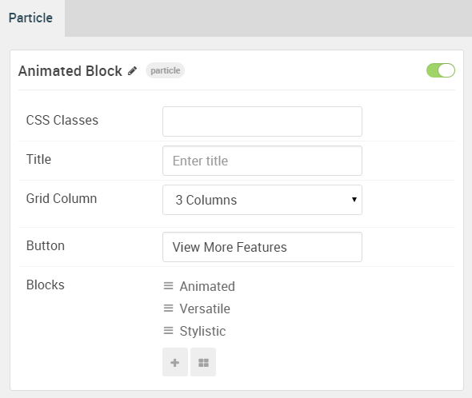
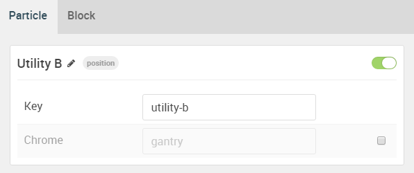
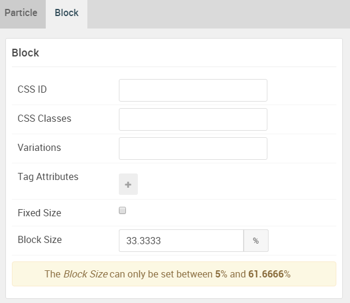
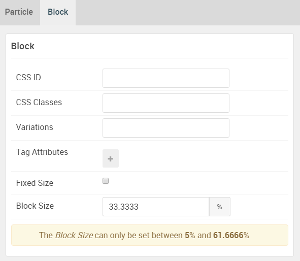

## Introduction

The **Utility** section includes three module positions, `utility-a`, `utility-b`, and `utility-c`. 

Here is a breakdown of the module(s) and particle(s) that appear in this section:

* [Utility A (module position)](#utility-a-(module-position))
    - [Animated Block (particle)](#gantry-5-particle-(animated-block))
* [Utility B (module position)](#utility-b-(module-position))
* [Utility C (module position)](#utility-c-(module-position))

## Section Settings

| Option         | Setting   |
| :-----         | :-----    |
| Layout         | Fullwidth |
| CSS Classes    | Blank     |
| Tag Attributes | Blank     |

## Utility A (module position)

#### Particle Settings

| Option | Setting     |
| :----- | :-----      |
| Key    | `utility-a` |
| Chrome | gantry      |

#### Block Settings

| Option         | Setting    |
| :-----         | :-----     |
| CSS ID         | Blank      |
| CSS Classes    | Blank      |
| Variations     | Blank      |
| Tag Attributes | Blank      |
| Block Size     | `33.3333%` |

### Assigned Module(s)

#### Gantry 5 Particle (Animated Block)

We added a **Animated Block** particle to the `utility-a` position. This was done by creating a **Gantry 5 Particle** module and selecting the **Animated Block** particle in the module's settings. 

You will find the particle settings used in this particle below:

##### Particle Settings

| Option                    | Setting                                                                                                    |
| :-----                    | :-----                                                                                                     |
| CSS Classes               | Blank                                                                                                      |
| Title                     | Blank                                                                                                      |
| Grid Column               | 3 Columns                                                                                                  |
| Button                    | View More Features                                                                                         |
| Blocks Item 1 Name        | `Animated`                                                                                                 |
| Blocks Item 1 Image       | Custom                                                                                                     |
| Blocks Item 1 Headline    | `Anim ated`                                                                                           |
| Blocks Item 1 Tag         | `Effects`                                                                                                  |
| Blocks Item 1 Description | `Rich CSS animations to enhance appeal without detracting from content` |
| Blocks Item 1 Read More   | `Read More`                                                                                                |
| Blocks Item 1 Link        | `#`                                                                                                        |

## Utility B (module position)

#### Particle Settings

| Option | Setting   |
| :----- | :-----    |
| Key    | `utility-b` |
| Chrome | gantry    |

#### Block Settings

| Option         | Setting    |
| :-----         | :-----     |
| CSS ID         | Blank      |
| CSS Classes    | Blank      |
| Variations     | Blank      |
| Tag Attributes | Blank      |
| Block Size     | `33.3333%` |

## Utility C (module position)

#### Particle Settings

| Option | Setting      |
| :----- | :-----       |
| Key    | `utility-c` |
| Chrome | gantry       |

#### Block Settings

| Option         | Setting    |
| :-----         | :-----     |
| CSS ID         | Blank      |
| CSS Classes    | Blank      |
| Variations     | Blank      |
| Tag Attributes | Blank      |
| Block Size     | `33.3333%` |
