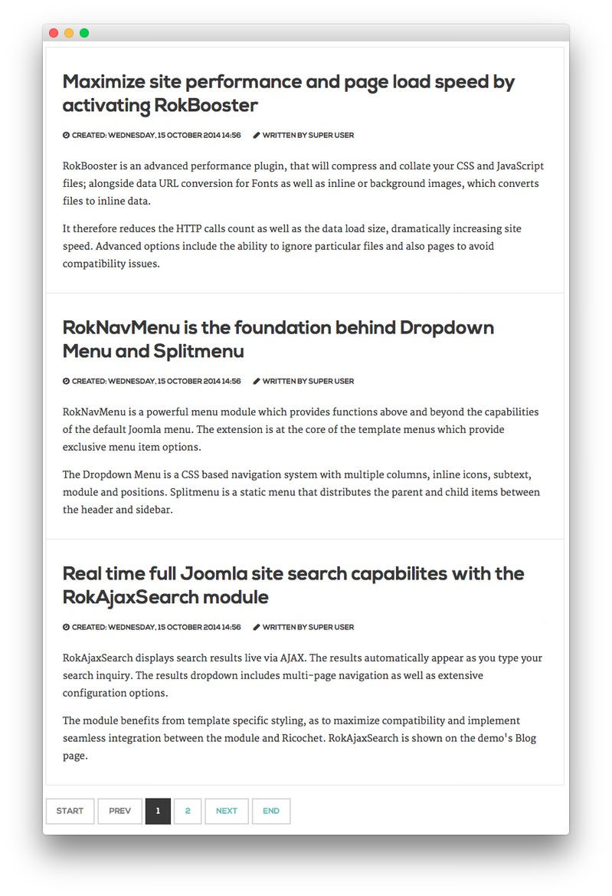

This area of the front page is an article. Articles appear within the **Mainbody** area of the front page.

Turning on Mainbody Content
-----

This content appears on the front page because the **Mainbody Enabled** option has been turned on in the template settings. You can find these settings by navigating to **Administrator -> Extensions -> Templates Manager -> Corvus -> Advanced**.

![][advanced]

Once this is done, you can navigate to the **Menu Manager** by going to **Administrator -> Menus -> Menu Manager**. From here, you'll want to find the menu item for your home page and select it so you can access its settings. For our demo, it is located in **Main Menu -> Home**.

![][menu]

:   1. **Intro Articles** [38%, 8%, se]

In order to show three featured articles on the front page, we placed a `3` in the **Intro Articles** setting within the **Layout Options** menu.

Article Properties
-----

The **Maximize site performance and page load speed by activating RokBooster** article is a standard article with the **Featured** option turned on so it appears in the front page mainbody.

Here is the **Article Text** we used:

~~~ .html

RokBooster is an advanced performance plugin, that will compress and collate your CSS and JavaScript files; alongside data URL conversion for Fonts as well as inline or background images, which converts files to inline data.

It therefore reduces the HTTP calls count as well as the data load size, dramatically increasing site speed. Advanced options include the ability to ignore particular files and also pages to avoid compatibility issues.

~~~

Once this article is created and set to **Featured**, it should appear on the front page.

[demo]: assets/demo_14.jpeg
[advanced]: assets/setadvanced.jpeg
[menu]: assets/menu.jpeg