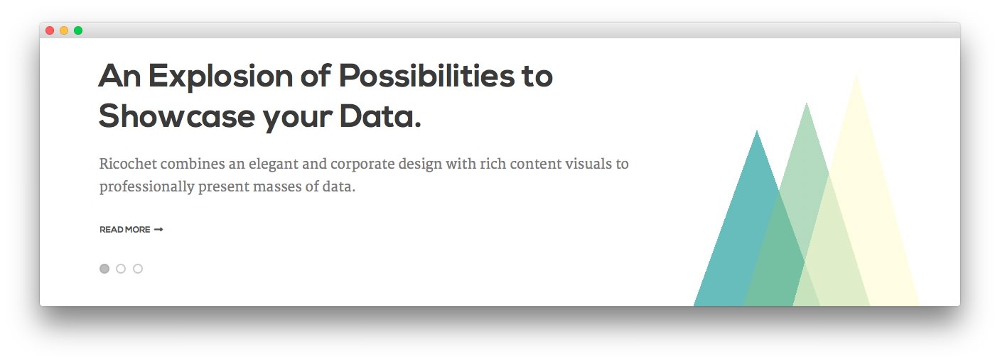
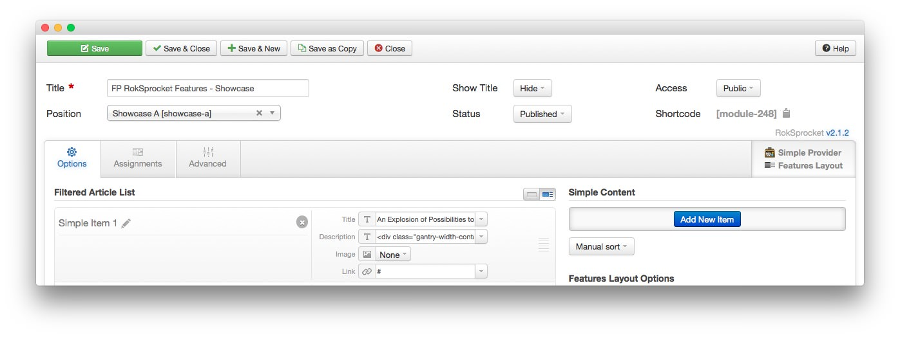
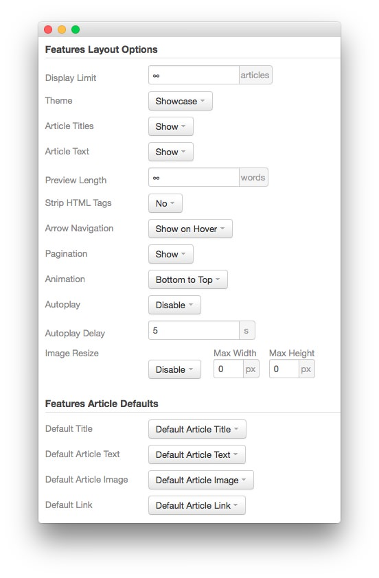
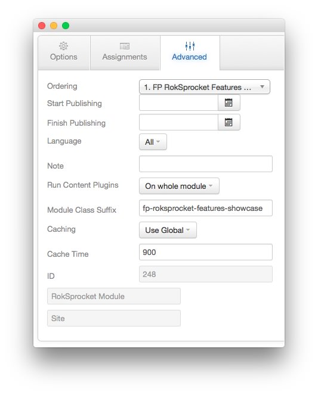

## Three Triangles

The three triangles represented in this area of the page are created using CSS. You can find the CSS source used to create them in the `ROOT/templates/rt_ricochet/less/demo.less` file. The written content in this area is managed using RokSprocket. Details about this are found in the sections below.

## FP RokSprocket Features - Showcase

The **RokSprocket Features** module used near the top of the front page is a great way to feature some of your site's more notable articles or areas of interest.

### Details

|      Option      |               Setting                |
| :--------------- | :----------------------------------- |
| Title            | `FP RokSprocket Features - Showcase` |
| Show Title       | Hide                                 |
| Access           | Public                               |
| Position         | showcase-a                           |
| Status           | Published                            |
| Content Provider | Simple                               |
| Type             | Features                             |

### Filtered Article List

We utilized the **Simple** Content Provider, allowing us to create custom content independent of full articles. The **Title**, **Description**, and **Link** fields in each article have been altered. A few examples of these article changes can be found below.

#### Article 1

**Title**

~~~ .html
An Explosion of Possibilities to Showcase your Data.
~~~

**Description**

~~~ .html

    

        

            
Ricochet combines an elegant and corporate design with rich
            content visuals to professionally present masses of data.

        

        

            
Ricochet combines an elegant and corporate design with rich
            content visuals to professionally present masses of data.

        

    

    

        

            

                

                

                

            

        

    

~~~

#### Article 2

**Title**

~~~
An Array of Template Specific Styling for RokSprocket.
~~~

**Description**

~~~ .html

    

        

            
RokSprocket benefits from a wide range of different layout
            modes, several themes, and many configuration options.

        

        

            
RokSprocket benefits from a wide range of different layout
            modes, several themes, and many configuration options.

        

    

    

        

            

                

                

                

            

        

    

~~~

#### Article 3

**Title**

~~~ .html
A Fixed or Sliding Position aside the Full Height of the Page.
~~~

**Description**

~~~ .html

    

        

            
A side module position existing outside of the main wrapper,
            configurable to be either permanently fixed, or via a slider.

        

        

            
A side module position existing outside of the main wrapper,
            configurable to be either permanently fixed, or via a slider.

        

    

    

        

            

                

                

                

            

        

    

~~~

### Layout Options

|         Option        |        Setting        |
| :-------------------- | :-------------------- |
| Display Limit         | `∞`                   |
| Theme                 | Showcase              |
| Article Titles        | Show                  |
| Article Text          | Show                  |
| Preview Length        | `∞`                   |
| Strip HTML Tags       | No                    |
| Arrow Navigation      | Show on Hover         |
| Pagination            | Show                  |
| Animation             | Bottom to Top         |
| Autoplay              | Disable               |
| Autoplay Delay        | `5`                   |
| Image Resize          | Disable               |
| Default Title         | Default Article Title |
| Default Article Text  | Default Article Text  |
| Default Article Image | Default Article Image |
| Default Link          | Default Article Link  |

### Advanced

|        Option       |              Setting               |
| :------------------ | :--------------------------------- |
| Module Class Suffix | `fp-roksprocket-features-showcase` |
