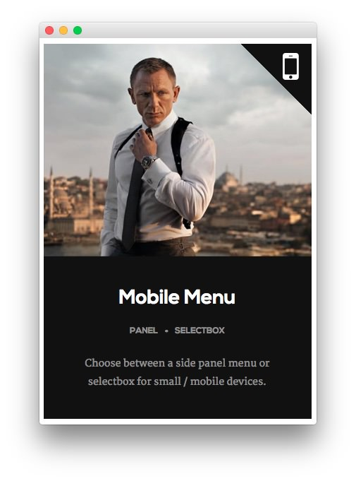
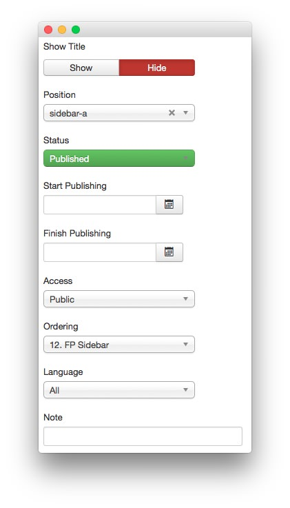
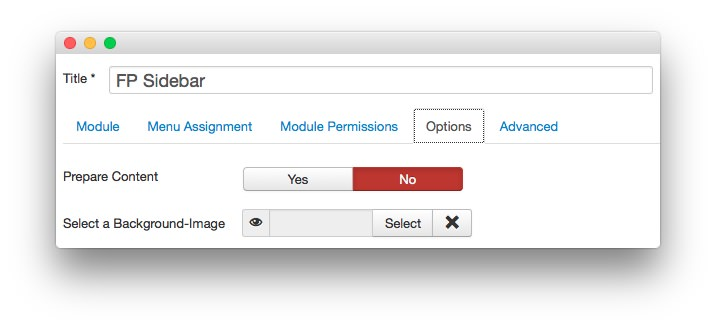
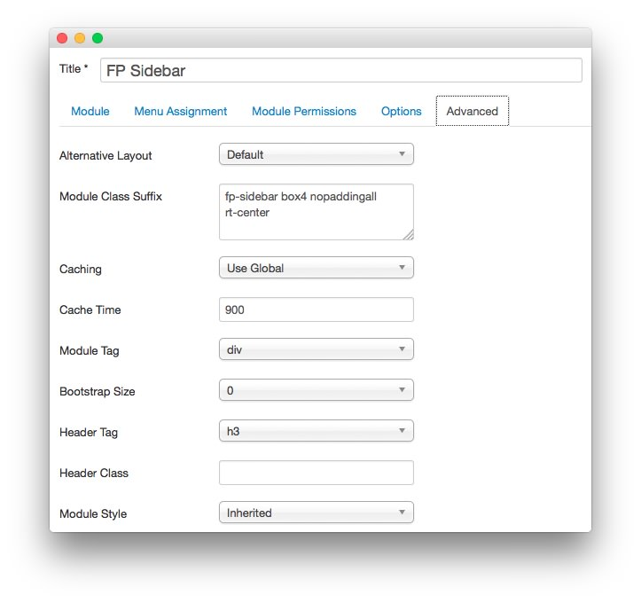

FP Sidebar
-----

This area of the front page is a **Custom HTML** module. You will find the settings used in our demo below.

>> Any **mod_custom** (Custom HTML) modules are best handled using either RokPad or no editor as a WYSIWYG editor can cause issues with any code that exists in the **Custom Output** field.

### Details

|   Option   |   Setting    |
| :--------- | :----------- |
| Title      | `FP Sidebar` |
| Show Title | Hide         |
| Position   | sidebar-a    |
| Status     | Published    |
| Access     | Public       |

### Custom Output

~~~ .html

    
    

    

        <h2 class="title">Mobile Menu</h2>
        <ul class="rt-tags">
            <li>Panel</li>
            <li>SelectBox</li>
        </ul>
        
Choose between a side panel menu or selectbox for small / mobile devices.
             
    

~~~

### Basic

|           Option          | Setting |
| :------------------------ | :------ |
| Prepare Content           | No      |
| Select a Background Image | Blank   |

### Advanced

|        Option       |                 Setting                  |
| :------------------ | :--------------------------------------- |
| Module Class Suffix | `fp-sidebar box4 nopaddingall rt-center` |
