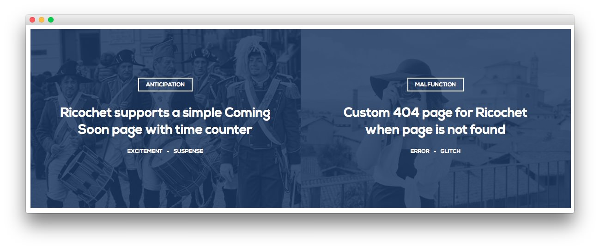
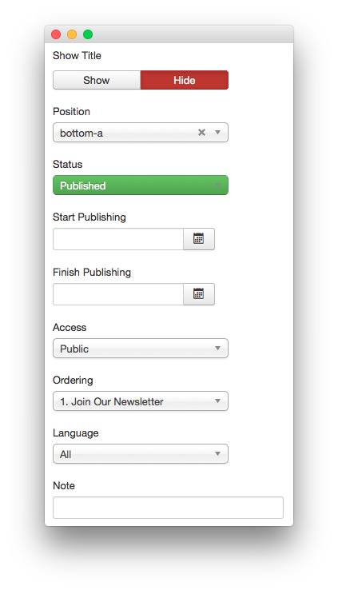
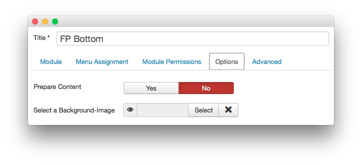
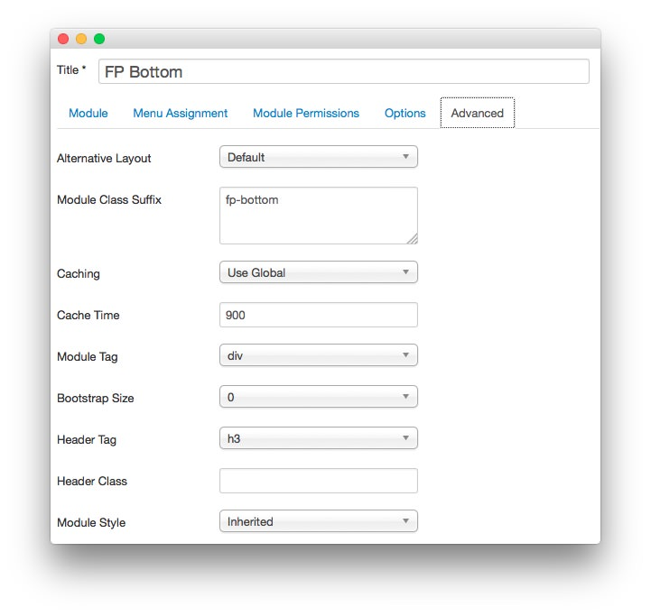

FP Bottom
-----

This area of the front page is a **Custom HTML** module. You will find the settings used in our demo below.

>> Any **mod_custom** (Custom HTML) modules are best handled using either RokPad or no editor as a WYSIWYG editor can cause issues with any code that exists in the **Custom Output** field.

### Details

|   Option   |   Setting   |
| :--------- | :---------- |
| Title      | `FP Bottom` |
| Show Title | Hide        |
| Position   | bottom-a    |
| Status     | Published   |
| Access     | Public      |

### Custom Output

~~~ .html

    

        

            

                

                    
                

                

                    

                        Anticipation
                        <h2 class="title">Ricochet supports a simple Coming Soon page with time counter</h2>
                        <ul class="rt-tags">
                            <li>Excitement</li>
                            <li>Suspense</li>
                        </ul>                       
                    

                
          
            

        
  
        

            

                

                    
                

                

                    

                        Malfunction
                        <h2 class="title">Custom 404 page for Ricochet when page is not found</h2>
                        <ul class="rt-tags">
                            <li>Error</li>
                            <li>Glitch</li>
                        </ul>                       
                    

                
          
            

        
          
    

~~~

### Basic

| Option                    | Setting     |
| :----------               | :---------- |
| Prepare Content           | No          |
| Select a Background Image | Blank       |

### Advanced

|        Option       |   Setting   |
| :------------------ | :---------- |
| Module Class Suffix | `fp-bottom` |
