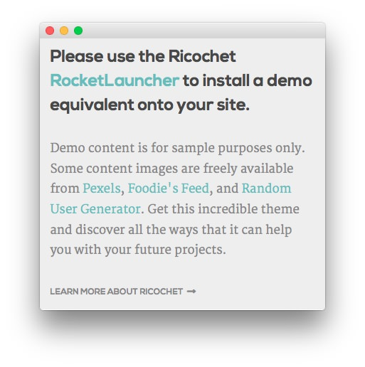
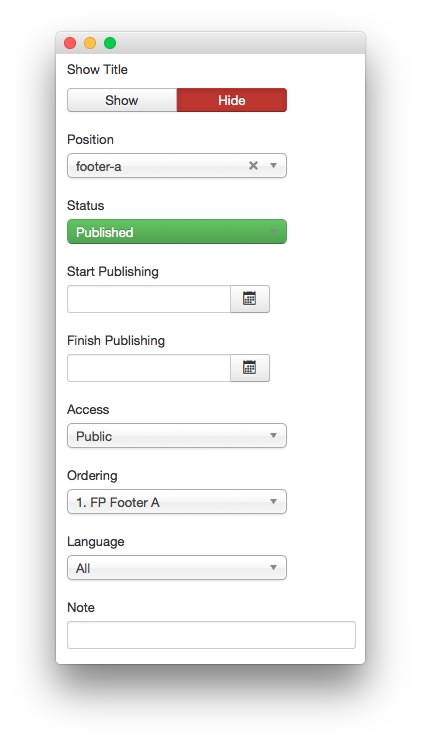
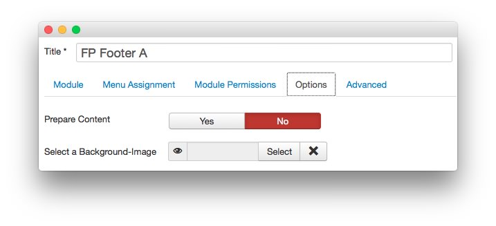
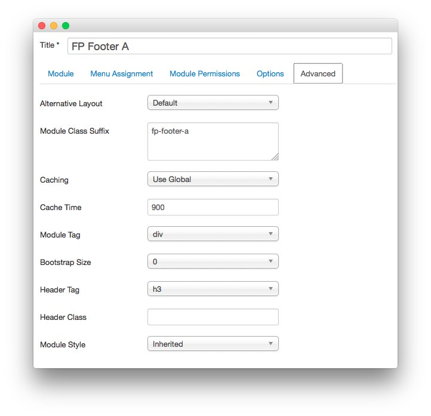

FP Footer A
-----

This area of the front page is a **Custom HTML** module. You will find the settings used in our demo below.

>> Any **mod_custom** (Custom HTML) modules are best handled using either RokPad or no editor as a WYSIWYG editor can cause issues with any code that exists in the **Custom Output** field.

### Details

|   Option   |    Setting    |
| :--------- | :------------ |
| Title      | `FP Footer A` |
| Show Title | Hide          |
| Position   | footer-a      |
| Status     | Published     |
| Access     | Public        |

### Custom Output

~~~ .html
<h2 class="title">Please use the Ricochet <a href="http://www.rockettheme.com/joomla/templates/ricochet">RocketLauncher</a> to install a demo equivalent onto your site.</h2>

<h6 class="largemargintop largepaddingtop largemarginbottom largepaddingbottom">Demo content is for sample purposes only. Some content images are freely available from <a href="http://www.pexels.com/">Pexels</a>, <a href="http://foodiesfeed.com/">Foodie's Feed</a>, and <a href="http://randomuser.me/photos.html">Random User Generator</a>. Get this incredible theme and discover all the ways that it can help you with your future projects.</h6>

<a href="http://www.rockettheme.com/joomla/templates/ricochet" class="readon2">Learn More About Ricochet</a>
~~~

### Basic

|           Option          | Setting |
| :------------------------ | :------ |
| Prepare Content           | No      |
| Select a Background Image | Blank   |

### Advanced

|        Option       |    Setting    |
| :------------------ | :------------ |
| Module Class Suffix | `fp-footer-a` |
