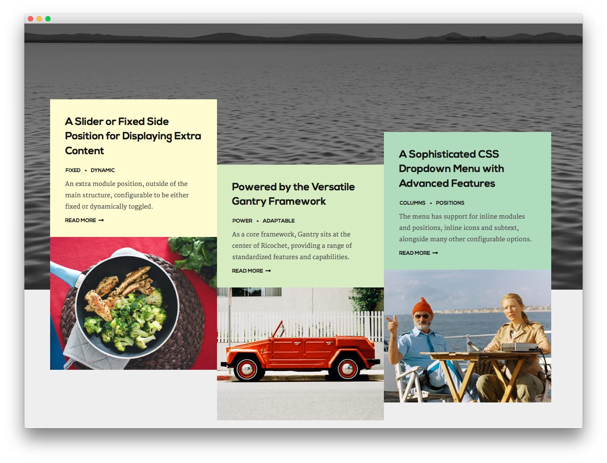
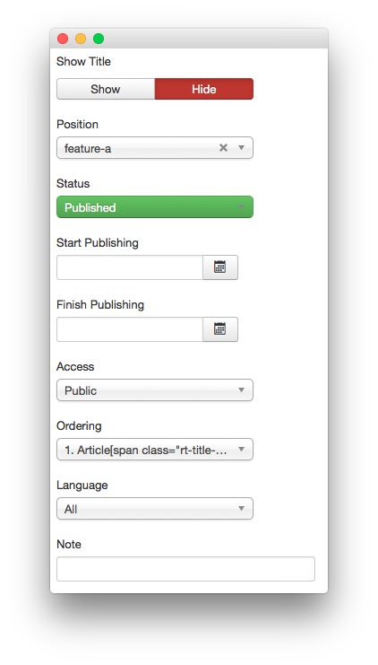
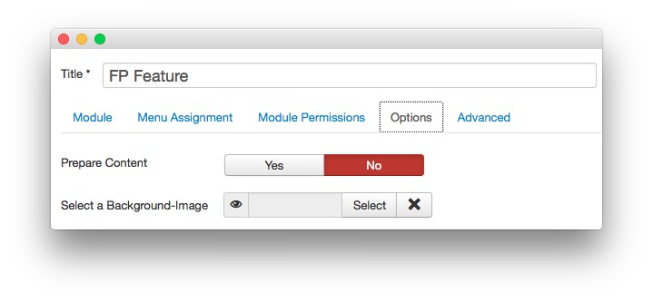
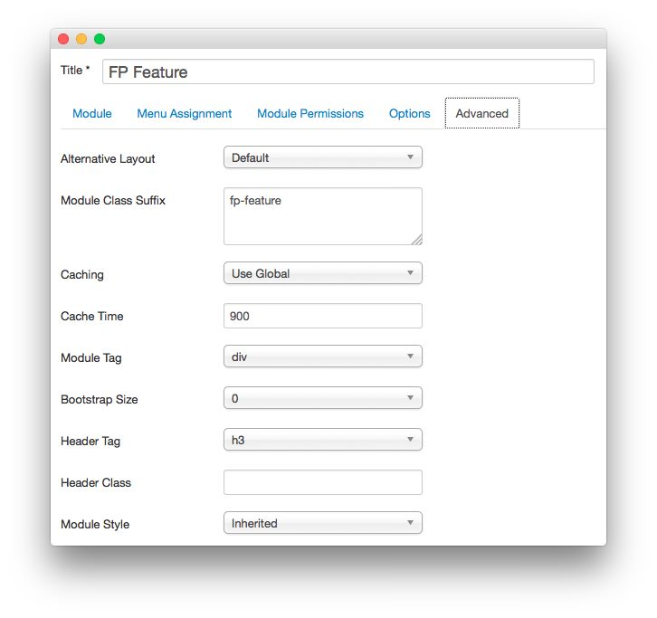

FP Feature
-----

This area of the front page is a **Custom HTML** module. You will find the settings used in our demo below.

>> Any **mod_custom** (Custom HTML) modules are best handled using either RokPad or no editor as a WYSIWYG editor can cause issues with any code that exists in the **Custom Output** field.

### Details

|   Option   |   Setting    |
| :--------- | :----------- |
| Title      | `FP Feature` |
| Show Title | Hide         |
| Position   | feature-a    |
| Status     | Published    |
| Access     | Public       |

### Custom Output

Enter the following in the **Custom Output** text editor.

~~~ .html

    

        

            

                

                    <h2>A Slider or Fixed Side Position for Displaying Extra Content</h2>
                    <ul class="rt-tags">
                        <li>Fixed</li>
                        <li>Dynamic</li>
                    </ul>
                    
An extra module position, outside of the main structure, configurable to be either fixed or dynamically toggled.

                    <a href="index.php?option=com_content&amp;view=article&amp;id=1&amp;Itemid=111" class="readon2">Read More</a>               
                

            

            

                
            

        

        

            

                

                    <h2>Powered by the Versatile Gantry Framework</h2>
                    <ul class="rt-tags">
                        <li>Power</li>
                        <li>Adaptable</li>
                    </ul>                   
                    
As a core framework, Gantry sits at the center of Ricochet, providing a range of standardized features and capabilities.

                    <a href="index.php?option=com_content&amp;view=article&amp;id=1&amp;Itemid=111" class="readon2">Read More</a>   
                
  
            

            

                
            

        

        

            

                

                    <h2>A Sophisticated CSS Dropdown Menu with Advanced Features</h2>
                    <ul class="rt-tags">
                        <li>Columns</li>
                        <li>Positions</li>
                    </ul>                   
                    
The menu has support for inline modules and positions, inline icons and subtext, alongside many other configurable options.

                    <a href="index.php?option=com_content&amp;view=article&amp;id=5&amp;Itemid=115" class="readon2">Read More</a>
                
  
            

            

                
            

        
      
    
  

~~~

### Basic

| Option                    | Setting     |
| :----------               | :---------- |
| Prepare Content           | No          |
| Select a Background Image | Blank       |

### Advanced

|        Option       |   Setting    |
| :------------------ | :----------- |
| Module Class Suffix | `fp-feature` |

[demo]: assets/demo_2.jpg
[demo2]: assets/demo_2a.jpeg
[demo3]: assets/demo_2b.jpeg
[demo4]: assets/
