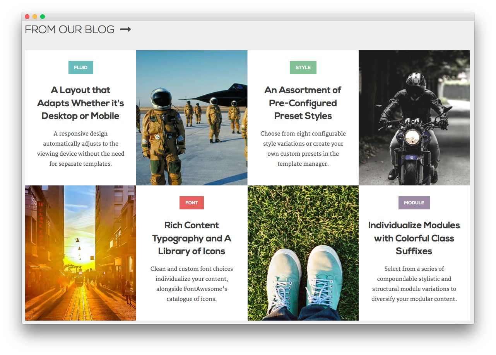
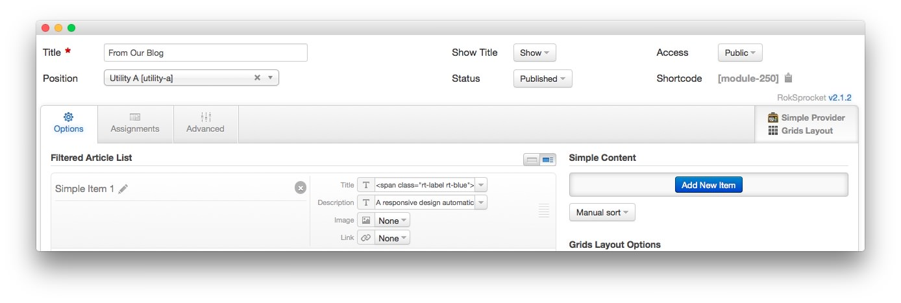
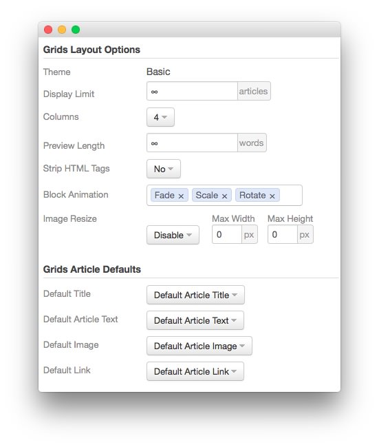
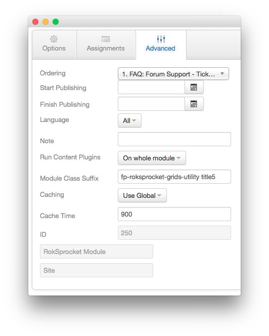

---
title: Ricochet: Recreating the Demo - From Our Blog
description: Your Guide to Recreating Elements of the Ricochet Demo for Joomla
breadcrumb: /joomla:Joomla/!templates:Templates/ricochet:Ricochet

---

From Our Blog
-----

This area of the page is a **RokSprocket** module utilizing the **Simple** content provider and the **Grids** layout.

The settings used in our demo are listed below.

### Details

|      Option      |     Setting     |
| :--------------- | :-------------- |
| Title            | `From Our Blog` |
| Show Title       | Show            |
| Access           | Public          |
| Position         | utility-a       |
| Status           | Published       |
| Content Provider | Simple          |
| Layout Mode      | Grids           |

### Simple Content Provider

The **Title** and **Description** fields in each item have been altered. A few examples of these article changes can be found below.

#### Article 1

**Title**

~~~ .html
Fluid A Layout that Adapts Whether it's Desktop or Mobile
~~~

**Description**

~~~ .html
A responsive design automatically adjusts to the viewing device without the need for separate templates.
~~~

#### Article 2

The second item has a custom image in the **Image** field. This enables the grid item to show up as an image with the **Description** appearing as you move your mouse cursor over it.

**Title**

~~~
Menu Multiple Menu Types to Select and Configure
~~~

**Description**

~~~ .html
The options available are either the Dropdown Menu, or Splitmenu. Each have mobile menu support.
~~~

#### Article 3

**Title**

~~~ .html
Style An Assortment of  Pre-Configured Preset Styles
~~~

**Description**

~~~ .html
Choose from eight configurable style variations or create your own custom presets in the template manager.
~~~

### Layout Options

| Option                | Setting               |
| :----------           | :----------           |
| Theme                 | Basic                 |
| Display Limit         | ∞                     |
| Columns               | 4                     |
| Preview Length        | ∞                     |
| Strip HTML Tags       | No                    |
| Block Animation       | Fade, Scale, Rotate   |
| Image Resize          | Disable               |
| Default Title         | Default Article Title |
| Default Article Text  | Default Article Text  |
| Default Article Image | Default Article Image |
| Default Link          | Default Article Link  |

### Advanced

|        Option       |                Setting                |
| :------------------ | :------------------------------------ |
| Module Class Suffix | `fp-roksprocket-grids-utility title5` |
