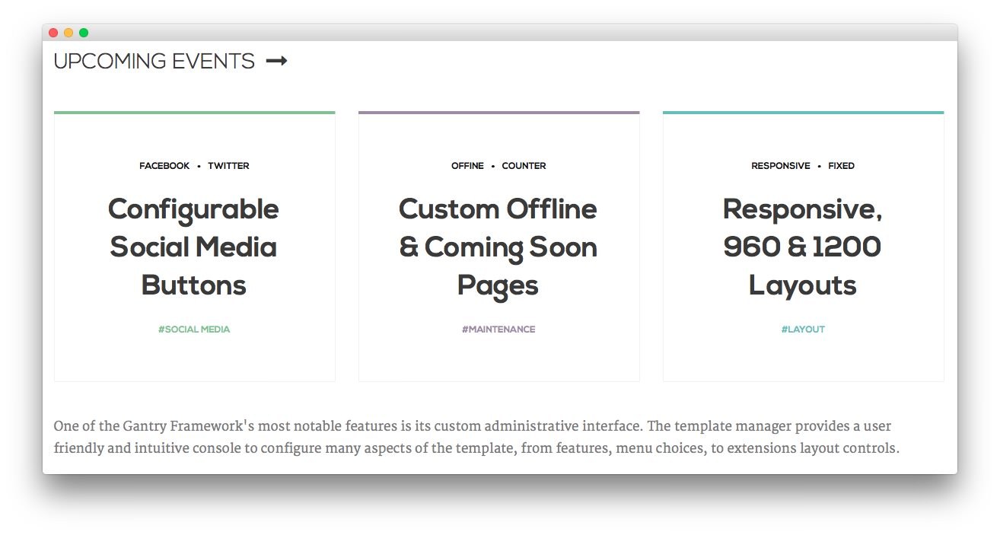
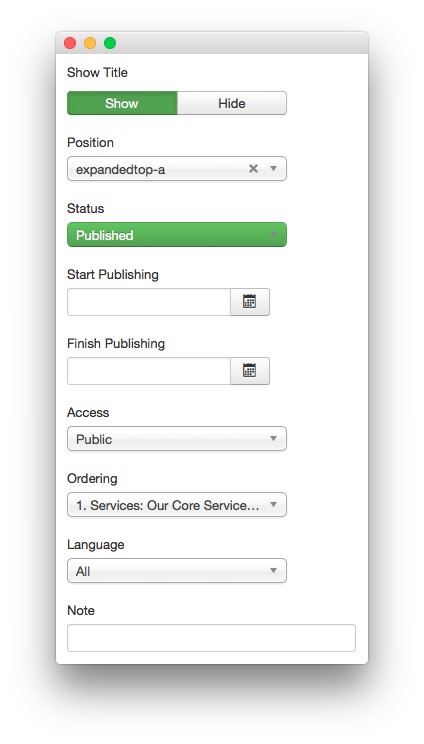
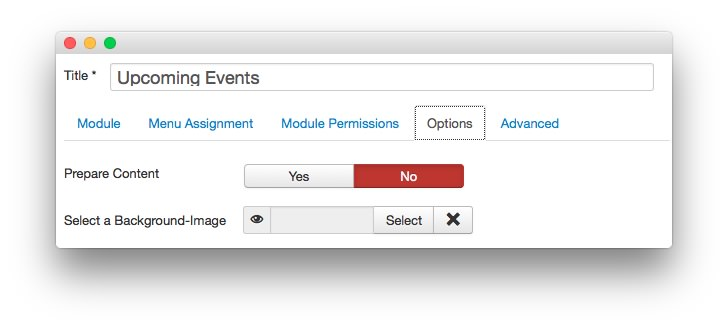
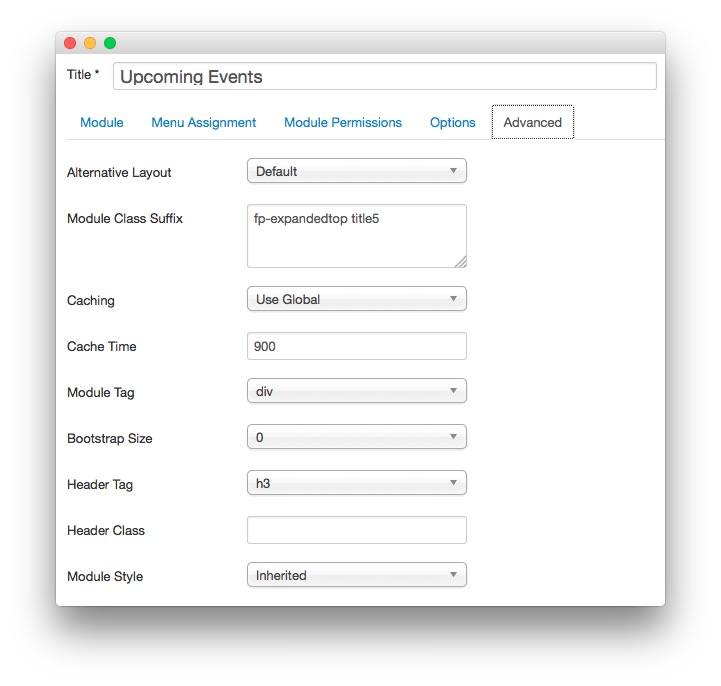

Upcoming Events
----

This area of the front page is a **Custom HTML** module. You will find the settings used in our demo below.

>> Any **mod_custom** (Custom HTML) modules are best handled using either RokPad or no editor as a WYSIWYG editor can cause issues with any code that exists in the **Custom Output** field.

### Details

|   Option   |      Setting      |
| :--------- | :---------------- |
| Title      | `Upcoming Events` |
| Show Title | Show              |
| Position   | expandedtop-a     |
| Status     | Published         |
| Access     | Public            |

### Custom Output

Enter the following in the **Custom Output** text editor.

~~~ .html

  

    

      

        

          <ul class="rt-tags">
            <li>Facebook</li>
            <li>Twitter</li>
          </ul>         
          <h2 class="title">Configurable Social Media Buttons</h2>
          <ul class="rt-tags">
            <li><a href="#">#Social Media</a></li>
          </ul>           
        

      

    
  
    

      

        

          <ul class="rt-tags">
            <li>Offine</li>
            <li>Counter</li>
          </ul>           
          <h2 class="title">Custom Offline &amp; Coming Soon Pages</h2>
          <ul class="rt-tags">
            <li><a href="#">#Maintenance</a></li>
          </ul>           
        

      

    
  
    

      

        

          <ul class="rt-tags">
            <li>Responsive</li>
            <li>Fixed</li>
          </ul>           
          <h2 class="title">Responsive, 960 &amp; 1200 Layouts</h2>
          <ul class="rt-tags">
            <li><a href="#">#Layout</a></li>
          </ul>           
        

      

    
      
  
    

<h6>One of the Gantry Framework's most notable features is its custom administrative interface. The template manager provides a user friendly and intuitive console to configure many aspects of the template, from features, menu choices, to extensions layout controls.</h6>
~~~

### Basic

| Option                    | Setting     |
| :----------               | :---------- |
| Prepare Content           | No          |
| Select a Background Image | Blank       |

### Advanced

|        Option       |         Setting         |
| :------------------ | :---------------------- |
| Module Class Suffix | `fp-expandedtop title5` |
