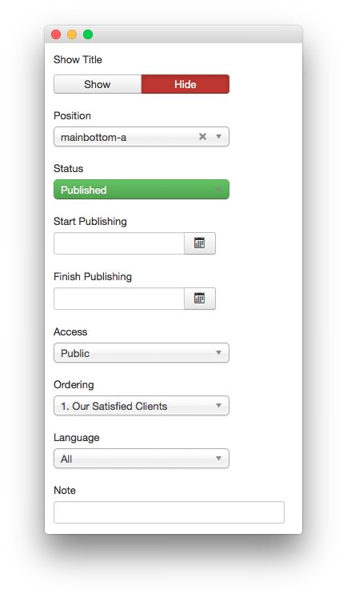
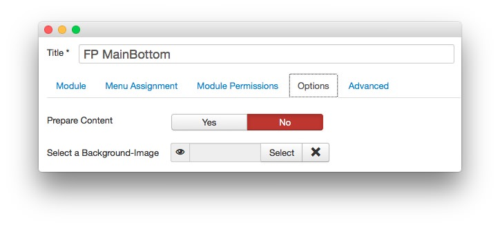
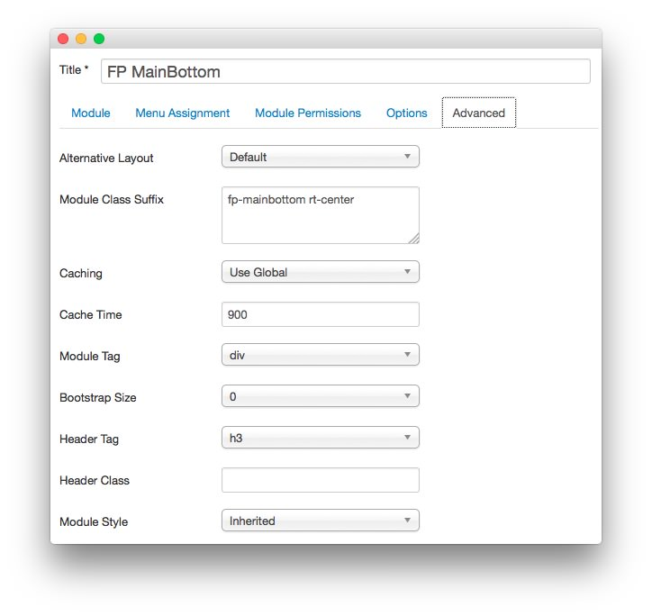

FP MainBottom
-----

This area of the front page is a **mod_custom** module. You will find the settings used in our demo below.

>> Any **mod_custom** (Custom HTML) modules are best handled using either RokPad or no editor as a WYSIWYG editor can cause issues with any code that exists in the **Custom Output** field.

### Details

|   Option   |     Setting     |
| :--------- | :-------------- |
| Title      | `FP MainBottom` |
| Show Title | Hide            |
| Position   | mainbottom-a    |
| Status     | Published       |
| Access     | Public          |

### Custom Output

Enter the following in the **Custom Output** text editor.

~~~ .html
<ul class="rt-tags">
    <li>Colors</li>
    <li>Backgrounds</li>
    <li>Overlays</li>
</ul>
Customize the Style with Ease via the Extensive Color Chooser Options
~~~

### Basic

| Option                    | Setting     |
| :----------               | :---------- |
| Prepare Content           | No          |
| Select a Background Image | Blank       |

### Advanced

|        Option       |          Setting          |
| :------------------ | :------------------------ |
| Module Class Suffix | `fp-mainbottom rt-center` |
