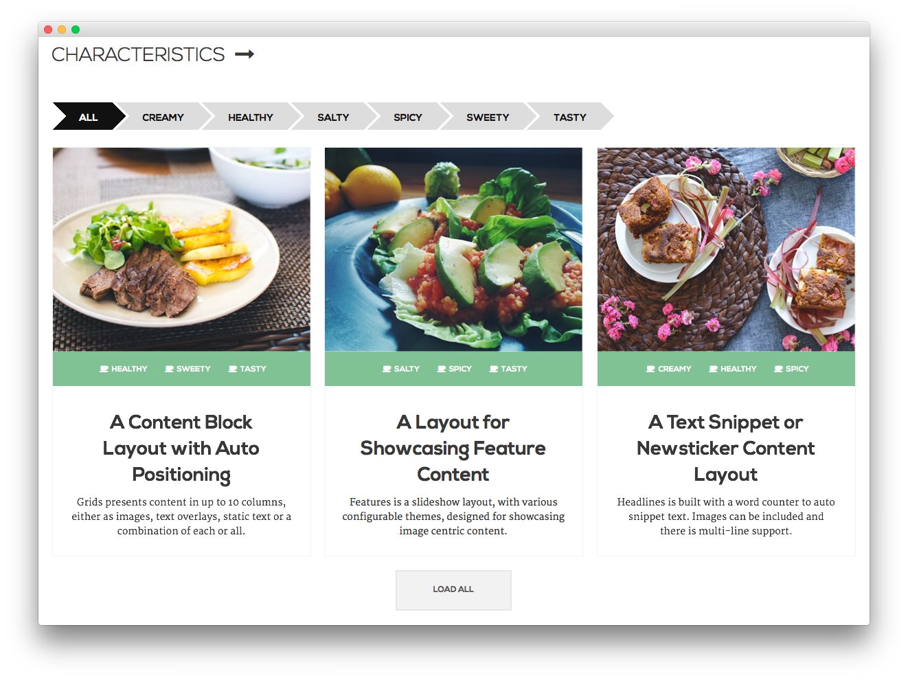
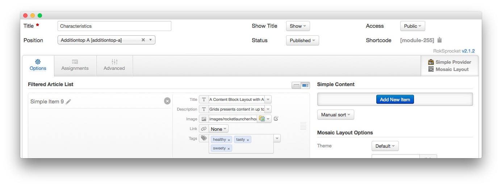
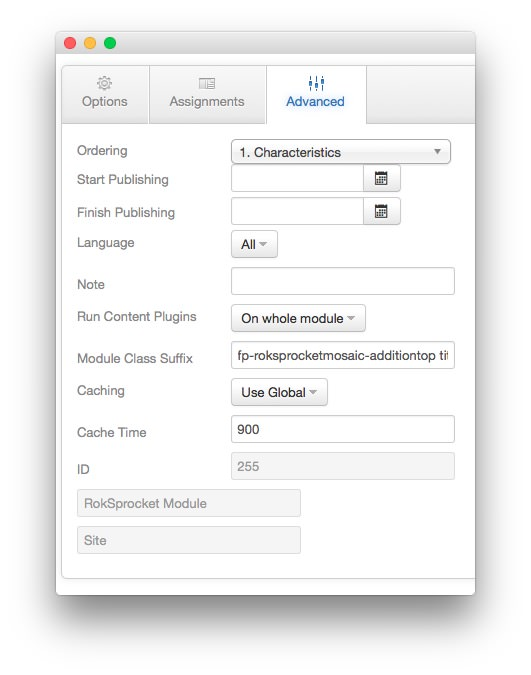

Characteristics
-----

This area of the front page is a **RokSprocket** module with the **Mosaic** layout mode applied. 

One important note here is that if you want to use this module in a different module position, you will want to change the background of the filter/order to match that of the module position you place it in. Here is the code you'll find in the demo.less file that sets this behavior.

~~~ .css
.sprocket-mosaic-filter ul li span:before, .sprocket-mosaic-order ul li span:before {
      border-left: 20px solid @white; // Just change this border color if you place your RokSprocket mosaic on other module position to match its background
    }
~~~

#### Module

|    Option   |      Setting      |
| :---------- | :---------------- |
| Title       | `Characteristics` |
| Show Title  | Hide              |
| Position    | additiontop-a     |
| Layout Type | Mosaic Layout     |
| Provider    | Simple Provider   |
| Status      | Published         |
| Access      | Public            |

#### Article List Item Example

We utilized the **Simple** Content Provider, allowing us to create custom content independent of full articles. The **Title**, **Description**, **Image**, and **Tags** fields in each article have been altered. A few examples of these article changes can be found below.

|    Option   |                                                                            Setting                                                                             |
| :---------- | :------------------------------------------------------------------------------------------------------------------------------------------------------------- |
| Title       | `A Content Block Layout with Auto Positioning`                                                                                                                 |
| Description | `Grids presents content in up to 10 columns, either as images, text overlays, static text or a combination of each or all.` |
| Image       | Custom                                                                                                                                                         |
| Link        | Custom                                                                                                                                                         |
| Tags        | Healthy, Tasty, Sweet                                                                                                                                          |

#### Options

|      Option     |           Setting            |
| :-------------- | :--------------------------- |
| Theme           | Default                      |
| Display Limit   | `∞`                          |
| Columns         | `3`                          |
| Preview Length  | `∞`                          |
| Only Show Tags  |                              |
| Strip HTML Tags | No                           |
| Blocks Per View | `3`                          |
| Article Details | Hide author and date         |
| Block Animation | Fade, Scale, Rotate          |
| Ordering        | Default, Title, Date, Random |
| Image Size      | Disable, 0, 0                |

#### Advanced

|        Option       |                  Setting                  |
| :------------------ | :---------------------------------------- |
| Module Class Suffix | `fp-roksprocketmosaic-additiontop title5` |
