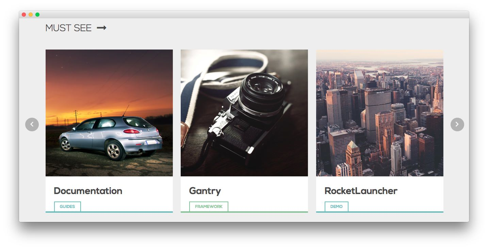
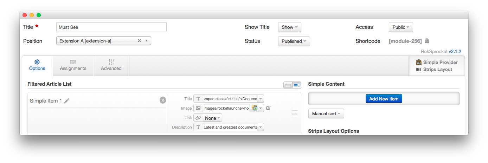
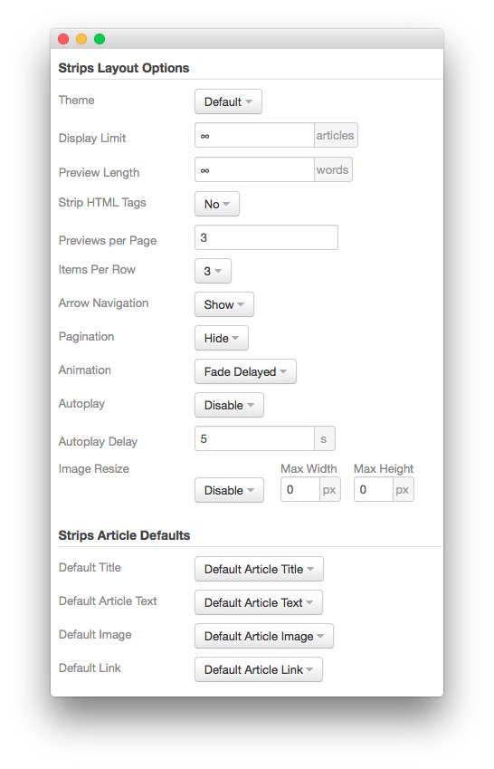
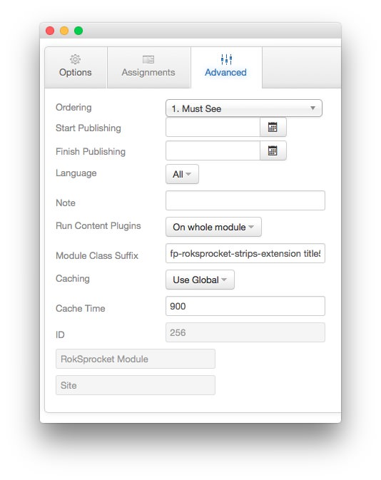

Must See
-----

We used a **RokSprocket** module with the **Strips** layout to make up this area of the front page. You will find the settings used in our demo below.

### Details

|      Option      |   Setting   |
| :--------------- | :---------- |
| Title            | `Must See`  |
| Show Title       | Show        |
| Access           | Public      |
| Position         | extension-a |
| Status           | Published   |
| Content Provider | Simple      |
| Type             | Strips      |

### Simple Item Example

| Option |                                      Setting                                      |
| :----- | :-------------------------------------------------------------------------------- |
| Title  | `DocumentationGuides` |
| Image  | Custom                                                                            |
| Link   | None                                                                              |

#### Description

~~~ .html
Latest and greatest documentation and information concerning clubs, templates, themes, extensions. Topics range from beginner to expert, so dig in!
~~~

### Layout Options

| Option            | Setting      |  
| :---------------- | :----------- |  
| Theme             | Default      |  
| Display Limit     | `∞`          |  
| Preview Length    | `∞`          |  
| Strip HTML Tags   | No           |  
| Previews Per Page | `3`          |  
| Items Per Row     | `3`          |  
| Arrow Navigation  | Show         |  
| Pagination        | Hide         |  
| Animation         | Fade Delayed |  
| Autoplay          | Disable      |  
| Autoplay Delay    | 5            |  
| Image Resize      | Disable      |  

### Advanced

|        Option       |                 Setting                  |
| :------------------ | :--------------------------------------- |
| Module Class Suffix | `fp-roksprocket-strips-extension title5` |
