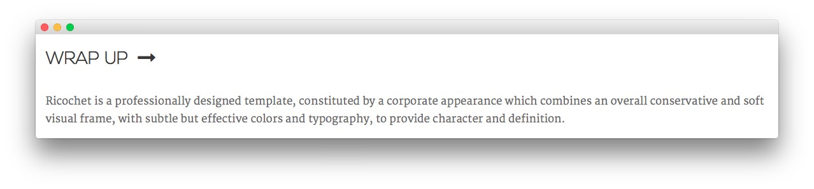
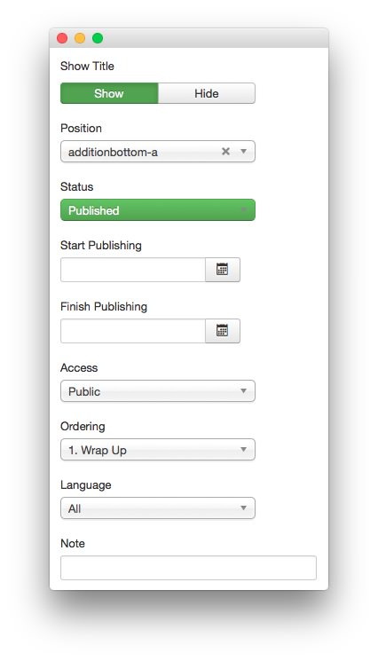
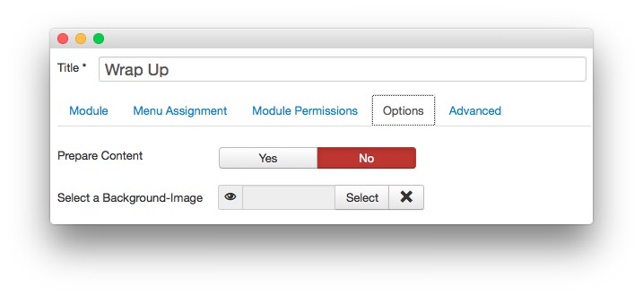
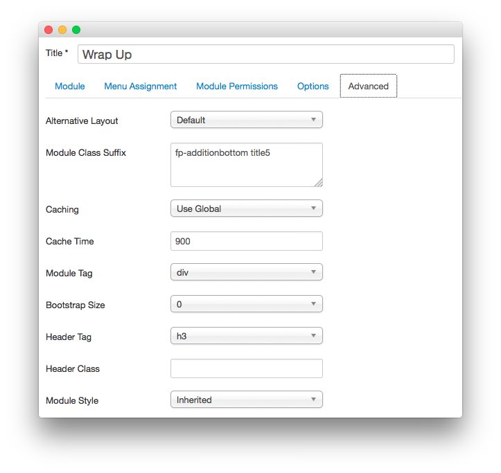

Wrap Up
-----

This area of the front page is a **Custom HTML** module. You will find the settings used in our demo below.

>> Any **mod_custom** (Custom HTML) modules are best handled using either RokPad or no editor as a WYSIWYG editor can cause issues with any code that exists in the **Custom Output** field.

### Details

|   Option   |     Setting      |
| :--------- | :--------------- |
| Title      | `Wrap Up`        |
| Show Title | Show             |
| Position   | additionbottom-a |
| Status     | Published        |
| Access     | Public           |

### Custom Output

~~~ .html
<h6>Ricochet is a professionally designed template, constituted by a corporate appearance which combines an overall conservative and soft visual frame, with subtle but effective colors and typography, to provide character and definition.</h6>
~~~

### Basic

| Option                    | Setting     |
| :----------               | :---------- |
| Prepare Content           | No          |
| Select a Background Image | Blank       |

### Advanced

|        Option       |          Setting           |
| :------------------ | :------------------------- |
| Module Class Suffix | `fp-additionbottom title5` |
