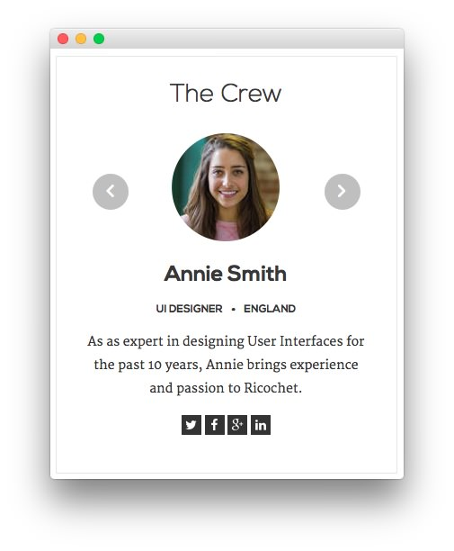
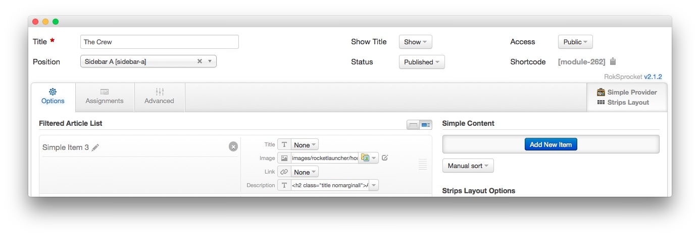
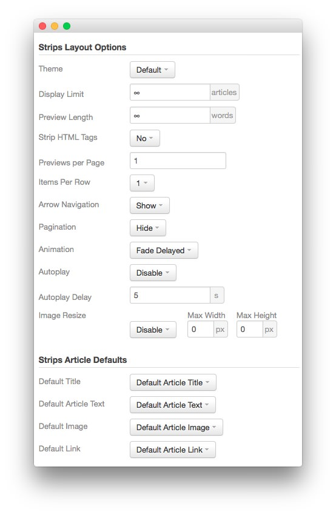
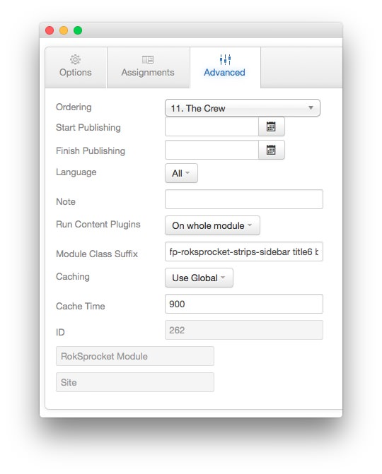

The Crew
-----

We used a **RokSprocket** module with the **Strips** layout to make up this area of the front page. You will find the settings used in our demo below.

### Details

|      Option      |  Setting   |
| :--------------- | :--------- |
| Title            | `The Crew` |
| Show Title       | Show       |
| Access           | Public     |
| Position         | sidebar-a  |
| Status           | Published  |
| Content Provider | Simple     |
| Type             | Strips     |

### Simple Item Example

| Option | Setting |
| :----- | :------ |
| Title  | None    |
| Image  | Custom  |
| Link   | None    |

#### Description

~~~ .html
<h2 class="title nomarginall">Annie Smith</h2>

<ul class="rt-tags">
    <li>UI Designer</li>

    <li>England</li>
</ul>

As as expert in designing User Interfaces for the
past 10 years, Annie brings experience and passion to Ricochet.

    <a class="social-button" href="#" target="_blank"></a> <a class="social-button" href="#" target=
    "_blank"></a> <a class="social-button"
    href="#" target="_blank"></a>
    <a class="social-button" href="#" target="_blank"></a>

~~~

### Layout Options

|       Option      |   Setting    |
| :---------------- | :----------- |
| Theme             | Default      |
| Display Limit     | `∞`          |
| Preview Length    | `∞`          |
| Strip HTML Tags   | No           |
| Previews Per Page | `1`          |
| Items Per Row     | `1`          |
| Arrow Navigation  | Show         |
| Pagination        | Hide         |
| Animation         | Fade Delayed |
| Autoplay          | Disable      |
| Autoplay Delay    | 5            |
| Image Resize      | Disable      |

### Advanced

|        Option       |                        Setting                        |
| :------------------ | :---------------------------------------------------- |
| Module Class Suffix | `fp-roksprocket-strips-sidebar title6 box6 rt-center` |
