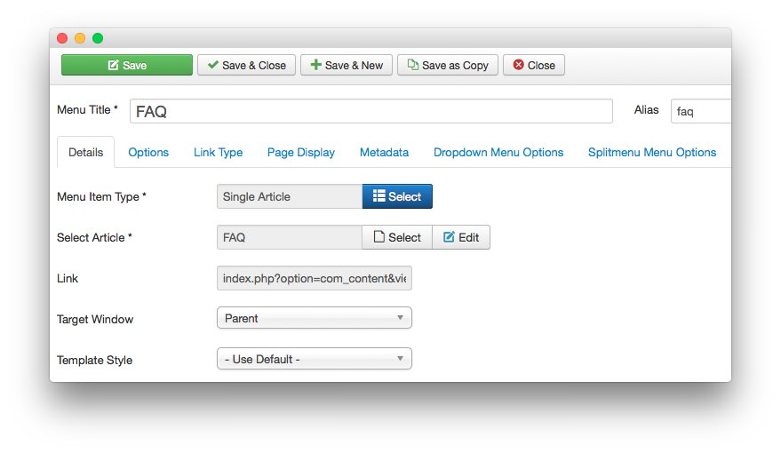
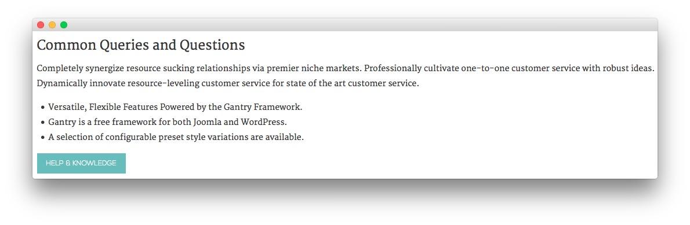
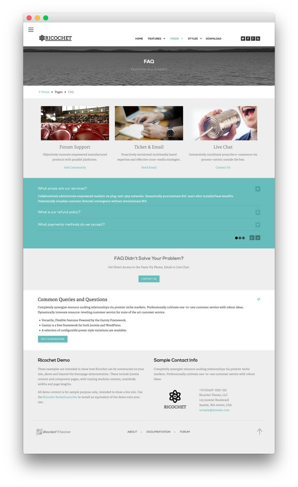
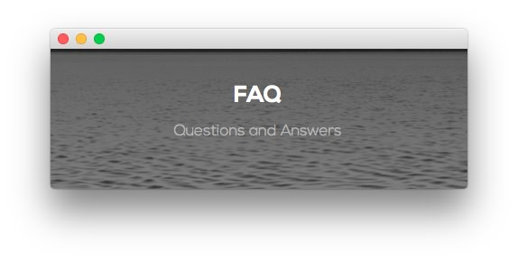
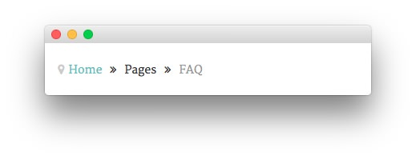
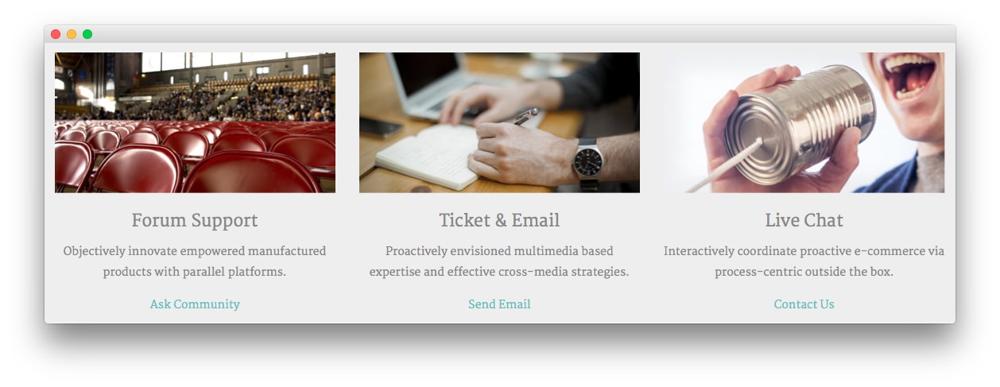
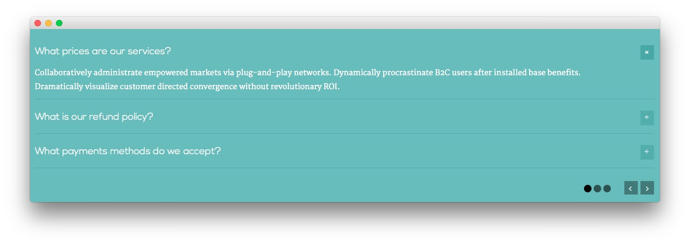
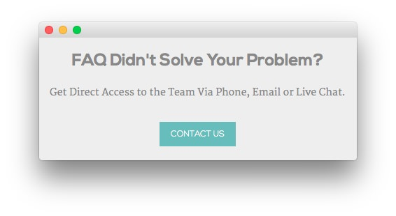
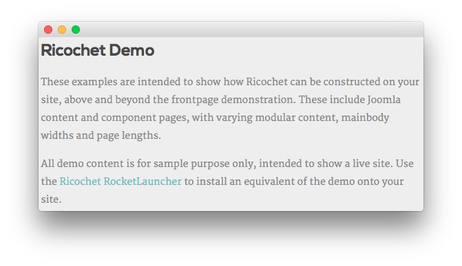

Introduction
-----

The **FAQ** example page demonstrates how you can create a beautiful page with the Ricochet template. Here is some information to help you replicate this page as it appears in the demo.

Menu Item Options
-----

The **FAQ** page is a **Single Article** menu item type. To recreate the layout the way it appears in our demo, enter `faq` in the **Alias** field in the menu item settings. This alias is tied to a class in the demo.less file.

In order for this to work, you should have the **Page Suffix** option set to **On** in **Administrator > Template Manager > Template > Advanced**.

Mainbody
-----

The page's content body is set in the **About Us** article. You will find the content used in the article below.

~~~ .html
<h3>Common Queries and Questions</h3>

Completely synergize resource sucking relationships via premier niche markets. Professionally cultivate one-to-one customer service with robust ideas. Dynamically innovate resource-leveling customer service for state of the art customer service.

<ul>
    <li>Versatile, Flexible Features Powered by the Gantry Framework.</li>
    <li>Gantry is a free framework for both Joomla and WordPress.</li>
    <li>A selection of configurable preset style variations are available.</li>
</ul>

<a href="http://www.rockettheme.com/docs/joomla/templates/ricochet" class="readon">Help &amp; Knowledge</a>

~~~

Modules
-----

Below is a brief rundown of the modules used to make up the demo page.

:   1. **Custom HTML - FAQ** [12%, 45%, se]
    2. **Breadcrumbs** [18%, 12%, se]
    3. **Custom HTML - Forum Support** [21%, 12%, se]
    4. **RokSprocket Lists** [38%, 12%, se]
    5. **Custom HTML - FAQ Didn't Solve Your Problem?** [52%, 35%, se]
    6. **Article Content** [61%, 12%, se]
    7. **Custom HTML - Ricochet Demo** [74%, 12%, se]
    8. **Custom HTML - Sample Contact Info** [74%, 52%, se]

1. [Custom HTML - FAQ](faqpage.md#custom-html---faq)
2. [Breadcrumbs](faqpage#breadcrumbs)
3. [Custom HTML - Forum Support](faqpage.md#custom-html---forum-support)
4. [RokSprocket Lists](faqpage.md#roksprocket-lists)
5. [Custom HTML - FAQ Didn't Solve Your Problem?](faqpage.md#custom-html---faq-didn't-solve-your-problem?)
6. [Article Content](faqpage.md#mainbody)
7. [Custom HTML - Ricochet Demo](faqpage.md#custom-html---ricochet-demo)
8. [Custom HTML - Sample Contact Info](faqpage.md#custom-html---sample-contact-info)

### Custom HTML - FAQ

#### Module

|   Option   |                           Setting                            |
| :--------- | :----------------------------------------------------------- |
| Title      | `FAQ[span class="rt-title-tag"]Questions and Answers[/span]` |
| Show Title | Yes                                                          |
| Position   | feature-a                                                    |
| Status     | Published                                                    |
| Access     | Public                                                       |

>> The title of this module requires RokCandy in order to appear properly on the screen due to the `[span]` tags present. See the main [RokCandy](../../extensions/rokcandy/rokcandy_use.md#rokcandy-use-in-rockettheme-template-demos) guide for additional instructions.

#### Options

|           Option          | Setting |
| :------------------------ | :------ |
| Prepare Content           | No      |
| Select a Background-Image | Blank   |

#### Advanced

|        Option       |                                    Setting                                     |
| :------------------ | :----------------------------------------------------------------------------- |
| Module Class Suffix | `rt-top-large-padding nomarginall rt-center rt-title-large rt-nomodulecontent` |

### Breadcrumbs

#### Module

|        Option       |    Setting    |
| :------------------ | :------------ |
| Title               | `Breadcrumbs` |
| Show You Are Here   | No            |
| Show Home           | Yes           |
| Text for Home Entry |               |
| Show Last           | Yes           |
| Text Separator      |               |
| Show Title          | Hide          |
| Position            | breadcrumb    |
| Status              | Published     |
| Access              | Public        |

##### Advanced

|        Option       |    Setting     |
| :------------------ | :------------- |
| Module Class Suffix | `hidden-phone` |

### Custom HTML - Forum Support

#### Module

| Option      | Setting                                         |
| :---------- | :-----------                                    |
| Title       | `FAQ: Forum Support - Ticket Email - Live Chat` |
| Show Title  | Hide                                            |
| Position    | utility-a                                       |
| Status      | Published                                       |
| Access      | Public                                          |

#### Content

~~~ .html

    

        

            
            <h4 class="medpaddingtop">Forum Support</h4>
            
Objectively innovate empowered manufactured products with parallel platforms.

            
<a href="http://www.rockettheme.com/forum/joomla-template-ricochet">Ask Community</a>

        

    

    

        

            
            <h4 class="medpaddingtop">Ticket &amp; Email</h4>
            
Proactively envisioned multimedia based expertise and effective cross-media strategies.

            
<a href="http://www.rockettheme.com/forum/joomla-template-ricochet">Send Email</a>

        

    

    

        

            
            <h4 class="medpaddingtop">Live Chat</h4>
            
Interactively coordinate proactive e-commerce via process-centric outside the box.

            
<a href="http://www.rockettheme.com/forum/joomla-template-ricochet">Contact Us</a>

        

    

~~~

#### Options

|           Option          | Setting |
| :------------------------ | :------ |
| Prepare Content           | No      |
| Select a Background-Image | Blank   |

#### Advanced

|        Option       |   Setting   |
| :------------------ | :---------- |
| Module Class Suffix | `rt-center` |

### RokSprocket Lists

#### Module

|   Option   |         Setting          |
| :--------- | :----------------------- |
| Title      | `FAQ: RokSprocket Lists` |
| Show Title | Hide                     |
| Position   | maintop-a                |
| Status     | Published                |
| Access     | Public                   |
| Provider   | Simple                   |
| Layout     | Lists Layout             |

#### Filtered Article List Item Sample

| Option |             Setting             |
| :----- | :------------------------------ |
| Title  | `What prices are our services?` |
| Image  | None                            |
| Link   | None                            |

**Description**

~~~ .html
Collaboratively administrate empowered markets via plug-and-play networks. Dynamically procrastinate B2C users after installed base benefits. Dramatically visualize customer directed convergence without revolutionary ROI.
~~~

#### Options

|        Option       | Setting |
| :------------------ | :------ |
| Theme               | Default |
| Display Limit       | ∞       |
| Collapsible Preview | Enable  |
| Preview Length      | ∞       |
| Strip HTML Tags     | No      |
| Previews per Page   | 3       |
| Arrow Navigation    | Show    |
| Pagination          | Show    |
| Autoplay            | Disable |
| Autoplay Delay      | 5       |
| Image Resize        | Disable |

#### Advanced

|        Option       | Setting |
| :------------------ | :------ |
| Module Class Suffix |         |

### Custom HTML - FAQ Didn't Solve Your Problem?

#### Module

| Option      | Setting                          |
| :---------- | :-----------                     |
| Title       | `FAQ Didn't Solve Your Problem?` |
| Show Title  | Show                             |
| Position    | extension-a                      |
| Status      | Published                        |
| Access      | Public                           |

#### Content

~~~ .html

Get Direct Access to the Team Via Phone, Email or Live Chat.

<a href="http://www.rockettheme.com/forum/joomla-template-Ricochet" class="readon largemargintop">Contact Us</a>

~~~

#### Options

| Option                    | Setting     |
| :----------               | :---------- |
| Prepare Content           | No          |
| Select a Background-Image | Blank       |

#### Advanced

| Option              | Setting     |
| :----------         | :---------- |
| Module Class Suffix | `rt-center` |

### Custom HTML - Ricochet Demo

#### Module

| Option      | Setting       |
| :---------- | :-----------  |
| Title       | `Ricochet Demo` |
| Show Title  | Yes           |
| Position    | footer-a      |
| Status      | Published     |
| Access      | Public        |

#### Content

~~~ .html

These examples are intended to show how Ricochet can be constructed on your site, above and beyond the frontpage demonstration. These include Joomla content and component pages, with varying modular content, mainbody widths and page lengths.

All demo content is for sample purpose only, intended to show a live site. Use the <a href="http://www.rockettheme.com/joomla/templates/ricochet">Ricochet RocketLauncher</a> to install an equivalent of the demo onto your site.

~~~

#### Options

| Option                    | Setting     |
| :----------               | :---------- |
| Prepare Content           | No          |
| Select a Background-Image | Blank       |

#### Advanced

| Option              | Setting           |
| :----------         | :----------       |
| Module Class Suffix | `rt-phone-center` |

### Custom HTML - Sample Contact Info

#### Module

| Option      | Setting               |
| :---------- | :-----------          |
| Title       | `Sample Contact Info` |
| Show Title  | Yes                   |
| Position    | footer-b              |
| Status      | Published             |
| Access      | Public                |

#### Content

~~~ .html

Completely synergize resource sucking relationships via premier niche markets. Professionally cultivate one-to-one customer service with robust ideas.

	

		

			
		

	

	

		

			+1(123)456-5555-555 
			Ricochet Theme, LLC 
			123 Joomla! Boulevard 
			Seattle, WA 00000, USA 
			<a href="#">noreply@domain.com</a>
		

	

~~~

#### Options

| Option                    | Setting     |
| :----------               | :---------- |
| Prepare Content           | No          |
| Select a Background-Image | Blank       |

#### Advanced

| Option              | Setting           |
| :----------         | :----------       |
| Module Class Suffix | `rt-phone-center` |

[faqpage]: assets/page_faq.jpeg
[faqmenu]: 
[faqpage2]: assets/page_faq_2.jpeg
[faqpage3]: assets/page_faq_3.jpeg
[faqpage4]: assets/page_faq_4.jpeg
[faqpage5]: 
[faqpage6]: assets/page_faq_6.jpeg
[faqpage7]: assets/page_aboutus_8.jpeg
[faqpage8]: assets/page_aboutus_9.jpeg
[faqpage9]: assets/page_faq_9.jpeg
[faqpage10]: assets/page_faq_10.jpeg
[faqpage11]: assets/page_faq_11.jpeg
[faqpage12]: assets/page_faq_12.jpeg
