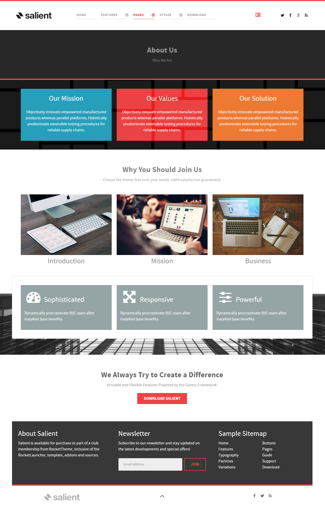
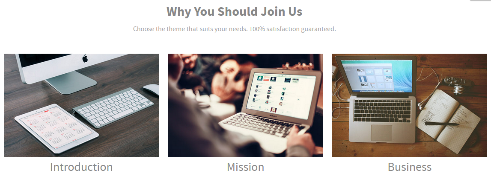
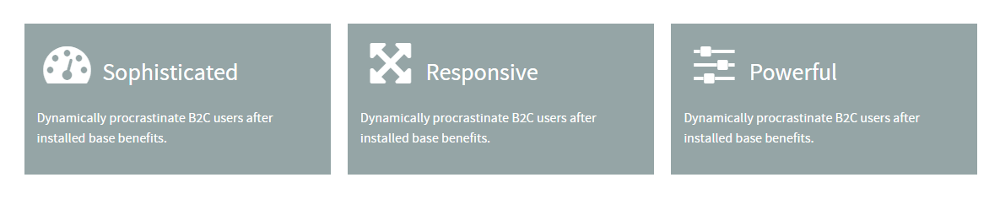
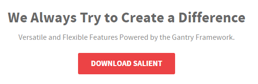
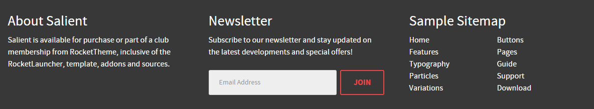

## Introduction

The **About Us** example page demonstrates how you can create a beautiful page with the Salient template. Here is some information to help you replicate this page as it appears in the demo.

## Modules and Particles

Below is a brief rundown of the modules and particles used to make up the demo page.

:   1. **Showcase - Custom HTML (Module)** [10%, 45%, se]
    2. **Above - Custom HTML (Module)** [18%, 10%, se]
    3. **Mainbar - Page Content** [32%, 10%, se]
    4. **Extension - Custom HTML (Module)** [55%, 10%, se]
    5. **Bottom - Custom HTML (Module)** [72%, 10%, se]
    6. **Footer - Custom HTML** [86%, 7%, se]
    7. **Footer - Newsletter** [86%, 36%, se]
    8. **Footer - Custom HTML** [86%, 65%, se]

1. [Showcase](#showcase-section)
2. [Above](#above-section)
3. [Mainbar](#mainbar-section)
4. [Extension](#extension-section)
5. [Bottom](#bottom-section)
6. [Footer](#footer-section)

## Showcase Section

This area of the page is a **Custom HTML** module. You will find the settings used in our demo below.

>> Any **mod_custom** (Custom HTML) modules are best handled using either RokPad or no editor as a WYSIWYG editor can cause issues with any code that exists in the **Custom Output** field.

### Custom HTML (Module)

### Details

| Field      | Setting             |
| :-----     | :-----              |
| Title      | `About Us - Header` |
| Show Title | Hide                |
| Position   | `showcase-a`        |
| Status     | Published           |

### Custom Output

Enter the following in the **Custom Output** text editor.

~~~ .html

  <h2 class="g-layercontent-title">About Us</h2>
  
Who We Are

~~~

### Basic

| Option                    | Setting     |
| :----------               | :---------- |
| Prepare Content           | No          |
| Select a Background Image | Blank       |

### Advanced

| Option              | Setting        |
| :----------         | :----------    |
| Module Class Suffix | `flush center` |

## Above Section

This area of the page is a **Custom HTML** module. You will find the settings used in our demo below.

>> Any **mod_custom** (Custom HTML) modules are best handled using either RokPad or no editor as a WYSIWYG editor can cause issues with any code that exists in the **Custom Output** field.

### Custom HTML (Module)

### Details

| Field      | Setting                         |
| :-----     | :-----                          |
| Title      | `Missions - Values - Solutions` |
| Show Title | Hide                            |
| Position   | `above-a`                     |
| Status     | Published                       |

### Custom Output

Enter the following in the **Custom Output** text editor.

~~~ .html

  

    

      <h2 class="g-title">Our Mission</h2>

      
Objectively innovate empowered manufactured products whereas parallel platforms. Holistically predominate extensible testing procedures for reliable supply chains.

    

  

  

    

      <h2 class="g-title">Our Values</h2>

      
Objectively innovate empowered manufactured products whereas parallel platforms. Holistically predominate extensible testing procedures for reliable supply chains.

    

  

  

    

      <h2 class="g-title">Our Solution</h2>

      
Objectively innovate empowered manufactured products whereas parallel platforms. Holistically predominate extensible testing procedures for reliable supply chains.

    

  

~~~

### Basic

| Option                    | Setting     |
| :----------               | :---------- |
| Prepare Content           | No          |
| Select a Background Image | Blank       |

### Advanced

| Option              | Setting        |
| :----------         | :----------    |
| Module Class Suffix | `flush center` |

## Mainbar Section

The **Mainbar** section includes the **About Us** article, displayed through the **Page Content** particle. Here are the settings found in the **About Us** article.

| Option   | Setting        |
| :-----   | :-----         |
| Title    | `About Us`     |
| Alias    | `about-us`     |
| Status   | Published      |
| Featured | No             |
| Category | `Sample Pages` |

**Content Body**

~~~ .html

  

    

      

        <h2 class="g-layercontent-title">
          Why You Should Join Us
        </h2>
        

          Choose the theme that suits your needs. 100% satisfaction guaranteed.
        

      

    

  

  

    

      

        

          

            
            <h2 class="g-title">
              Introduction
            </h2>
          

        

        

          

            
            <h2 class="g-title">
              Mission
            </h2>
          

        

        

          

            
            <h2 class="g-title">
              Business
            </h2>
          

        

      

    

  

~~~

## Extension Section

This area of the page is a **Custom HTML** module. You will find the settings used in our demo below.

>> Any **mod_custom** (Custom HTML) modules are best handled using either RokPad or no editor as a WYSIWYG editor can cause issues with any code that exists in the **Custom Output** field.

### Custom HTML (Module)

### Details

| Field      | Setting                                 |
| :-----     | :-----                                  |
| Title      | `Sophisticated - Responsive - Powerful` |
| Show Title | Hide                                    |
| Position   | `extension-a`                           |
| Status     | Published                               |

### Custom Output

Enter the following in the **Custom Output** text editor.

~~~ .html

  

    

      <h2 class="g-title"> Sophisticated</h2>
      
Dynamically procrastinate B2C users after installed base benefits.

    

  

  

    

      <h2 class="g-title"> Responsive</h2>
      
Dynamically procrastinate B2C users after installed base benefits.

    

  

  

    

      <h2 class="g-title"> Powerful</h2>
      
Dynamically procrastinate B2C users after installed base benefits.

    

  

~~~

### Basic

| Option                    | Setting     |
| :----------               | :---------- |
| Prepare Content           | No          |
| Select a Background Image | Blank       |

### Advanced

| Option              | Setting     |
| :----------         | :---------- |
| Module Class Suffix | Blank       |

## Bottom Section

This area of the page is a **Custom HTML** module. You will find the settings used in our demo below.

>> Any **mod_custom** (Custom HTML) modules are best handled using either RokPad or no editor as a WYSIWYG editor can cause issues with any code that exists in the **Custom Output** field.

### Custom HTML (Module)

### Details

| Field      | Setting                                |
| :-----     | :-----                                 |
| Title      | `We Always Try to Create a Difference` |
| Show Title | Hide                                   |
| Position   | `bottom-a`                             |
| Status     | Published                              |

### Custom Output

Enter the following in the **Custom Output** text editor.

~~~ .html

  <h2 class="g-layercontent-title">We Always Try to Create a Difference</h2>
  
Versatile and Flexible Features Powered by the Gantry Framework.

  <a href="http://www.rockettheme.com/joomla/templates/salient" class="button">Download Salient</a>

~~~

### Basic

| Option                    | Setting     |
| :----------               | :---------- |
| Prepare Content           | No          |
| Select a Background Image | Blank       |

### Advanced

| Option              | Setting        |
| :----------         | :----------    |
| Module Class Suffix | `flush center` |

## Footer Section

:   1. **Custom HTML 1** [30%, 5%, se]
    2. **Newsletter** [30%, 38%, se]
    3. **Custom HTML 2** [30%, 70%, se]

The **Footer** section is made up of two modules and one particle in a single row. This includes a **Newsletter** particle surrounded by two **Custom HTML** modules.

Settings used in our demo for each of these modules and particle can be found below.

### Custom HTML 1 (Module)

#### Module settings

| Field        | Setting         |
| :-----       | :-----          |
| Module Title | `About Salient` |
| Show Title   | Show            |
| Position     | `footer-a`      |

**Custom HTML**
~~~ .html
Salient is available for purchase or part of a club membership from RocketTheme, inclusive of the RocketLauncher, template, addons and sources.
~~~

### Newsletter (Particle)

#### Particle Settings

| Field          | Setting           |
| :-----         | :-----            |
| Particle Name  | `Newsletter`      |
| CSS Classes    | Blank             |
| Title          | `Newsletter`      |
| InputBox Text  | `Email Address`   |
| Button Text    | `Join`            |
| Feedburner URI | `rocketthemeblog` |
| Button Classes | `button-4`        |

**Heading Text**
~~~ .html
Subscribe to our newsletter and stay updated on the latest developments and special offers!
~~~

#### Block Settings

| Field          | Setting |
| :-----         | :-----  |
| CSS ID         | Blank   |
| CSS Classes    | Blank   |
| Variations     | Blank   |
| Tag Attributes | Blank   |
| Block Size     | `33.3%` |

### Custom HTML 2 (Module)

#### Module settings

| Field        | Setting          |
| :-----       | :-----           |
| Module Title | `Sample Sitemap` |
| Show Title   | Show             |
| Position     | `footer-c`       |

**Custom HTML**
~~~ .html

  

    <ul class="nomarginall noliststyle">
      <li><a href="index.php">Home</a></li>
      <li><a href="index.php?option=com_gantry5&amp;view=custom&amp;Itemid=105">Features</a></li>
      <li><a href="index.php?option=com_gantry5&amp;view=custom&amp;Itemid=106">Typography</a></li>
      <li><a href="index.php?option=com_gantry5&amp;view=custom&amp;Itemid=106">Particles</a></li>
      <li><a href="index.php?option=com_content&amp;view=article&amp;id=3&amp;Itemid=107">Variations</a></li>
    </ul>
  

  

    <ul class="nomarginall noliststyle">
      <li><a href="index.php?option=com_gantry5&amp;view=custom&amp;Itemid=106">Buttons</a></li>
      <li><a href="index.php?option=com_content&amp;view=article&amp;id=4&amp;Itemid=111">Pages</a></li>
      <li><a href="http://www.rockettheme.com/docs/joomla/templates/salient">Guide</a></li>
      <li><a href="http://www.rockettheme.com/forum/joomla-template-salient">Support</a></li>
      <li><a href="http://www.rockettheme.com/joomla/templates/salient">Download</a></li>
    </ul>   
  
  

~~~