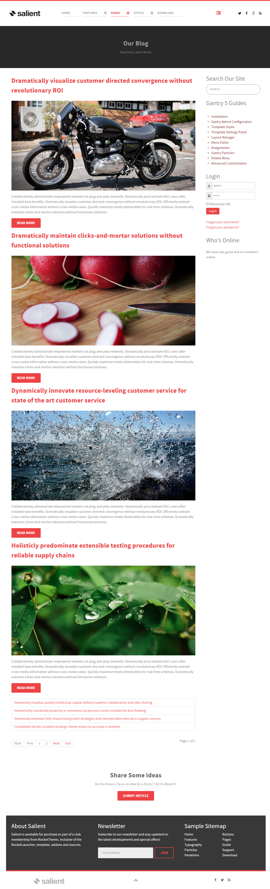
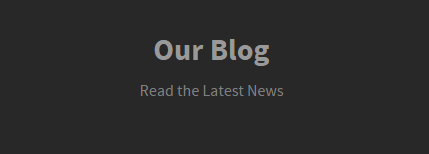
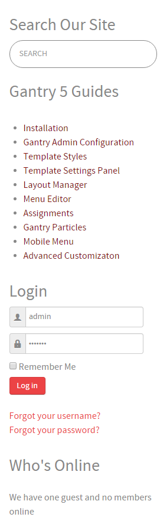

# Introduction

The **Blog** example page demonstrates how you can create a beautiful page with the Salient template. Here is some information to help you replicate this page as it appears in the demo.

# Modules and Particles

Below is a brief rundown of the modules and particles used to make up the demo page.

:   1. **Showcase - Custom HTML (Module)** [5%, 45%, se]
    2. **Mainbar - Page Content** [9%, 5%, se]
    3. **Aside - RokAjaxSearch (Module)** [9%, 75%, se]
    4. **Aside - Custom HTML (Module)** [12%, 75%, se]
    5. **Aside - Login (Module)** [20%, 75%, se]
    6. **Aside - Who's Online (Module)** [28%, 75%, se]
    7. **Bottom - Custom HTML (Module)** [87%, 35%, se]

1. [Showcase](#showcase-section)
2. [Mainbar](#mainbar-section)
3. [Aside](#aside-section)
4. [Bottom](#bottom-section)

# Showcase Section

This area of the page is a **Custom HTML** module. You will find the settings used in our demo below.

>> Any **mod_custom** (Custom HTML) modules are best handled using either RokPad or no editor as a WYSIWYG editor can cause issues with any code that exists in the **Custom Output** field.

## Custom HTML (Module)

### Details

| Field      | Setting             |
| :-----     | :-----              |
| Title      | `Our Blog - Header` |
| Show Title | Hide                |
| Position   | `showcase-a`        |
| Status     | Published           |

### Custom Output

Enter the following in the **Custom Output** text editor.

~~~ .html

    <h2 class="g-layercontent-title">Our Blog</h2>
    
Read the Latest News

~~~

### Basic

| Option                    | Setting     |
| :----------               | :---------- |
| Prepare Content           | No          |
| Select a Background Image | Blank       |

### Advanced

| Option              | Setting        |
| :----------         | :----------    |
| Module Class Suffix | `flush center` |

# Mainbar Section

The **Mainbar** section includes several articles assigned to the **Joomla Blog** category, displayed through the **Page Content** particle. Here are the settings found in the **Dramatically visualize customer directed convergence without revolutionary ROI** article.

| Option   | Setting                                                                          |
| :-----   | :-----                                                                           |
| Title    | `Dramatically visualize customer directed convergence without revolutionary ROI` |
| Alias    | `dramatically-visualize-customer-directed-convergence-without-revolutionary-roi` |
| Status   | Published                                                                        |
| Featured | No                                                                               |
| Category | `Joomla Blog`                                                                    |

**Content Body**

~~~ .html

Collaboratively administrate empowered markets via plug-and-play networks. Dynamically procrastinate B2C users after installed base benefits. Dramatically visualize customer directed convergence without revolutionary ROI. Efficiently unleash cross-media information without cross-media value. Quickly maximize timely deliverables for real-time schemas. Dramatically maintain clicks-and-mortar solutions without functional solutions.

<a class="button" href="#">Read More</a>
~~~

# Aside Section

:   1. **RokAjaxSearch (Module)** [7%, 15%, se]
    2. **Custom HTML (Module)** [20%, 15%, se]
    3. **Login (Module)** [50%, 15%, se]
    4. **Who's Online (Module)** [80%, 15%, se]

This area of the page consists of the **Aside** section, which sits to the right of the **Mainbar** section in the **Layout Manager**.

Here is a breakdown of the modules used in the `aside` module position assigned to the **Aside** section in the **Layout Manager** for the **Blog** sample page:

* RokAjaxSearch (Module)
* Custom HTML (Module)
* Login (Module)
* Who's Online (Module)

>> Any **mod_custom** (Custom HTML) modules are best handled using either RokPad or no editor as a WYSIWYG editor can cause issues with any code that exists in the **Custom Output** field.

## RokAjaxSearch (Module)

The Site Search area of the front page is a **mod_rokajaxsearch** module that allows visitors to search your site using the powerful RokAjaxSearch tool.

### Details

| Option      | Setting           |
| :---------- | :----------       |
| Title       | `Search Our Site` |
| Show Title  | Show              |
| Position    | aside             |
| Status      | Published         |
| Access      | Public            |

### Module

| Option                            | Setting                                                  |
| :----------                       | :----------                                              |
| Search Page URL                   | `index.php?option=com_search&view=search&tmpl=component` |
| Advanced Search Page URL          | `index.php?option=com_search&view=search`                |
| Include RokAjaxSearch default CSS | No                                                       |
| Theme Style                       | Light                                                    |
| Searchphrase                      | Any words                                                |
| Ordering                          | Newest First                                             |
| Limit                             | 10                                                       |
| Results Per Page                  | 3                                                        |
| Google Web Search                 | No                                                       |
| Google Blog Search                | No                                                       |
| Google Images Search              | No                                                       |
| Google Videos Search              | No                                                       |
| Show Pagination                   | Yes                                                      |
| Google SafeSearch                 | Moderate                                                 |
| Image Size to Search              | Medium                                                   |
| Show Estimated                    | Yes                                                      |
| Hide div id(s)                    | Blank                                                    |
| Link to All Results               | Yes                                                      |
| Show Description                  | Yes                                                      |
| Include (Category/Section)        | Yes                                                      |
| Show Read More Link               | Yes                                                      |

### Advanced

| Option              | Setting     |
| :----------         | :---------- |
| Module Class Suffix | Blank       |

## Custom HTML (Module)

### Details

| Field      | Setting                                 |
| :-----     | :-----                                  |
| Title      | `Sophisticated - Responsive - Powerful` |
| Show Title | Hide                                    |
| Position   | `extension-a`                           |
| Status     | Published                               |

### Custom Output

Enter the following in the **Custom Output** text editor.

~~~ .html

  

    

      <h2 class="g-title"> Sophisticated</h2>
      
Dynamically procrastinate B2C users after installed base benefits.

    

  

  

    

      <h2 class="g-title"> Responsive</h2>
      
Dynamically procrastinate B2C users after installed base benefits.

    

  

  

    

      <h2 class="g-title"> Powerful</h2>
      
Dynamically procrastinate B2C users after installed base benefits.

    

  

~~~

### Basic

| Option                    | Setting     |
| :----------               | :---------- |
| Prepare Content           | No          |
| Select a Background Image | Blank       |

### Advanced

| Option              | Setting     |
| :----------         | :---------- |
| Module Class Suffix | Blank       |

## Login (Module)

### Details

| Field      | Setting   |
| :-----     | :-----    |
| Title      | `Login`   |
| Show Title | Show      |
| Position   | `aside`   |
| Status     | Published |

### Options

| Field                   | Setting |
| :-----                  | :-----  |
| Pre-text                | Blank   |
| Post-text               | Blank   |
| Login Redirection Page  | Default |
| Logout Redirection Page | Default |
| Show Greeting           | Yes     |
| Show Name/Username      | Name    |
| Encrypt Login Form      | No      |
| Display Labels          | Icons   |

### Advanced

| Field               | Setting |
| :-----              | :-----  |
| Module Class Suffix | `box3`  |

## Who's Online (Module)

### Details

| Field      | Setting   |
| :-----     | :-----    |
| Title      | `Who's Online`   |
| Show Title | Show      |
| Position   | `aside`   |
| Status     | Published |

### Options

| Field   | Setting             |
| :-----  | :-----              |
| Display | # of Guests / Users |

### Advanced

| Field               | Setting |
| :-----              | :-----  |
| Module Class Suffix | Blank   |

## Bottom Section

This area of the page is a **Custom HTML** module. You will find the settings used in our demo below.

>> Any **mod_custom** (Custom HTML) modules are best handled using either RokPad or no editor as a WYSIWYG editor can cause issues with any code that exists in the **Custom Output** field.

### Custom HTML (Module)

### Details

| Field      | Setting            |
| :-----     | :-----             |
| Title      | `Share Some Ideas` |
| Show Title | Show               |
| Position   | `bottom-a`         |
| Status     | Published          |

### Custom Output

Enter the following in the **Custom Output** text editor.

~~~ .html

    <h2 class="g-layercontent-title">Share Some Ideas</h2>
    
Do You Have a Tip or an Idea for a Story? Tell Us About It.

    <a href="http://www.rockettheme.com/joomla/templates/salient" class="button button-2">Submit Article</a>

~~~

### Basic

| Option                    | Setting     |
| :----------               | :---------- |
| Prepare Content           | No          |
| Select a Background Image | Blank       |

### Advanced

| Option              | Setting        |
| :----------         | :----------    |
| Module Class Suffix | `flush center` |
