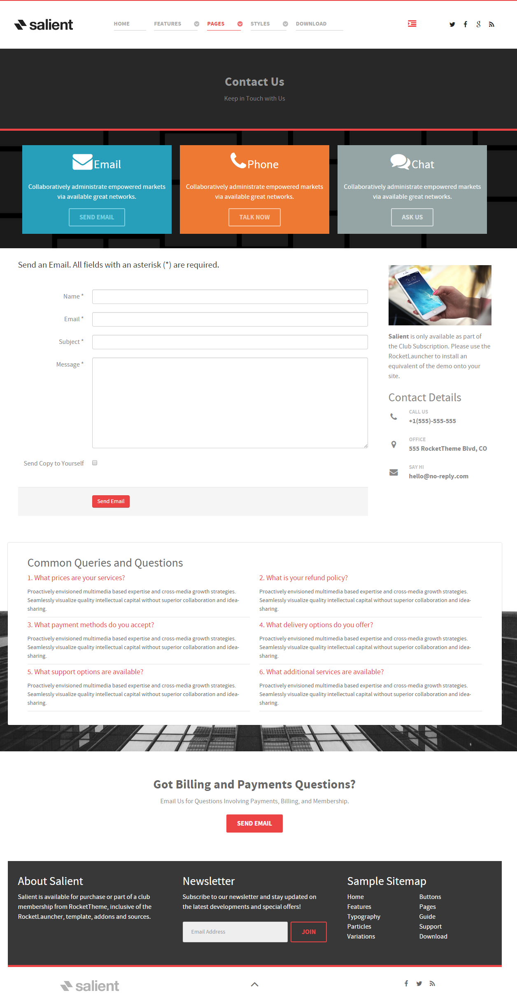
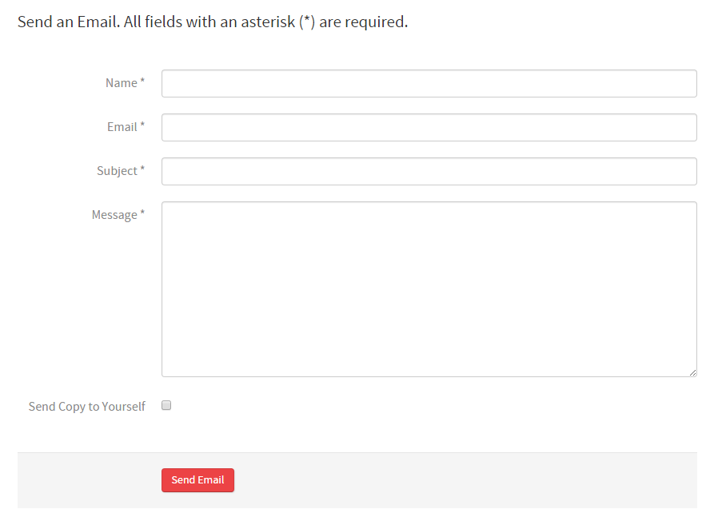
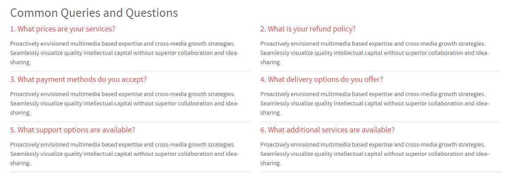

## Introduction

The **Contact** example page demonstrates how you can create a beautiful page with the Salient template. Here is some information to help you replicate this page as it appears in the demo.

## Modules and Particles

Below is a brief rundown of the modules and particles used to make up the demo page.

:   1. **Showcase - Custom HTML (Module)** [9%, 40%, se]
    2. **Above - Custom HTML (Module)** [14%, 5%, se]
    3. **Mainbar - Page Content** [26%, 9%, se]
    4. **Aside - Custom HTML (Module)** [26%, 70%, se]
    5. **Bottom - Custom HTML (Module)** [77%, 30%, se]

1. [Showcase](#showcase-section)
2. [Above](#above-section)
2. [Mainbar](#mainbar-section)
3. [Aside](#aside-section)
4. [Bottom](#bottom-section)

## Showcase Section

This area of the page is a **Custom HTML** module. You will find the settings used in our demo below.

>> Any **mod_custom** (Custom HTML) modules are best handled using either RokPad or no editor as a WYSIWYG editor can cause issues with any code that exists in the **Custom Output** field.

### Custom HTML (Module)

### Details

| Field      | Setting            |
| :-----     | :-----             |
| Title      | `Contact - Header` |
| Show Title | Hide               |
| Position   | `showcase-a`       |
| Status     | Published          |

### Custom Output

Enter the following in the **Custom Output** text editor.

~~~ .html

  <h2 class="g-layercontent-title">Contact</h2>
  
Keep in Touch with Us

~~~

### Basic

| Option                    | Setting     |
| :----------               | :---------- |
| Prepare Content           | No          |
| Select a Background Image | Blank       |

### Advanced

| Option              | Setting        |
| :----------         | :----------    |
| Module Class Suffix | `flush center` |

## Above Section

This area of the page is a **Custom HTML** module. You will find the settings used in our demo below.

>> Any **mod_custom** (Custom HTML) modules are best handled using either RokPad or no editor as a WYSIWYG editor can cause issues with any code that exists in the **Custom Output** field.

### Custom HTML (Module)

### Details

| Field      | Setting                |
| :-----     | :-----                 |
| Title      | `Email - Phone - Chat` |
| Show Title | Hide                   |
| Position   | `above-a`              |
| Status     | Published              |

### Custom Output

Enter the following in the **Custom Output** text editor.

~~~ .html

  

    

      
      <h2 class="g-title">Email</h2>
      
Collaboratively administrate empowered markets via available great networks.

      <a class="button button-4" href="">Send Email</a>
    

  

  

    

      
      <h2 class="g-title">Phone</h2>
      
Collaboratively administrate empowered markets via available great networks.

      <a class="button button-4" href="">Talk Now</a>
    

  

  

    

      
      <h2 class="g-title">Chat</h2>
      
Collaboratively administrate empowered markets via available great networks.

      <a class="button button-4" href="">Ask Us</a>
    

  

~~~

### Basic

| Option                    | Setting     |
| :----------               | :---------- |
| Prepare Content           | No          |
| Select a Background Image | Blank       |

### Advanced

| Option              | Setting     |
| :----------         | :---------- |
| Module Class Suffix | Blank       |

## Mainbar Section

The **Mainbar** section is set to `60`% width and both the **Sidebar** and **Aside** sections are set to `20`%.

The page's content is sourced from a **Single Contact** menu item assigned to the outline. This creates the contact form as seen in our demo.

Settings used in our demo for each of these particles can be found below.

### Page Content

#### Particle Settings

| Field         | Setting        |
| :-----        | :-----         |
| Particle Name | `Page Content` |

#### Block Settings

| Field          | Setting |
| :-----         | :-----  |
| CSS ID         | Blank   |
| CSS Classes    | Blank   |
| Variations     | Blank   |
| Tag Attributes | Blank   |
| Block Size     | `100%`  |

## Aside Section

The **Aside** section is set to `20`% width.

This area of the page is an **Contact** particle. You will find the settings used in our demo below.

### Contact (Particle)

#### Particle Settings

| Field                | Setting             |
| :-----               | :-----              |
| Particle Name        | `Contact`           |
| CSS Classes          | Blank               |
| Title                | `Contact Details`   |
| Contact Item 1 Name  | `Call Us`           |
| Contact Item 1 Icon  | `fa fa-phone fa-fw` |
| Contact Item 1 Value | `+1(555)-555-555`   |
| Map Position         | Top                 |
| Maps                 | Blank               |

## Extension Section

The **Extension** section consists of an **Info List** particle assigned to the `extension-a` module position.

You will find the settings used in our demo below.

### Info List (Particle)

#### Particle Settings

| Field                            | Setting                                                                                                                                                                                 |
| :-----                           | :-----                                                                                                                                                                                  |
| Particle Name                    | `Info List`                                                                                                                                                                             |
| CSS Classes                      | Blank                                                                                                                                                                                   |
| Title                            | `Common Queries and Questions`                                                                                                                                                          |
| Description                      | Blank                                                                                                                                                                                   |
| Grid Column                      | 2 Columns                                                                                                                                                                               |
| Info Lists Item 1 Name           | `What prices are your services?`                                                                                                                                                        |
| Info Lists Item 1 Image          | Blank                                                                                                                                                                                   |
| Info Lists Item 1 Image Location | Left                                                                                                                                                                                    |
| Info Lists Item 1 Text Style     | Compact                                                                                                                                                                                 |
| Info Lists Item 1 Image Style    | Compact                                                                                                                                                                                 |
| Info Lists Item 1 Description    | Proactively envisioned multimedia based expertise and cross-media growth strategies. Seamlessly visualize quality intellectual capital without superior collaboration and idea-sharing. |
| Info Lists Item 1 Tag            | Blank                                                                                                                                                                                   |
| Info Lists Item 1 Sub Tag        | Blank                                                                                                                                                                                   |
| Info Lists Item 1 Label          | Blank                                                                                                                                                                                   |
| Info Lists Item 1 Link           | `#`                                                                                                                                                                                     |
| Info Lists Item 1 Icon           | Blank                                                                                                                                                                                   |
| Info Lists Item 1 CSS Classes    | Blank                                                                                                                                                                                   |

## Bottom Section

This area of the page is a **Custom HTML** module assigned to the `bottom-a` module position. You will find the settings used in our demo below.

>> Any **mod_custom** (Custom HTML) modules are best handled using either RokPad or no editor as a WYSIWYG editor can cause issues with any code that exists in the **Custom Output** field.

### Custom HTML (Module)

### Details

| Field      | Setting                               |
| :-----     | :-----                                |
| Title      | `Got Billing and Payments Questions?` |
| Show Title | Hide                                  |
| Position   | `bottom-a`                            |
| Status     | Published                             |

### Custom Output

Enter the following in the **Custom Output** text editor.

~~~ .html

  <h2 class="g-layercontent-title">Got Billing and Payments Questions?</h2>
  
Email Us for Questions Involving Payments, Billing, and Membership.

  <a href="http://www.rockettheme.com/joomla/templates/salient" class="button">Send Email</a>

~~~

### Basic

| Option                    | Setting     |
| :----------               | :---------- |
| Prepare Content           | No          |
| Select a Background Image | Blank       |

### Advanced

| Option              | Setting        |
| :----------         | :----------    |
| Module Class Suffix | `flush center` |

