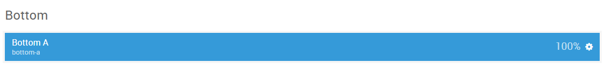
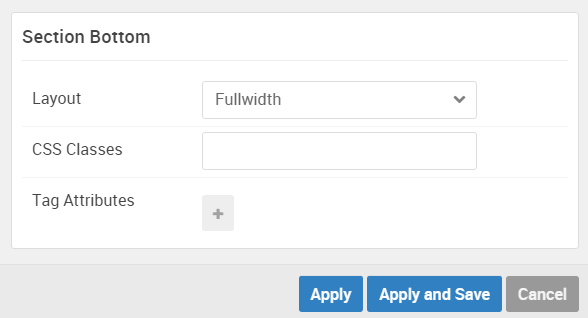

## Introduction

The **Bottom** section includes one module position, `bottom-a`. This module position is created using the Layout Manager.

Here is a breakdown of the module(s) and particle(s) that appear in this section:

* [Bottom A (module position)](#bottom-a-(module-position))
    - [Promo Content (particle)](#gantry-5-particle-(testimonial))

## Section Settings

| Option         | Setting   |
| :-----         | :-----    |
| Layout         | Fullwidth |
| CSS Classes    | Blank     |
| Tag Attributes | Blank     |

## Bottom A (module position)

#### Particle Settings

| Option | Setting      |
| :----- | :-----       |
| Key    | `bottom-a` |
| Chrome | gantry       |

#### Block Settings

| Option         | Setting |
| :-----         | :-----  |
| CSS ID         | Blank   |
| CSS Classes    | Blank   |
| Variations     | Title 1 |
| Tag Attributes | Blank   |
| Block Size     | `100%`  |

### Assigned Module(s)

#### Gantry 5 Particle (Testimonial)

We added a **Testimonial** particle to the `bottom-a` position. This was done by creating a **Gantry 5 Particle** module and selecting the **Testimonial** particle in the module's settings. 

You will find the particle settings used in this particle below:

##### Particle Settings

| Option                | Setting             |
| :-----                | :-----              |
| CSS Classes           | Blank               |
| Title                 | Blank               |
| Intro                 | Blank               |
| Grid Column           | 1 Column            |
| Testimonial 1 Name    | `Eddie Lobanovsky`  |
| Testimonial 1 Image   | Custom              |
| Testimonial 1 Author  | `Eddie Lobanovsky`  |
| Testimonial 1 Company | `Super Corporation` |
| Testimonial 1 Link    | `#`                 |

**Testimonial 1 Content**
~~~ .html
The Gantry 5 Framework is an ideal platform for users of all levels, whether beginners or web professionals. The administrative interface is both simple to use, intuitive and highly flexible, allowing for swift and extensive changes.
~~~