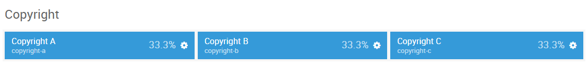

## Introduction

The **Copyright** section includes three module positions, `copyright-a`, `copyright-b`, and `copyright-c`. These module positions are created using the Layout Manager.

Here is a breakdown of the module(s) and particle(s) that appear in this section:

* [Copyright A (module position)](#copyright-a-(module-position))
    - [Logo (particle)](#gantry-5-particle-(logo))
* [Copyright B (module position)](#copyright-b-(module-position))
    - [Menu (particle)](#gantry-5-particle-(menu))
* [Copyright C (module position)](#copyright-c-(module-position))
    - [Custom HTML (module)](#custom-html)
* [Copyright D (module position)](#copyright-d-(module-position))
    - [Social (particle)](#gantry-5-particle-(social))

## Section Settings

| Option         | Setting   |
| :-----         | :-----    |
| Layout         | Fullwidth |
| CSS Classes    | Blank     |
| Tag Attributes | Blank     |

## Copyright A (module position)

#### Particle Settings

| Option | Setting       |
| :----- | :-----        |
| Key    | `copyright-a` |
| Chrome | gantry        |

#### Block Settings

| Option         | Setting    |
| :-----         | :-----     |
| CSS ID         | Blank      |
| CSS Classes    | Blank      |
| Variations     | Blank      |
| Tag Attributes | Blank      |
| Block Size     | `33.3333%` |

### Assigned Module(s)

#### Gantry 5 Particle (Logo)

We added a **Logo** particle to the `copyright-a` position. This was done by creating a **Gantry 5 Particle** module and selecting the **Logo** particle in the module's settings. 

You will find the particle settings used in this particle below:

##### Particle Settings

| Option      | Setting                               |
| :-----      | :-----                                |
| URL         | Blank                                 |
| Image       | `gantry-media://logo/logo-header.png` |
| Alt         | `Salient`                             |
| Text        | Blank                                 |
| CSS Classes | `g-footer-logo`                       |

## Copyright B (module position)

#### Particle Settings

| Option | Setting       |
| :----- | :-----        |
| Key    | `copyright-b` |
| Chrome | gantry        |

#### Block Settings

| Option         | Setting    |
| :-----         | :-----     |
| CSS ID         | Blank      |
| CSS Classes    | Blank      |
| Variations     | Blank      |
| Tag Attributes | Blank      |
| Block Size     | `33.3333%` |

### Assigned Module(s)

#### Gantry 5 Particle (To Top)

We added a **To Top** particle to the `copyright-b` position. This was done by creating a **Gantry 5 Particle** module and selecting the **To Top** particle in the module's settings. 

You will find the particle settings used in this particle below:

##### Particle Settings

| Option      | Setting                                      |
| :-----      | :-----                                       |
| CSS Classes | `totop`                                      |
| Text        | `` |

## Copyright C (module position)

#### Particle Settings

| Option | Setting       |
| :----- | :-----        |
| Key    | `copyright-c` |
| Chrome | gantry        |

#### Block Settings

| Option         | Setting    |
| :-----         | :-----     |
| CSS ID         | Blank      |
| CSS Classes    | Blank      |
| Variations     | Blank      |
| Tag Attributes | Blank      |
| Block Size     | `33.3333%` |

### Assigned Module(s)

#### Gantry 5 Particle (Social)

We added a **Social** particle to the `copyright-c` position. This was done by creating a **Gantry 5 Particle** module and selecting the **Social** particle in the module's settings. 

You will find the particle settings used in this particle below:

##### Particle Settings

| Option             | Setting                               |
| :-----             | :-----                                |
| CSS Classes        | `social`                              |
| Title              | Blank                                 |
| Target             | New Window                            |
| Social Item 1 Name | `Facebook`                            |
| Social Item 1 Icon | `fa fa-facebook fa-fw`                |
| Social Item 1 Text | Blank                                 |
| Social Item 1 Link | `http://www.facebook.com/rockettheme` |