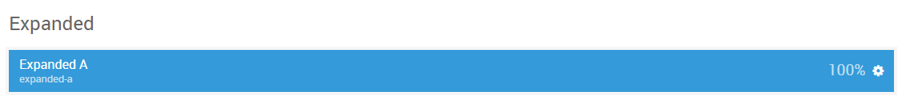
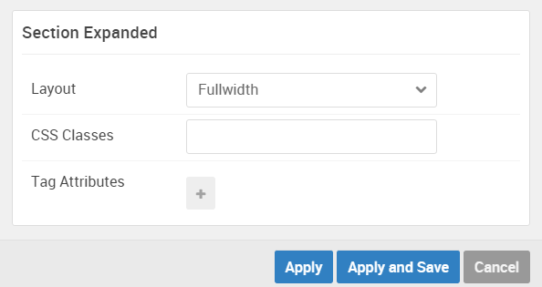

## Introduction

The **Expanded** section includes one module position, `expanded-a`. This module position is created using the Layout Manager.

Here is a breakdown of the module(s) and particle(s) that appear in this section:

* [Expanded A (module position)](#expanded-a-(module-position))
    - [Promo Content (particle)](#gantry-5-particle-(promo-content))

## Section Settings

| Option         | Setting   |
| :-----         | :-----    |
| Layout         | Fullwidth |
| CSS Classes    | Blank     |
| Tag Attributes | Blank     |

## Background Image

The background image seen to the right of the content area of the section is set in the **Styles** tab within the Gantry administrator.

## Expanded A (module position)

#### Particle Settings

| Option | Setting      |
| :----- | :-----       |
| Key    | `expanded-a` |
| Chrome | gantry       |

#### Block Settings

| Option         | Setting |
| :-----         | :-----  |
| CSS ID         | Blank   |
| CSS Classes    | Blank   |
| Variations     | Title 1 |
| Tag Attributes | Blank   |
| Block Size     | `100%`  |

### Assigned Module(s)

#### Gantry 5 Particle (Promo Content)

We added a **Promo Content** particle to the `expanded-a` position. This was done by creating a **Gantry 5 Particle** module and selecting the **Promo Content** particle in the module's settings. 

You will find the particle settings used in this particle below:

##### Particle Settings

| Option           | Setting                                                                                                          |
| :-----           | :-----                                                                                                           |
| CSS Classes      | Blank                                                                                                            |
| Title            | Blank                                                                                                            |
| Promo Style      | Sub Promo                                                                                                        |
| Promo Text       | `Gantry 5 features an advanced Menu Editor, which augments the core menu with a rich, drag and drop interface. ` |
| Description      | Blank                                                                                                            |
| Readmore Text    | `&rarr;`                                                                                                         |
| Readmore Classes | `button-arrow`                                                                                                   |
| Link             | `#`                                                                                                              |
| Readmore Style   | Inline                                                                                                           |
| Tags             | Blank                                                                                                            |
