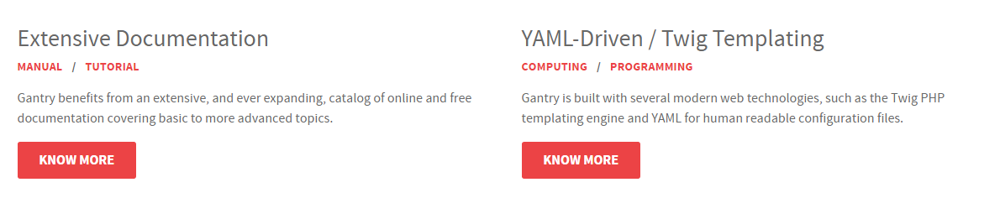
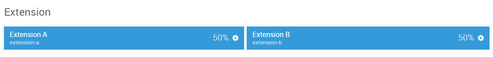

## Introduction

The **Extension** section includes two module positions, `extension-a`, and `extension-b`. These module positions are created using the Layout Manager.

Here is a breakdown of the module(s) and particle(s) that appear in this section:

* [Extension A (module position)](#extension-a-(module-position))
    - [Promo Content (particle)](##gantry-5-particle-(promo-content)-1)
* [Extension B (module position)](#extension-b-(module-position))
    - [Promo Content (particle)](##gantry-5-particle-(promo-content)-2)

## Section Settings

| Option         | Setting        |
| :-----         | :-----         |
| Layout         | Fullwidth      |
| CSS Classes    | `fp-extension` |
| Tag Attributes | Blank          |

## Extension A (module position)

#### Particle Settings

| Option | Setting       |
| :----- | :-----        |
| Key    | `extension-a` |
| Chrome | gantry        |

#### Block Settings

| Option         | Setting |
| :-----         | :-----  |
| CSS ID         | Blank   |
| CSS Classes    | Blank   |
| Variations     | Blank   |
| Tag Attributes | Blank   |
| Block Size     | `50%`   |

### Assigned Module(s)

#### Gantry 5 Particle (Promo Content) 1

We added a **Promo Content** particle to the `extension-a` position. This was done by creating a **Gantry 5 Particle** module and selecting the **Promo Content** particle in the module's settings. 

You will find the particle settings used in this particle below:

##### Particle Settings

| Option           | Setting                                                                                                                                          |
| :-----           | :-----                                                                                                                                           |
| CSS Classes      | Blank                                                                                                                                            |
| Title            | Blank                                                                                                                                            |
| Promo Style      | Standard                                                                                                                                         |
| Promo Text       | `Extensive Documentation`                                                                                                                        |
| Description      | `
Gantry benefits from an extensive, and ever expanding, catalog of online and free documentation covering basic to more advanced topics.
` |
| Readmore Text    | `Know More`                                                                                                                                      |
| Readmore Classes | Blank                                                                                                                                            |
| Link             | `#`                                                                                                                                              |
| Readmore Style   | Block                                                                                                                                            |
| Tag 1 Item Name  | `Manual`                                                                                                                                         |
| Tag 1 Item Icon  | Blank                                                                                                                                            |
| Tag 1 Item Text  | `Manual`                                                                                                                                         |
| Tag 1 Item Link  | `#`                                                                                                                                              |

## Extension B (module position)

#### Particle Settings

| Option | Setting       |
| :----- | :-----        |
| Key    | `extension-b` |
| Chrome | gantry        |

#### Block Settings

| Option         | Setting |
| :-----         | :-----  |
| CSS ID         | Blank   |
| CSS Classes    | Blank   |
| Variations     | Blank   |
| Tag Attributes | Blank   |
| Block Size     | `50%`   |

### Assigned Module(s)

#### Gantry 5 Particle (Promo Content) 2

We added a **Promo Content** particle to the `extension-b` position. This was done by creating a **Gantry 5 Particle** module and selecting the **Promo Content** particle in the module's settings. 

You will find the particle settings used in this particle below:

##### Particle Settings

| Option           | Setting                                                                                                                                                |
| :-----           | :-----                                                                                                                                                 |
| CSS Classes      | Blank                                                                                                                                                  |
| Title            | Blank                                                                                                                                                  |
| Promo Style      | Standard                                                                                                                                               |
| Promo Text       | `YAML-Driven / Twig Templating`                                                                                                                        |
| Description      | `
Gantry is built with several modern web technologies, such as the Twig PHP templating engine and YAML for human readable configuration files.
` |
| Readmore Text    | `Know More`                                                                                                                                            |
| Readmore Classes | Blank                                                                                                                                                  |
| Link             | `#`                                                                                                                                                    |
| Readmore Style   | Block                                                                                                                                                  |
| Tag 1 Item Name  | `Computing`                                                                                                                                            |
| Tag 1 Item Icon  | Blank                                                                                                                                                  |
| Tag 1 Item Text  | `Computing`                                                                                                                                            |
| Tag 1 Item Link  | `#`                                                                                                                                                    |