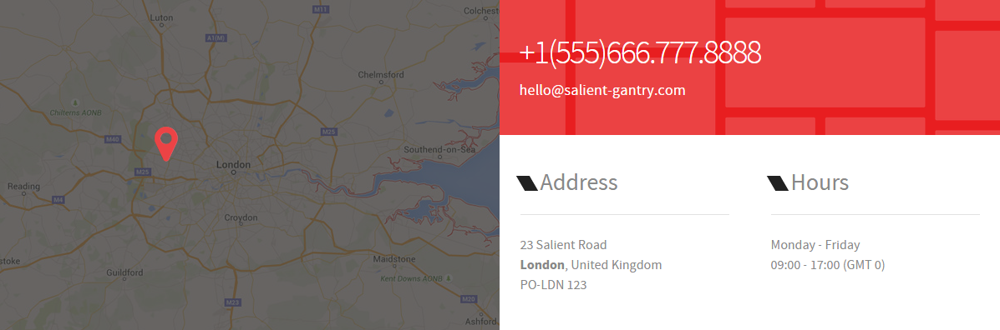
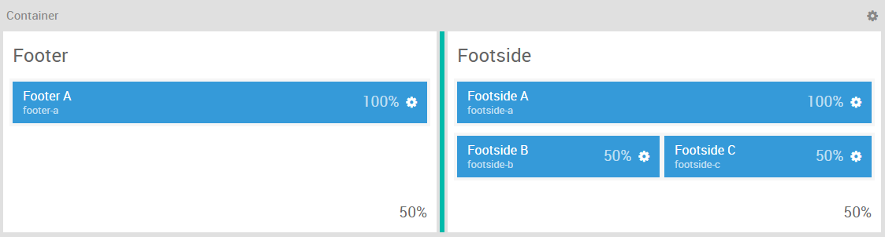
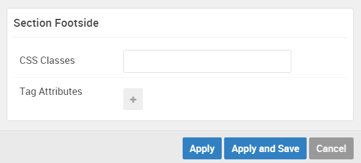

## Introduction

The **Footer / Footside** sections include four module positions, `footer-a`, `footside-a`, `footside-b`, and `footside-c`. These module positions are created using the Layout Manager, and span across three sections (all of which are contained within a single horizontal container).

Here is a breakdown of the module(s) and particle(s) that appear in this section:

* [Footer A (module position)](#footer-a-(module-position))
    - [Contact (particle)](#gantry-5-particle-(contact)-1)
* [Footside A (module position)](#footside-a-(module-position))
    - [Promo Content (particle)](#gantry-5-particle-(promo-content))
* [Footside B (module position)](#footside-b-(module-position))
    - [Contact (particle)](#gantry-5-particle-(contact)-2)
* [Footside C (module position)](#footside-c-(module-position))
    - [Contact (particle)](#gantry-5-particle-(contact)-3)

## Section Settings

| Option         | Setting   |
| :-----         | :-----    |
| Section Width  | `50%`     |
| Layout         | Fullwidth |
| CSS Classes    | Blank     |
| Tag Attributes | Blank     |

| Option         | Setting   |
| :-----         | :-----    |
| Section Width  | `50%`     |
| Layout         | Fullwidth |
| CSS Classes    | Blank     |
| Tag Attributes | Blank     |

## Footer A (module position)

#### Particle Settings

| Option | Setting    |
| :----- | :-----     |
| Key    | `footer-a` |
| Chrome | gantry     |

#### Block Settings

| Option         | Setting                       |
| :-----         | :-----                        |
| CSS ID         | Blank                         |
| CSS Classes    | `nomarginall`, `nopaddingall` |
| Variations     | Blank                         |
| Tag Attributes | Blank                         |
| Block Size     | `100%`                        |

### Assigned Module(s)

#### Gantry 5 Particle (Contact) 1

We added a **Contact** particle to the `footer-a` position. This was done by creating a **Gantry 5 Particle** module and selecting the **Contact** particle in the module's settings. 

You will find the particle settings used in this particle below:

##### Particle Settings

| Option                     | Setting                  |
| :-----                     | :-----                   |
| CSS Classes                | Blank                    |
| Title                      | Blank                    |
| Contact Items              | Blank                    |
| Map Position               | Top                      |
| Maps Item 1 Name           | London                   |
| Maps Item 1 Image          | Custom                   |
| Maps Item 1 Enable Overlay | Enabled                  |
| Maps Item 1 Enable Marker  | Enabled                  |
| Maps Item 1 Marker Icon    | `fa fa-map-marker fa-fw` |
| Maps Item 1 Map Min-Height | `400px`                  |
| Maps Item 1 Top Position   | `140px`                  |
| Maps Item 1 Left Position  | `170px`                  |

## Footside A (module position)

#### Particle Settings

| Option | Setting      |
| :----- | :-----       |
| Key    | `footside-a` |
| Chrome | gantry       |

#### Block Settings

| Option         | Setting                       |
| :-----         | :-----                        |
| CSS ID         | Blank                         |
| CSS Classes    | `nomarginall`, `nopaddingall` |
| Variations     | Box 1                         |
| Tag Attributes | Blank                         |
| Block Size     | `100%`                        |

### Assigned Module(s)

#### Gantry 5 Particle (Promo Content)

We added a **Promo Content** particle to the `footside-a` position. This was done by creating a **Gantry 5 Particle** module and selecting the **Promo Content** particle in the module's settings. 

You will find the particle settings used in this particle below:

##### Particle Settings

| Option           | Setting                           |
| :-----           | :-----                            |
| CSS Classes      | Blank                             |
| Title            | Blank                             |
| Promo Style      | Sub Promo                         |
| Promo Text       | `+1(555)666.777.8888`             |
| Description      | `
hello@salient-gantry.com
` |
| Readmore Text    | Blank                             |
| Readmore Classes | Blank                             |
| Link             | Blank                             |
| Readmore Style   | Block                             |
| Tags             | Blank                             |

## Footside B (module position)

#### Particle Settings

| Option | Setting      |
| :----- | :-----       |
| Key    | `footside-b` |
| Chrome | gantry       |

#### Block Settings

| Option         | Setting         |
| :-----         | :-----          |
| CSS ID         | Blank           |
| CSS Classes    | `fp-footside-b` |
| Variations     | Title 1         |
| Tag Attributes | Blank           |
| Block Size     | `50%`           |

### Assigned Module(s)

#### Gantry 5 Particle (Contact) 2

We added a **Contact** particle to the `footside-b` position. This was done by creating a **Gantry 5 Particle** module and selecting the **Contact** particle in the module's settings. 

You will find the particle settings used in this particle below:

##### Particle Settings

| Option               | Setting             |
| :-----               | :-----              |
| CSS Classes          | `g-contact-compact` |
| Title                | Blank               |
| Contact Item 1 Name  | `23 Salient Road`   |
| Contact Item 1 Icon  | Blank               |
| Contact Item 1 Value | `23 Salient Road`   |
| Map Position         | Top                 |
| Maps                 | Blank               |

## Footside C (module position)

#### Particle Settings

| Option | Setting      |
| :----- | :-----       |
| Key    | `footside-c` |
| Chrome | gantry       |

#### Block Settings

| Option         | Setting |
| :-----         | :-----  |
| CSS ID         | Blank   |
| CSS Classes    | Blank   |
| Variations     | Title 1 |
| Tag Attributes | Blank   |
| Block Size     | `50%`   |

### Assigned Module(s)

#### Gantry 5 Particle (Contact) 3

We added a **Contact** particle to the `footside-c` position. This was done by creating a **Gantry 5 Particle** module and selecting the **Contact** particle in the module's settings. 

You will find the particle settings used in this particle below:

##### Particle Settings

| Option               | Setting             |
| :-----               | :-----              |
| CSS Classes          | `g-contact-compact` |
| Title                | Blank               |
| Contact Item 1 Name  | `Monday - Friday`   |
| Contact Item 1 Icon  | Blank               |
| Contact Item 1 Value | `Monday - Friday`   |
| Map Position         | Top                 |
| Maps                 | Blank               |