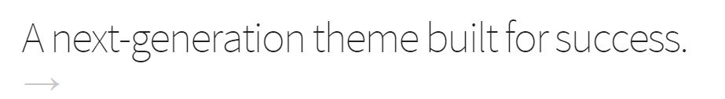
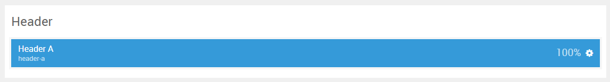

## Introduction

The **Header** section includes one module position, `header-a`. This module position is created using the Layout Manager.

Here is a breakdown of the module(s) and particle(s) that appear in this section:

* [Header A (module position)](#header-a-(module-position))
    - [Promo Content (particle)](#gantry-5-particle-(promo-content))

## Section Settings

| Option         | Setting   |
| :-----         | :-----    |
| Layout         | Fullwidth |
| CSS Classes    | Blank     |
| Tag Attributes | Blank     |

## Header A (module position)

#### Particle Settings

| Option | Setting    |
| :----- | :-----     |
| Key    | `header-a` |
| Chrome | gantry     |

#### Block Settings

| Option         | Setting |
| :-----         | :-----  |
| CSS ID         | Blank   |
| CSS Classes    | Blank   |
| Variations     | Blank   |
| Tag Attributes | Blank   |
| Block Size     | `100%`  |

### Assigned Module(s)

#### Gantry 5 Particle (Promo Content)

We added a **Promo Content** particle to the `header-a` position. This was done by creating a **Gantry 5 Particle** module and selecting the **Promo Content** particle in the module's settings. 

You will find the particle settings used in this particle below:

##### Particle Settings

| Option           | Setting                                      |
| :-----           | :-----                                       |
| CSS Classes      | Blank                                        |
| Title            | Blank                                        |
| Promo Style      | Promo                                        |
| Promo Text       | `A next-generation theme built for success.` |
| Description      | Blank                                        |
| Readmore Text    | `&rarr;`                                     |
| Readmore Classes | `button-arrow`, `nopaddingall`               |
| Link             | `#`                                          |
| Readmore Style   | Block                                        |
| Tags             | Blank                                        |
