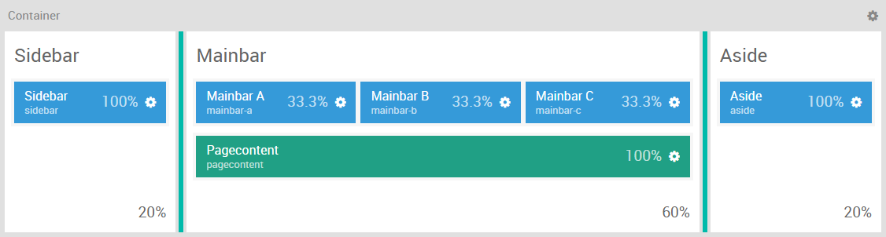
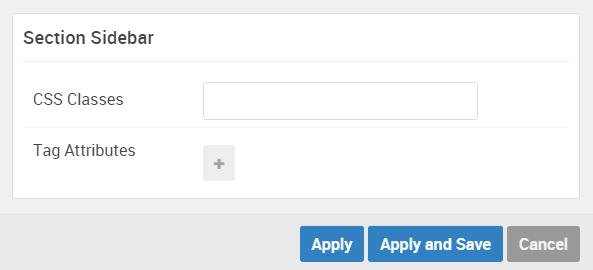
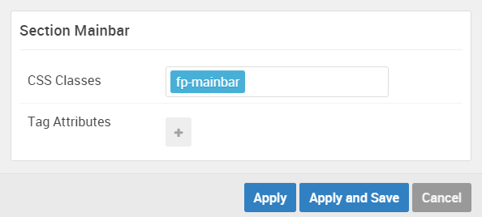

## Introduction

The **Sidebar / Mainbar / Aside** sections include six module positions, `sidebar`, `mainbar-a`, `mainbar-b`, `mainbar-c`, `pagecontent`, and `aside`. These module positions are created using the Layout Manager, and span across three sections (all of which are contained within a single horizontal container).

The **Page Content** section in particular is a simple **Page Content** positions particle, adding any content assigned to the page to be rendered on the front end.

Here is a breakdown of the module(s) and particle(s) that appear in this section:

* [Sidebar (module position)](#sidebar-(module-position))
* [Mainbar A (module position)](#mainbar-a-(module-position))
    - [Block Content (particle)](#gantry-5-particle-(block-content))
* [Mainbar B (module position)](#mainbar-b-(module-position))
* [Mainbar C (module position)](#mainbar-c-(module-position))
* [Pagecontent (module position)](#page-content)
* [Aside (module position)](#aside-(module-position))

## Section Settings

| Option         | Setting   |
| :-----         | :-----    |
| Section Width  | `20%`     |
| Layout         | Fullwidth |
| CSS Classes    | Blank     |
| Tag Attributes | Blank     |

| Option         | Setting   |
| :-----         | :-----    |
| Section Width  | `60%`     |
| Layout         | Fullwidth |
| CSS Classes    | Blank     |
| Tag Attributes | Blank     |

| Option         | Setting   |
| :-----         | :-----    |
| Section Width  | `20%`     |
| Layout         | Fullwidth |
| CSS Classes    | Blank     |
| Tag Attributes | Blank     |

## Sidebar (module position)

#### Particle Settings

| Option | Setting   |
| :----- | :-----    |
| Key    | `sidebar` |
| Chrome | gantry    |

#### Block Settings

| Option         | Setting |
| :-----         | :-----  |
| CSS ID         | Blank   |
| CSS Classes    | Blank   |
| Variations     | Blank   |
| Tag Attributes | Blank   |
| Block Size     | `100%`  |

## Mainbar A (module position)

#### Particle Settings

| Option | Setting     |
| :----- | :-----      |
| Key    | `mainbar-a` |
| Chrome | gantry      |

#### Block Settings

| Option         | Setting    |
| :-----         | :-----     |
| CSS ID         | Blank      |
| CSS Classes    | Blank      |
| Variations     | Blank      |
| Tag Attributes | Blank      |
| Block Size     | `33.3333%` |

### Assigned Module(s)

#### Gantry 5 Particle (Block Content)

We added a **Block Content** particle to the `mainbar-a` position. This was done by creating a **Gantry 5 Particle** module and selecting the **Block Content** particle in the module's settings. 

You will find the particle settings used in this particle below:

##### Particle Settings

| Option                     | Setting                                                                                                                        |
| :-----                     | :-----                                                                                                                         |
| Image                      | Blank                                                                                                                          |
| Headline                   | Blank                                                                                                                          |
| Description                | Blank                                                                                                                          |
| Link                       | Blank                                                                                                                          |
| Link Text                  | Blank                                                                                                                          |
| Content Item 1 Name        | `Styling`                                                                                                                      |
| Content Item 1 Title       | `Styling`                                                                                                                      |
| Content Item 1 Icon        | Blank                                                                                                                          |
| Content Item 1 Image       | Custom                                                                                                                         |
| Content Item 1 Sub Title   | `<a href="#">01.</a>`                                                                                                          |
| Content Item 1 Description | `The Styles settings allows for customizing the stylistic elements of the template, such as links, font or background colors.` |
| Content Item 1 Variations  | Blank                                                                                                                          |

## Mainbar B (module position)

#### Particle Settings

| Option | Setting     |
| :----- | :-----      |
| Key    | `mainbar-b` |
| Chrome | gantry      |

#### Block Settings

| Option         | Setting    |
| :-----         | :-----     |
| CSS ID         | Blank      |
| CSS Classes    | Blank      |
| Variations     | Blank      |
| Tag Attributes | Blank      |
| Block Size     | `33.3333%` |

## Mainbar C (module position)

#### Particle Settings

| Option | Setting     |
| :----- | :-----      |
| Key    | `mainbar-c` |
| Chrome | gantry      |

#### Block Settings

| Option         | Setting    |
| :-----         | :-----     |
| CSS ID         | Blank      |
| CSS Classes    | Blank      |
| Variations     | Blank      |
| Tag Attributes | Blank      |
| Block Size     | `33.3333%` |

## Page Content

#### Particle Settings

#### Block Settings

| Option         | Setting |
| :-----         | :-----  |
| CSS ID         | Blank   |
| CSS Classes    | Blank   |
| Variations     | Blank   |
| Tag Attributes | Blank   |
| Block Size     | `100%`  |

## Aside (module position)

#### Particle Settings

| Option | Setting |
| :----- | :-----  |
| Key    | `aside` |
| Chrome | gantry  |

#### Block Settings

| Option         | Setting |
| :-----         | :-----  |
| CSS ID         | Blank   |
| CSS Classes    | Blank   |
| Variations     | Blank   |
| Tag Attributes | Blank   |
| Block Size     | `100%`  |