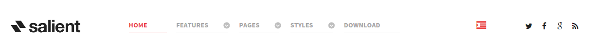
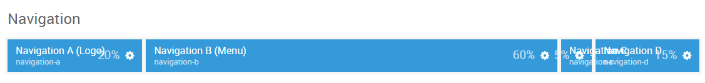

## Introduction

The **Navigation** section includes four module positions, `navigation-a`, `navigation-b`, `navigation-c`, and `navigation-d`. These module positions are created using the Layout Manager.

Here is a breakdown of the module(s) and particle(s) that appear in this section:

* [Navigation A (module position)](#navigation-a-(module-position))
    - [Logo (particle)](#gantry-5-particle-(logo))
* [Navigation B (module position)](#navigation-b-(module-position))
    - [Menu (particle)](#gantry-5-particle-(menu))
* [Navigation C (module position)](#navigation-c-(module-position))
    - [Custom HTML (module)](#custom-html)
* [Navigation D (module position)](#navigation-d-(module-position))
    - [Social (particle)](#gantry-5-particle-(social))

## Section Settings

| Option         | Setting   |
| :-----         | :-----    |
| Layout         | Fullwidth |
| CSS Classes    | Blank     |
| Tag Attributes | Blank     |

## Navigation A (module position)

#### Particle Settings

| Option        | Setting        |
| :-----        | :-----         |
| Key           | `navigation-a` |
| Chrome        | gantry         |

#### Block Settings

| Option         | Setting |
| :-----         | :-----  |
| CSS ID         | Blank   |
| CSS Classes    | Blank   |
| Variations     | Blank   |
| Tag Attributes | Blank   |
| Block Size     | `20%`   |

### Assigned Module(s)

#### Gantry 5 Particle (Logo)

We added a **Logo** particle to the `navigation-a` position. This was done by creating a **Gantry 5 Particle** module and selecting the **Logo** particle in the module's settings. 

You will find the particle settings used in this particle below:

##### Particle Settings

| Option      | Setting                               |
| :-----      | :-----                                |
| URL         | Blank                                 |
| Image       | `gantry-media://logo/logo-header.png` |
| Alt         | Blank                                 |
| Text        | Blank                                 |
| CSS Classes | `g-logo`                              |

## Navigation B (module position)

#### Particle Settings

| Option        | Setting        |
| :-----        | :-----         |
| Key           | `navigation-b` |
| Chrome        | gantry         |

#### Block Settings

| Option         | Setting |
| :-----         | :-----  |
| CSS ID         | Blank   |
| CSS Classes    | Blank   |
| Variations     | Blank   |
| Tag Attributes | Blank   |
| Block Size     | `60%`   |

### Assigned Module(s)

#### Gantry 5 Particle (Menu)

We added a **Menu** particle to the `navigation-b` position. This was done by creating a **Gantry 5 Particle** module and selecting the **Menu** particle in the module's settings. 

You will find the particle settings used in this particle below:

##### Particle Settings

| Option        | Setting          |
| :-----        | :-----           |
| Base Path     | `/`              |
| Menu          | Use Default Menu |
| Start Level   | `1`              |
| End Level     | `0`              |
| Mobile Target | Unchecked        |

## Navigation C (module position)

#### Particle Settings

| Option        | Setting        |
| :-----        | :-----         |
| Key           | `navigation-c` |
| Chrome        | gantry         |

#### Block Settings

| Option         | Setting |
| :-----         | :-----  |
| CSS ID         | Blank   |
| CSS Classes    | Blank   |
| Variations     | Blank   |
| Tag Attributes | Blank   |
| Block Size     | `5%`    |

### Assigned Module(s)

#### Custom HTML

We added a **Custom HTML** module to the `navigation-c` position.

You will find the settings used in this module below:

##### Module Settings

| Option        | Setting             |
| :-----        | :-----              |
| Title         | `Off Canvas Toggle` |
| Show Title    | Hide                |
| Position      | `navigation-c`      |

##### Custom HTML

~~~ .html

  <i class="fa fa-fw fa-indent"></i>

~~~

##### Advanced

| Option              | Setting |
| :------             | :-----  |
| Module Class Suffix | Blank   |

## Navigation D (module position)

#### Particle Settings

| Option        | Setting        |
| :-----        | :-----         |
| Key           | `navigation-d` |
| Chrome        | gantry         |

#### Block Settings

| Option         | Setting |
| :-----         | :-----  |
| CSS ID         | Blank   |
| CSS Classes    | Blank   |
| Variations     | Blank   |
| Tag Attributes | Blank   |
| Block Size     | `15%`   |

### Assigned Module(s)

#### Gantry 5 Particle (Social)

We added a **Social** particle to the `navigation-d` position. This was done by creating a **Gantry 5 Particle** module and selecting the **Social** particle in the module's settings. 

You will find the particle settings used in this particle below:

##### Particle Settings

| Option             | Setting                        |
| :-----             | :-----                         |
| CSS Classes        | `social-items`                 |
| Title              | Blank                          |
| Target             | New Window                     |
| Social Item 1 Name | `Twitter`                      |
| Social Item 1 Icon | `fa fa-twitter fa-fw`          |
| Social Item 1 Text | Blank                          |
| Social Item 1 Link | http://twitter.com/rockettheme |