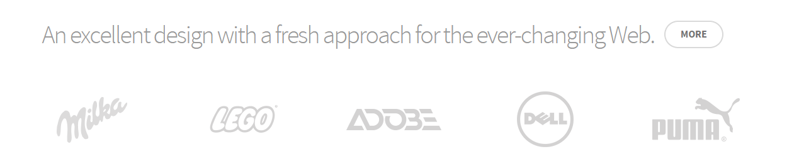
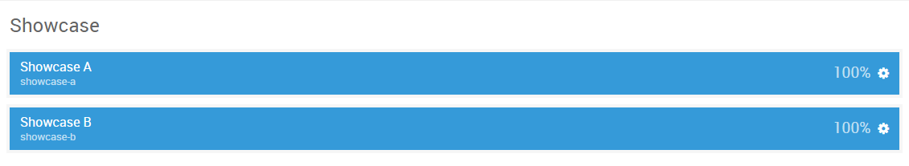

## Introduction

The **Showcase** section includes two module positions, `showcase-a` and `showcase-b`. These module positions are created using the Layout Manager, and are set on two different horizontal rows so they stack vertically.

Here is a breakdown of the module(s) and particle(s) that appear in this section:

* [Showcase A (module position)](#showcase-a-(module-position))
    - [Promo Content (particle)](#gantry-5-particle-(promo-content))
* [Showcase B (module position)](#showcase-b-(module-position))

## Section Settings

| Option         | Setting   |
| :-----         | :-----    |
| Layout         | Fullwidth |
| CSS Classes    | Blank     |
| Tag Attributes | Blank     |

## Showcase A (module position)

#### Particle Settings

| Option | Setting      |
| :----- | :-----       |
| Key    | `showcase-a` |
| Chrome | gantry       |

#### Block Settings

| Option         | Setting |
| :-----         | :-----  |
| CSS ID         | Blank   |
| CSS Classes    | Blank   |
| Variations     | Blank   |
| Tag Attributes | Blank   |
| Block Size     | `100%`  |

### Assigned Module(s)

#### Gantry 5 Particle (Promo Content)

We added a **Promo Content** particle to the `showcase-a` position. This was done by creating a **Gantry 5 Particle** module and selecting the **Promo Content** particle in the module's settings. 

You will find the particle settings used in this particle below:

##### Particle Settings

| Option           | Setting                                                                |
| :-----           | :-----                                                                 |
| CSS Classes      | Blank                                                                  |
| Title            | Blank                                                                  |
| Promo Style      | Sub Promo                                                              |
| Promo Text       | `An excellent design with a fresh approach for the ever-changing Web.` |
| Description      | Blank                                                                  |
| Readmore Text    | `More`                                                                 |
| Readmore Classes | `button-3`                                                             |
| Link             | `#`                                                                    |
| Readmore Style   | Aside                                                                  |
| Tags             | Blank                                                                  |

## Showcase B (module position)

#### Particle Settings

| Option | Setting      |
| :----- | :-----       |
| Key    | `showcase-b` |
| Chrome | gantry       |

#### Block Settings

| Option         | Setting                  |
| :-----         | :-----                   |
| CSS ID         | Blank                    |
| CSS Classes    | `flush`, `fp-showcase-b` |
| Variations     | Blank                    |
| Tag Attributes | Blank                    |
| Block Size     | `100%`                   |

### Assigned Module(s)

#### Gantry 5 Particle (Block Content)

We added a **Block Content** particle to the `showcase-b` position. This was done by creating a **Gantry 5 Particle** module and selecting the **Block Content** particle in the module's settings. 

You will find the particle settings used in this particle below:

##### Particle Settings

| Option                    | Setting |
| :-----                    | :-----  |
| Image                     | Blank   |
| Headline                  | Blank   |
| Description               | Blank   |
| Link                      | Blank   |
| Link Text                 | Blank   |
| Content Item 1 Name       | `Milka` |
| Content Item 1 Title      | Blank   |
| Content Item 1 Icon       | Blank   |
| Content Item 1 Image      | Custom  |
| Content Item 1 Sub Title  | Blank   |
| Content Item 1 Descriptio | Blank   |
| Content Item 1 Variations | Blank   |