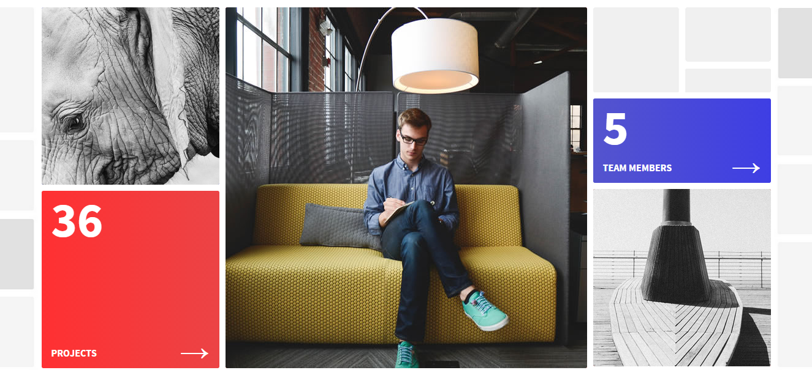
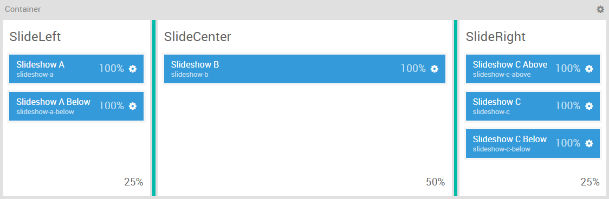
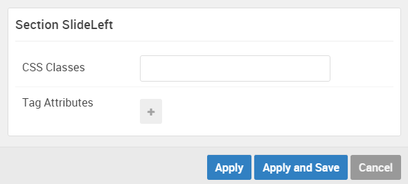
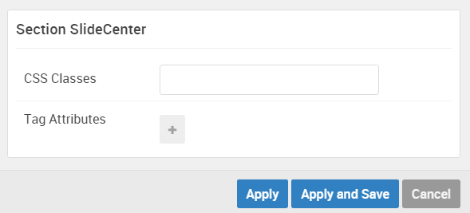
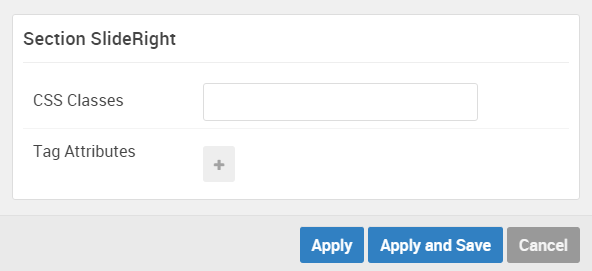

## Introduction

The **Slideshow** section includes six module positions, `slideshow-a`, `slideshow-a-below`, `slideshow-b`, `slideshow-c-above`, `slideshow-c`, and `slideshow-c-below`. These module positions are created using the Layout Manager, and span across three sections (all of which are contained within a single horizontal container).

Here is a breakdown of the module(s) and particle(s) that appear in this section:

* [Slideshow A (module position)](#slideshow-a-(module-position))
    - [Promo Content (particle)](#gantry-5-particle-(promo-content))
* [Slideshow A Below (module position)](#slideshow-a-below-(module-position))
    - [Animated Block (particle)](#gantry-5-particle-(animated-block)-1)
* [Slideshow B (module position)](#slideshow-b-(module-position))
    - [Animated Block (particle)](#gantry-5-particle-(animated-block)-2)
* [Slideshow C Above (module position)](#slideshow-c-above-(module-position))
    - [Custom HTML (module)](#custom-html-(module))
* [Slideshow C (module position)](#slideshow-c-(module-position))
    - [Animated Block (particle)](#gantry-5-particle-(animated-block)-4)
* [Slideshow C Below (module position)](#slideshow-c-below-(module-position))
    - [Animated Block (particle)](#gantry-5-particle-(animated-block)-5)

## Section Settings

| Option         | Setting   |
| :-----         | :-----    |
| Section Width  | `25%`     |
| Layout         | Fullwidth |
| CSS Classes    | Blank     |
| Tag Attributes | Blank     |

| Option         | Setting   |
| :-----         | :-----    |
| Section Width  | `50%`     |
| Layout         | Fullwidth |
| CSS Classes    | Blank     |
| Tag Attributes | Blank     |

| Option         | Setting   |
| :-----         | :-----    |
| Section Width  | `25%`     |
| Layout         | Fullwidth |
| CSS Classes    | Blank     |
| Tag Attributes | Blank     |

## Slideshow A (module position)

#### Particle Settings

| Option | Setting       |
| :----- | :-----        |
| Key    | `slideshow-a` |
| Chrome | gantry        |

#### Block Settings

| Option         | Setting    |
| :-----         | :-----     |
| CSS ID         | Blank      |
| CSS Classes    | Blank      |
| Variations     | No Padding |
| Tag Attributes | Blank      |
| Block Size     | `100%`     |

### Assigned Module(s)

#### Gantry 5 Particle (Promo Content)

We added a **Promo Content** particle to the `slideshow-a` position. This was done by creating a **Gantry 5 Particle** module and selecting the **Promo Content** particle in the module's settings. 

You will find the particle settings used in this particle below:

##### Particle Settings

| Option           | Setting                                                                |
| :-----           | :-----                                                                 |
| CSS Classes      | Blank                                                                  |
| Title            | Blank                                                                  |
| Promo Style      | Sub Promo                                                              |
| Promo Text       | `An excellent design with a fresh approach for the ever-changing Web.` |
| Description      | Blank                                                                  |
| Readmore Text    | `More`                                                                 |
| Readmore Classes | `button-3`                                                             |
| Link             | `#`                                                                    |
| Readmore Style   | Aside                                                                  |
| Tags             | Blank                                                                  |

## Slideshow A Below (module position)

#### Particle Settings

| Option | Setting             |
| :----- | :-----              |
| Key    | `slideshow-a-below` |
| Chrome | gantry              |

#### Block Settings

| Option         | Setting    |
| :-----         | :-----     |
| CSS ID         | Blank      |
| CSS Classes    | Blank      |
| Variations     | No Padding |
| Tag Attributes | Blank      |
| Block Size     | `100%`     |

### Assigned Module(s)

#### Gantry 5 Particle (Animated Block) 1

We added a **Animated Block** particle to the `slideshow-a-below` position. This was done by creating a **Gantry 5 Particle** module and selecting the **Animated Block** particle in the module's settings. 

You will find the particle settings used in this particle below:

##### Particle Settings

| Option           | Setting     |
| :-----           | :-----      |
| CSS Classes      | Blank       |
| Background Color | Gradient 1  |
| Animation        | Animation 2 |
| Title            | Blank       |
| Image            | Custom      |
| Headline         | `36`        |
| Description      | `Projects`  |
| Read More        | `&rarr;`    |
| Link             | `#`         |
| Button           | `Join`      |
| Button Classes   | `button-4`  |

## Slideshow B (module position)

#### Particle Settings

| Option | Setting       |
| :----- | :-----        |
| Key    | `slideshow-b` |
| Chrome | gantry        |

#### Block Settings

| Option         | Setting    |
| :-----         | :-----     |
| CSS ID         | Blank      |
| CSS Classes    | Blank      |
| Variations     | No Padding |
| Tag Attributes | Blank      |
| Block Size     | `100%`     |

### Assigned Module(s)

#### Gantry 5 Particle (Animated Block) 2

We added a **Animated Block** particle to the `slideshow-b` position. This was done by creating a **Gantry 5 Particle** module and selecting the **Animated Block** particle in the module's settings. 

You will find the particle settings used in this particle below:

##### Particle Settings

| Option           | Setting            |
| :-----           | :-----             |
| CSS Classes      | Blank              |
| Background Color | Accent 1           |
| Animation        | Animation 1        |
| Title            | Blank              |
| Image            | Custom             |
| Headline         | `Fresh`            |
| Description      | `Simple and Clean` |
| Read More        | `&rarr;`           |
| Link             | `#`                |
| Button           | Blank              |
| Button Classes   | Blank              |

## Slideshow C Above (module position)

#### Particle Settings

| Option | Setting       |
| :----- | :-----        |
| Key    | `slideshow-c-above` |
| Chrome | gantry        |

#### Block Settings

| Option         | Setting    |
| :-----         | :-----     |
| CSS ID         | Blank      |
| CSS Classes    | Blank      |
| Variations     | No Padding |
| Tag Attributes | Blank      |
| Block Size     | `100%`     |

### Assigned Module(s)

#### Custom HTML (module)

We added a **Custom HTML** module to the `slideshow-c-above` position.

You will find the particle settings used in this particle below:

##### Module Settings

| Option         | Setting                                                                       |
| :-----         | :-----                                                                        |
| Title          | `SlideRight`                                                                  |
| Custom HTML    | `` |
| Show Title     | Hide                                                                          |
| Position       | `slideshow-c-above`                                                           |

##### Advanced Settings

| Option              | Setting                        |
| :-----              | :-----                         |
| Module Class Suffix | `g-animatedblock hidden-phone` |

## Slideshow C (module position)

#### Particle Settings

| Option | Setting       |
| :----- | :-----        |
| Key    | `slideshow-c` |
| Chrome | gantry        |

#### Block Settings

| Option         | Setting    |
| :-----         | :-----     |
| CSS ID         | Blank      |
| CSS Classes    | Blank      |
| Variations     | No Padding |
| Tag Attributes | Blank      |
| Block Size     | `100%`     |

### Assigned Module(s)

#### Gantry 5 Particle (Animated Block) 4

We added a **Animated Block** particle to the `slideshow-c` position. This was done by creating a **Gantry 5 Particle** module and selecting the **Animated Block** particle in the module's settings. 

You will find the particle settings used in this particle below:

##### Particle Settings

| Option           | Setting        |
| :-----           | :-----         |
| CSS Classes      | Blank          |
| Background Color | Gradient 2     |
| Animation        | Animation 3    |
| Title            | Blank          |
| Image            | Custom         |
| Headline         | `5`            |
| Description      | `Team Members` |
| Read More        | `&rarr;`       |
| Link             | `#`            |
| Button           | `Hire`         |
| Button Classes   | `button-4`     |

## Slideshow C Below (module position)

#### Particle Settings

| Option | Setting       |
| :----- | :-----        |
| Key    | `slideshow-c-below` |
| Chrome | gantry        |

#### Block Settings

| Option         | Setting    |
| :-----         | :-----     |
| CSS ID         | Blank      |
| CSS Classes    | Blank      |
| Variations     | No Padding |
| Tag Attributes | Blank      |
| Block Size     | `100%`     |

### Assigned Module(s)

#### Gantry 5 Particle (Animated Block) 5

We added a **Animated Block** particle to the `slideshow-c-below` position. This was done by creating a **Gantry 5 Particle** module and selecting the **Animated Block** particle in the module's settings. 

You will find the particle settings used in this particle below:

##### Particle Settings

| Option           | Setting        |
| :-----           | :-----         |
| CSS Classes      | Blank          |
| Background Color | Accent 3       |
| Animation        | Animation 1    |
| Title            | Blank          |
| Image            | Custom         |
| Headline         | `7`            |
| Description      | `Sample Pages` |
| Read More        | `&rarr;`       |
| Link             | `#`            |
| Button           | Blank          |
| Button Classes   | Blank          |