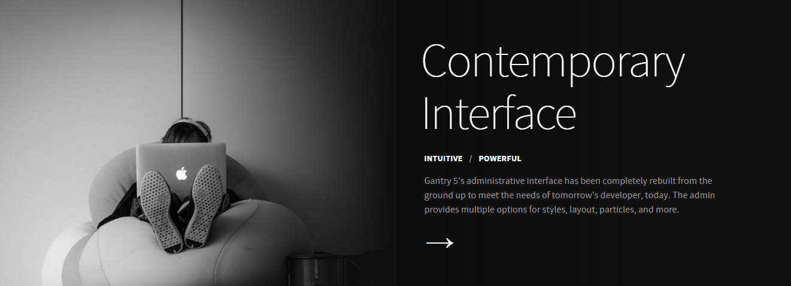
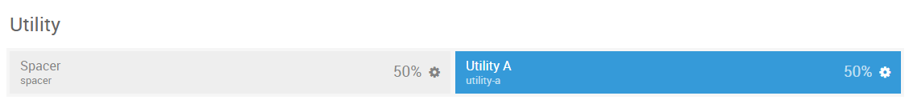
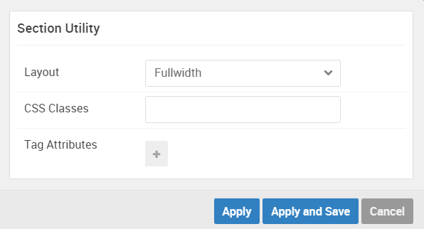

## Introduction

The **Utility** section includes one module position, `utility-a`. It also includes a spacer, set at 50% width to the left of the module position. Both the spacer and the module position can be set up using the **Layout Manager**.

Here is a breakdown of the module(s) and particle(s) that appear in this section:

* [Spacer (position)](#spacer-(positions-particle))
* [Utility A (module position)](#utility-a-(module-position))
    - [Promo Content (particle)](#gantry-5-particle-(promo-content))

## Section Settings

| Option         | Setting   |
| :-----         | :-----    |
| Layout         | Fullwidth |
| CSS Classes    | Blank     |
| Tag Attributes | Blank     |

## Spacer (positions particle)

#### Particle Settings

#### Block Settings

| Option         | Setting |
| :-----         | :-----  |
| CSS ID         | Blank   |
| CSS Classes    | Blank   |
| Variations     | Blank   |
| Tag Attributes | Blank   |
| Block Size     | `50%`   |

## Utility A (module position)

#### Particle Settings

| Option | Setting     |
| :----- | :-----      |
| Key    | `utility-a` |
| Chrome | gantry      |

#### Block Settings

| Option         | Setting |
| :-----         | :-----  |
| CSS ID         | Blank   |
| CSS Classes    | Blank   |
| Variations     | Blank   |
| Tag Attributes | Blank   |
| Block Size     | `50%`  |

### Assigned Module(s)

#### Gantry 5 Particle (Promo Content)

We added a **Promo Content** particle to the `utility-a` position. This was done by creating a **Gantry 5 Particle** module and selecting the **Promo Content** particle in the module's settings. 

You will find the particle settings used in this particle below:

##### Particle Settings

| Option           | Setting                                                                                                                                                                                                                    |
| :-----           | :-----                                                                                                                                                                                                                     |
| CSS Classes      | `g-overlay`                                                                                                                                                                                                                |
| Title            | Blank                                                                                                                                                                                                                      |
| Promo Style      | Super Promo                                                                                                                                                                                                                |
| Promo Text       | `Contemporary   Interface`                                                                                                                                                                                            |
| Description      | `
Gantry 5's administrative interface has been completely rebuilt from the ground up to meet the needs of tomorrow's developer, today. The admin provides multiple options for styles, layout, particles, and more.
` |
| Readmore Text    | `&rarr;`                                                                                                                                                                                                                   |
| Readmore Classes | `button-arrow`, `nopaddingall`                                                                                                                                                                                             |
| Link             | `#`                                                                                                                                                                                                                        |
| Readmore Style   | Block                                                                                                                                                                                                                      |
| Tag Item 1 Name  | `Intuitive`                                                                                                                                                                                                                |
| Tag Item 1 Icon  | Blank                                                                                                                                                                                                                      |
| Tag Item 1 Text  | `Intuitive`                                                                                                                                                                                                                |
| Tag Item 1 Link  | `#`                                                                                                                                                                                                                        |
