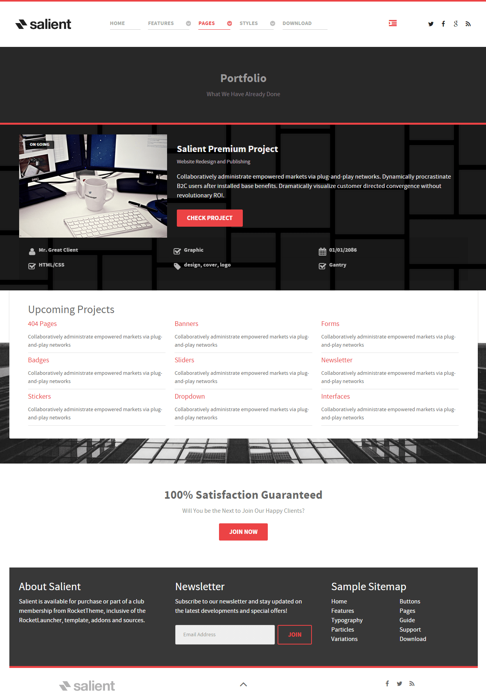
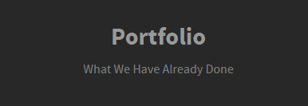
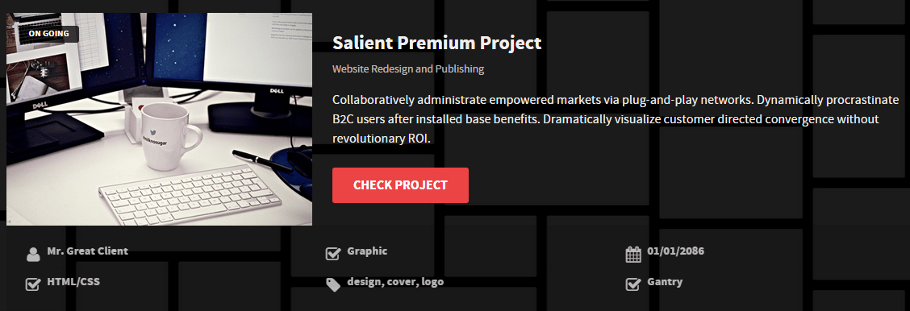
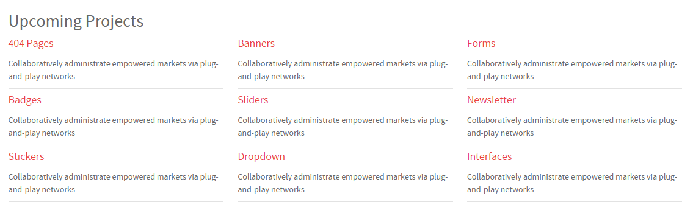
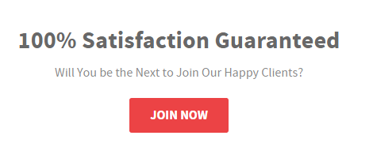

## Introduction

The **Portfolio** example page demonstrates how you can create a beautiful page with the Salient template. Here is some information to help you replicate this page as it appears in the demo.

## Modules and Particles

Below is a brief rundown of the modules and particles used to make up the demo page.

:   1. **Showcase - Custom HTML (Module)** [10%, 45%, se]
    2. **Above - Custom HTML (Module)** [18%, 5%, se]
    3. **Extension - Custom HTML (Module)** [45%, 5%, se]
    4. **Bottom - Custom HTML (Module)** [70%, 30%, se]
    5. **Footer - Custom HTML** [86%, 7%, se]
    7. **Footer - Newsletter** [86%, 36%, se]
    8. **Footer - Custom HTML** [86%, 65%, se]

1. [Showcase](#showcase-section)
2. [Above](#above-section)
3. [Extension](#extension-section)
4. [Bottom](#bottom-section)
5. [Footer](#footer-section)

## Showcase Section

This area of the page is a **Custom HTML** module. You will find the settings used in our demo below.

>> Any **mod_custom** (Custom HTML) modules are best handled using either RokPad or no editor as a WYSIWYG editor can cause issues with any code that exists in the **Custom Output** field.

### Custom HTML (Module)

### Details

| Field      | Setting              |
| :-----     | :-----               |
| Title      | `Portfolio - Header` |
| Show Title | Hide                 |
| Position   | `showcase-a`         |
| Status     | Published            |

### Custom Output

Enter the following in the **Custom Output** text editor.

~~~ .html

    <h2 class="g-layercontent-title">Portfolio</h2>
    
What We Have Already Done

~~~

### Basic

| Option                    | Setting     |
| :----------               | :---------- |
| Prepare Content           | No          |
| Select a Background Image | Blank       |

### Advanced

| Option              | Setting        |
| :----------         | :----------    |
| Module Class Suffix | `flush center` |

## Above Section

This area of the page is a **Content List** particle rendered via a **Gantry 5 Particle** module placed in the `feature-a` position.

### Content List (Particle)

### Details

| Field                    | Setting                                                                                                                                                                                                                         |
| :-----                   | :-----                                                                                                                                                                                                                          |
| Particle Name            | `Content List`                                                                                                                                                                                                                  |
| CSS Classes              | Blank                                                                                                                                                                                                                           |
| Title                    | Blank                                                                                                                                                                                                                           |
| Image                    | Custom                                                                                                                                                                                                                          |
| Image Tag                | `On Going`                                                                                                                                                                                                                      |
| Headline                 | `Salient Premium Project`                                                                                                                                                                                                      |
| Subtitle                 | `Website Redesign and Publishing`                                                                                                                                                                                               |
| Description              | `Collaboratively administrate empowered markets via plug-and-play networks. Dynamically procrastinate B2C users after installed base benefits. Dramatically visualize customer directed convergence without revolutionary ROI.` |
| Label                    | `Check Project`                                                                                                                                                                                                                 |
| Link                     | `#`                                                                                                                                                                                                                             |
| Icon                     | Blank                                                                                                                                                                                                                           |
| Read More Classes        | Blank                                                                                                                                                                                                                           |
| Grid Column              | 2 Columns                                                                                                                                                                                                                       |
| Content List Item 1 Name | `Mr. Great Client`                                                                                                                                                                                                              |
| Content List Item 1 Icon | `fa fa-user fa-fw`                                                                                                                                                                                                              |
| Content List Item 1 Text | `Mr. Great Client`                                                                                                                                                                                                              |
| Content List Item 1 Link | Blank                                                                                                                                                                                                                           |

## Extension Section

This area of the page is an **Info List** particle rendered via a **Gantry 5 Particle** module placed in the `extension-a` position.

### Info List (Particle)

### Details

| Field                        | Setting                                                                     |
| :-----                       | :-----                                                                      |
| Particle Name                | `Info List`                                                                 |
| CSS Classes                  | Blank                                                                       |
| Title                        | `Upcoming Projects`                                                         |
| Intro                        | Blank                                                                       |
| Grid Column                  | 3 Columns                                                                   |
| Info List Item 1 Name        | `404 Pages`                                                                 |
| Info List Item 1 Location    | Left                                                                        |
| Info List Item 1 Text Style  | Compact                                                                     |
| Info List Item 1 Image Style | Compact                                                                     |
| Info List Item 1 Description | `Collaboratively administrate empowered markets via plug-and-play networks` |
| Info List Item 1 Tag         | Blank                                                                       |
| Info List Item 1 Sub Tag     | Blank                                                                       |
| Info List Item 1 Label       | Blank                                                                       |
| Info List Item 1 Link        | `#`                                                                         |
| Info List Item 1 Icon        | Blank                                                                       |
| Info List Item 1 CSS Classes | Blank                                                                       |

## Bottom Section

This area of the page is a **Custom HTML** module. You will find the settings used in our demo below.

>> Any **mod_custom** (Custom HTML) modules are best handled using either RokPad or no editor as a WYSIWYG editor can cause issues with any code that exists in the **Custom Output** field.

### Custom HTML (Module)

### Details

| Field      | Setting                        |
| :-----     | :-----                         |
| Title      | `100% Satisfaction Guaranteed` |
| Show Title | Hide                           |
| Position   | `bottom-a`                     |
| Status     | Published                      |

### Custom Output

Enter the following in the **Custom Output** text editor.

~~~ .html

  <h2 class="g-layercontent-title">100% Satisfaction Guaranteed</h2>
  
Will You be the Next to Join Our Happy Clients?

  <a href="http://www.rockettheme.com/joomla/templates/salient" class="button">Join Now</a>

~~~

### Basic

| Option                    | Setting     |
| :----------               | :---------- |
| Prepare Content           | No          |
| Select a Background Image | Blank       |

### Advanced

| Option              | Setting        |
| :----------         | :----------    |
| Module Class Suffix | `flush center` |

## Footer Section

:   1. **Custom HTML 1** [30%, 5%, se]
    2. **Newsletter** [30%, 38%, se]
    3. **Custom HTML 2** [30%, 70%, se]

The **Footer** section is made up of two modules and one particle in a single row. This includes a **Newsletter** particle surrounded by two **Custom HTML** modules.

Settings used in our demo for each of these modules and particle can be found below.

### Custom HTML 1 (Module)

#### Module settings

| Field        | Setting         |
| :-----       | :-----          |
| Module Title | `About Salient` |
| Show Title   | Show            |
| Position     | `footer-a`      |

**Custom HTML**
~~~ .html
Salient is available for purchase or part of a club membership from RocketTheme, inclusive of the RocketLauncher, template, addons and sources.
~~~

### Newsletter (Particle)

#### Particle Settings

| Field          | Setting           |
| :-----         | :-----            |
| Particle Name  | `Newsletter`      |
| CSS Classes    | Blank             |
| Title          | `Newsletter`      |
| InputBox Text  | `Email Address`   |
| Button Text    | `Join`            |
| Feedburner URI | `rocketthemeblog` |
| Button Classes | `button-4`        |

**Heading Text**
~~~ .html
Subscribe to our newsletter and stay updated on the latest developments and special offers!
~~~

#### Block Settings

| Field          | Setting |
| :-----         | :-----  |
| CSS ID         | Blank   |
| CSS Classes    | Blank   |
| Variations     | Blank   |
| Tag Attributes | Blank   |
| Block Size     | `33.3%` |

### Custom HTML 2 (Module)

#### Module settings

| Field        | Setting          |
| :-----       | :-----           |
| Module Title | `Sample Sitemap` |
| Show Title   | Show             |
| Position     | `footer-c`       |

**Custom HTML**
~~~ .html

  

    <ul class="nomarginall noliststyle">
      <li><a href="index.php">Home</a></li>
      <li><a href="index.php?option=com_gantry5&amp;view=custom&amp;Itemid=105">Features</a></li>
      <li><a href="index.php?option=com_gantry5&amp;view=custom&amp;Itemid=106">Typography</a></li>
      <li><a href="index.php?option=com_gantry5&amp;view=custom&amp;Itemid=106">Particles</a></li>
      <li><a href="index.php?option=com_content&amp;view=article&amp;id=3&amp;Itemid=107">Variations</a></li>
    </ul>
  

  

    <ul class="nomarginall noliststyle">
      <li><a href="index.php?option=com_gantry5&amp;view=custom&amp;Itemid=106">Buttons</a></li>
      <li><a href="index.php?option=com_content&amp;view=article&amp;id=4&amp;Itemid=111">Pages</a></li>
      <li><a href="http://www.rockettheme.com/docs/joomla/templates/salient">Guide</a></li>
      <li><a href="http://www.rockettheme.com/forum/joomla-template-salient">Support</a></li>
      <li><a href="http://www.rockettheme.com/joomla/templates/salient">Download</a></li>
    </ul>   
  
  

~~~