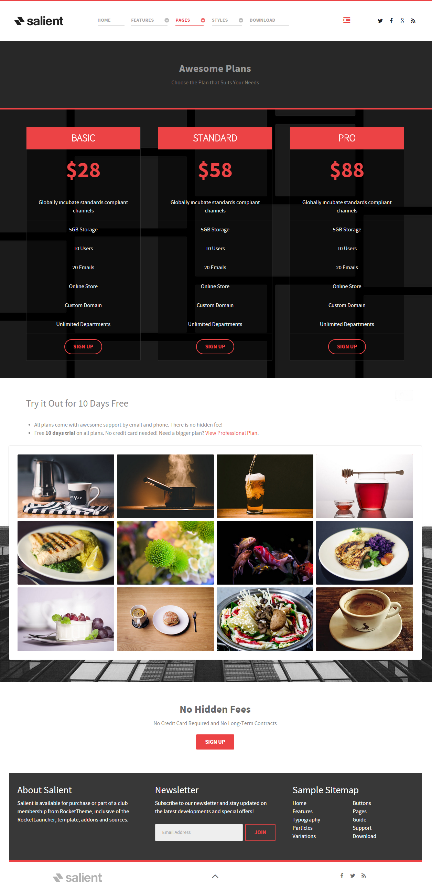
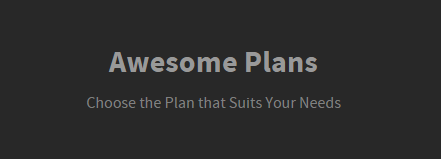
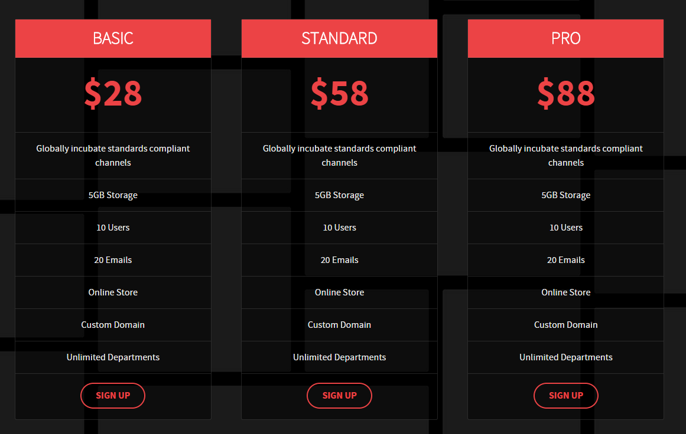
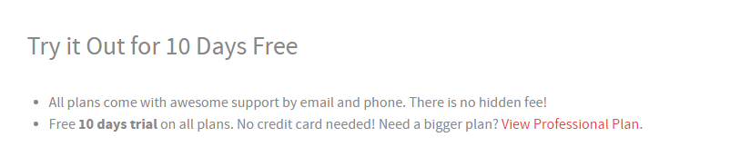
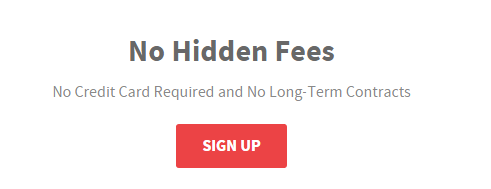

## Introduction

The **Pricing** example page demonstrates how you can create a beautiful page with the Salient template. Here is some information to help you replicate this page as it appears in the demo.

## Modules and Particles

Below is a brief rundown of the modules and particles used to make up the demo page.

:   1. **Showcase - Custom HTML (Module)** [8%, 40%, se]
    2. **Above - Custom HTML (Module)** [15%, 9% se]
    3. **Mainbar - Page Content** [45%, 9%, se]
    4. **Extension - Image Grid (Particle)** [52%, 9%, se]
    5. **Bottom - Custom HTML (Module)** [80%, 40%, se]

1. [Showcase](#showcase-section)
2. [Above](#above-section)
2. [Mainbar](#mainbar-section)
3. [Extension](#extension-section)
4. [Bottom](#bottom-section)

## Showcase Section

This area of the page is a **Custom HTML** module. You will find the settings used in our demo below.

>> Any **mod_custom** (Custom HTML) modules are best handled using either RokPad or no editor as a WYSIWYG editor can cause issues with any code that exists in the **Custom Output** field.

### Custom HTML (Module)

### Details

| Field      | Setting                  |
| :-----     | :-----                   |
| Title      | `Awesome Plans - Header` |
| Show Title | Hide                     |
| Position   | `showcase-a`             |
| Status     | Published                |

### Custom Output

Enter the following in the **Custom Output** text editor.

~~~ .html

    <h2 class="g-layercontent-title">Awesome Plans</h2>
    
Choose the Plan that Suits Your Needs

~~~

### Basic

| Option                    | Setting     |
| :----------               | :---------- |
| Prepare Content           | No          |
| Select a Background Image | Blank       |

### Advanced

| Option              | Setting        |
| :----------         | :----------    |
| Module Class Suffix | `flush center` |

## Above Section

This area of the page is a **Custom HTML** module. You will find the settings used in our demo below.

>> Any **mod_custom** (Custom HTML) modules are best handled using either RokPad or no editor as a WYSIWYG editor can cause issues with any code that exists in the **Custom Output** field.

### Custom HTML (Module)

### Details

| Field      | Setting         |
| :-----     | :-----          |
| Title      | `Pricing Table` |
| Show Title | Hide            |
| Position   | `above-a`       |
| Status     | Published       |

### Custom Output

Enter the following in the **Custom Output** text editor.

~~~ .html

  

    

      <ul class="g-pricingtable">
        <li class="g-pricingtable-title">Basic
        </li>
        <li class="g-pricingtable-price">$28
        </li>
        <li class="g-pricingtable-desc">Globally incubate standards compliant channels
        </li>
        <li class="g-pricingtable-item">5GB Storage
        </li>
        <li class="g-pricingtable-item">10 Users
        </li>
        <li class="g-pricingtable-item">20 Emails
        </li>
        <li class="g-pricingtable-item">Online Store
        </li>
        <li class="g-pricingtable-item">Custom Domain
        </li>
        <li class="g-pricingtable-item">Unlimited Departments
        </li>
        <li class="g-pricingtable-cta">
          <a class="button button-3" href="http://www.rockettheme.com/joomla/templates/salient">Sign Up</a>
        </li>
      </ul>
    

  

  

    

      <ul class="g-pricingtable">
        <li class="g-pricingtable-title">Standard
        </li>
        <li class="g-pricingtable-price">$58
        </li>
        <li class="g-pricingtable-desc">Globally incubate standards compliant channels
        </li>
        <li class="g-pricingtable-item">5GB Storage
        </li>
        <li class="g-pricingtable-item">10 Users
        </li>
        <li class="g-pricingtable-item">20 Emails
        </li>
        <li class="g-pricingtable-item">Online Store
        </li>
        <li class="g-pricingtable-item">Custom Domain
        </li>
        <li class="g-pricingtable-item">Unlimited Departments
        </li>
        <li class="g-pricingtable-cta">
          <a class="button button-3" href="http://www.rockettheme.com/joomla/templates/salient">Sign Up</a>
        </li>
      </ul>
    

  

  

    

      <ul class="g-pricingtable">
        <li class="g-pricingtable-title">Pro
        </li>
        <li class="g-pricingtable-price">$88
        </li>
        <li class="g-pricingtable-desc">Globally incubate standards compliant channels
        </li>
        <li class="g-pricingtable-item">5GB Storage
        </li>
        <li class="g-pricingtable-item">10 Users
        </li>
        <li class="g-pricingtable-item">20 Emails
        </li>
        <li class="g-pricingtable-item">Online Store
        </li>
        <li class="g-pricingtable-item">Custom Domain
        </li>
        <li class="g-pricingtable-item">Unlimited Departments
        </li>
        <li class="g-pricingtable-cta">
          <a class="button button-3" href="http://www.rockettheme.com/joomla/templates/salient">Sign Up</a>
        </li>
      </ul>
    

  

~~~

### Basic

| Option                    | Setting     |
| :----------               | :---------- |
| Prepare Content           | No          |
| Select a Background Image | Blank       |

### Advanced

| Option              | Setting     |
| :----------         | :---------- |
| Module Class Suffix | Blank       |

## Mainbar Section

The **Mainbar** section includes the **Pricing** article, displayed through the **Page Content** particle. Here are the settings found in the **Pricing** article.

| Option   | Setting        |
| :-----   | :-----         |
| Title    | `Pricing`      |
| Alias    | `pricing`      |
| Status   | Published      |
| Featured | No             |
| Category | `Sample Pages` |

**Content Body**

~~~ .html

  

    <h2 class="g-title">
      Try it Out for 10 Days Free
    </h2>
    <ul>
      <li>All plans come with awesome support by email and phone. There is no hidden fee!
      </li>
      <li>Free <strong>10 days trial</strong> on all plans. No credit card needed! Need a bigger plan? <a href="http://www.rockettheme.com/joomla/templates/salient">View Professional Plan</a>.
      </li>
    </ul>
  

~~~

## Extension Section

This area of the page is an **Image Grid** particle placed within a **Gantry 5 Particle** module in the `extension-a` module position. We have included the settings for this particle below.

### Image Grid (Particle)

### Particle Settings

| Field                         | Setting      |
| :-----                        | :-----       |
| Particle Name                 | `Image Grid` |
| CSS Classes                   | Blank        |
| Title                         | Blank        |
| Description                   | Blank        |
| Grid Column                   | 4 Columns    |
| Album Name                    | `clients`    |
| Info Lists Item 1 Name        | `Image 1`    |
| Info Lists Item 1 Promo Image | Custom       |
| Info Lists Item 1 Caption     | `Image 1`    |

## Bottom Section

This area of the page is a **Custom HTML** module. You will find the settings used in our demo below.

>> Any **mod_custom** (Custom HTML) modules are best handled using either RokPad or no editor as a WYSIWYG editor can cause issues with any code that exists in the **Custom Output** field.

### Custom HTML (Module)

### Details

| Field      | Setting          |
| :-----     | :-----           |
| Title      | `No Hidden Fees` |
| Show Title | Hide             |
| Position   | `bottom-a`       |
| Status     | Published        |

### Custom Output

Enter the following in the **Custom Output** text editor.

~~~ .html

  <h2 class="g-layercontent-title">No Hidden Fees</h2>
  
No Credit Card Required and No Long-Term Contracts

  <a href="http://www.rockettheme.com/joomla/templates/salient" class="button">Sign Up</a>

~~~

### Basic

| Option                    | Setting     |
| :----------               | :---------- |
| Prepare Content           | No          |
| Select a Background Image | Blank       |

### Advanced

| Option              | Setting        |
| :----------         | :----------    |
| Module Class Suffix | `flush center` |
