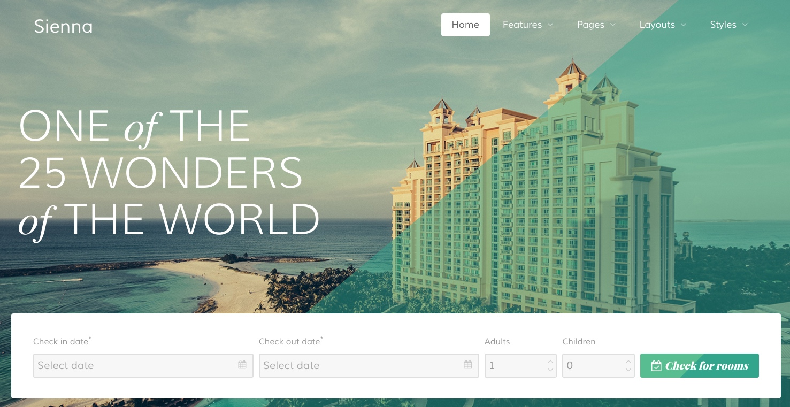

Introduction
-----

Sienna is a beautiful theme, perfect for a wide range of sites from travel agencies and hotels to apartment complexes and event venues. It features a brilliant layout and unique particles to help you create the perfect website.

New to Gantry 5?
-----
If you are new to Gantry 5, a good place to start would our [dedicated Gantry documentation](http://docs.gantry.org).

As a Joomla user, you are most likely accustomed to editing modules when working with our Gantry 4 templates. While our RocketLauncher package contains modules for our subpages, the Home page content is specifically found in the template's Layout. This can be found via your Joomla administrator -> Extensions -> Templates - > Home -> Layout. Click on any of the cog icons on the Particles to edit the content.

To understand more how the Layout manager works, please [click here](http://docs.gantry.org/gantry5/configure/layout-manager). 

Requirements
-----

* Apache 2.2+ or Microsoft IIS 7
* PHP 5.4+ (PHP 5.5+ Recommended)
* MySQL 5.1+
* Joomla 3.4+

>> NOTE: Gantry v5.2.15+ is required for Sienna to work correctly. For more details on the Gantry Framework, please visit its [Dedicated Website](http://gantry.org).

Key Features
-----

* Responsive Layout
* 6 Preset Styles
* Block Variations
* Custom Typography
* Unlimited Positions
* Popup Module
* Custom Particles
* Social Icons
* Mobile Menu
* Coming Soon Page
* Font Awesome Icons 
* Gantry Core Features
* YAML-based Configuration
* Twig Templating
* Powerful Particle System
* Visual Menu Editor
* MegaMenu Support
* Off-Canvas Panel
* Ajax Admin
* Layout Manager
* Theme Inheritance
* Fluid Width Option
* Fixed Width Option
* SCSS Support
* Sophisticated Fields
* Unlimited Undo/Redo

## Particles

The Sienna template features a wide range of particles to meet a variety of needs and enhance your site content, including the brand new Booking Form and Simple Booking particles which make booking reservations easy.

## Typography

Typography is an important instrument in not only the site design, but how your content is portrayed and utilized by your visitors. Therefore, Sienna offers a rich selection of elegant typography to provide focus to varying content types.

## Responsive

Sienna is a responsive template which means it adapts to the viewing device's width, such as mobile, tablet or desktop. Mobile modes have a unique menu to aid usability. Support classes can also be used to display or hide various types of content for each device.
