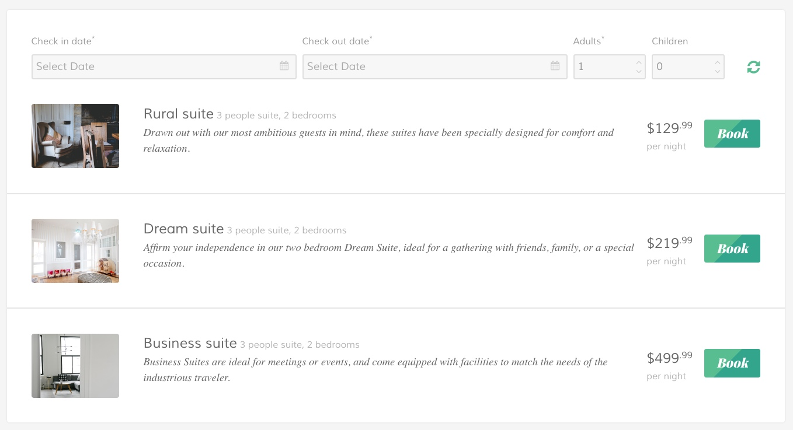
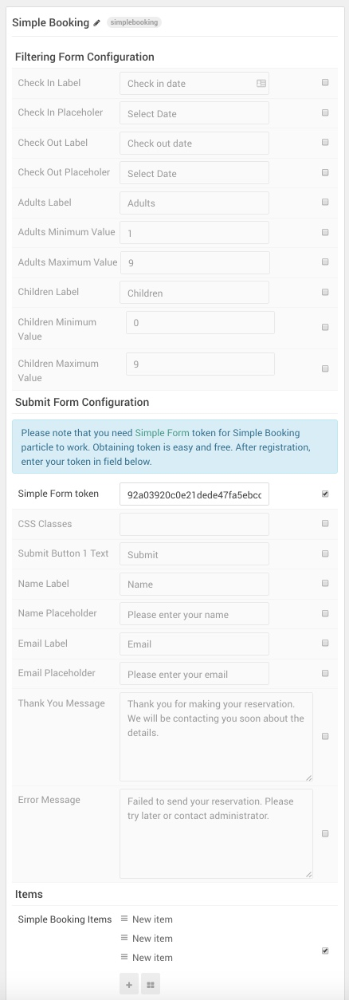

## Introduction

The **Simple Booking** particle is a Simple Form powered form enabling visitors to find something that meets their needs and is available on the date(s) they need it, and send you a request to book it via email. This particular particle is a perfect choice for any business that deals with reservations such as hotels.

Of course, like any particle, this can also be customized to connect to any number of different simplebooking systems with a little know-how. By default, it uses the Simple Form service which is a clean, simple way to receive contact information and gather other details about your customer's interest in your products/services. Simple Form will email you each time the form is filled out and submitted by a visitor, along with the information you need to set up reservations.

You will need a Simple Form token in order for this particle to work. You can get one from [Simple Form's website](https://getsimpleform.com/) with your email address. They will email a token to you, and you can easily insert it into the **Simple Form Token** field of the particle. Once this is done, any submissions will be emailed to you as well as made available through the Simple Form website in a private link emailed along with your token.

Here are the topics covered in this guide:

* [Layout](#layout)
    - [Particle Content](#particle-content)
* [Configuration](#configuration)
    - [Main Options](#main-options)
    - [Item Options](#item-options)

## Layout

Simple Booking particles generally host most of the important content in its items, with the ability to set a label, field type, and more.

### Particle Content

:   1. **Item - Label** [25%, 13%, sw]
    2. **Item - Type - Date Picker** [50%, 4%, se]
    3. **Item - Type - Number Input** [50%, 61%, se]
    4. **Submit Button 1** [50%, 81%, se]

## Configuration

### Main Options 

These options affect the main area of the particle, and not the individual items within. You can set the title of the particle, as well as give it an introductory paragraph here.

| Option                 | Description                                                                                       |
| :-----                 | :-----                                                                                            |
| Check In Label         | Enter a label you wish to have appear in the front end for the **Check In** field.                |
| Check In Placeholer    | Enter a default entry for the **Check In** field.                                                 |
| Check Out Label        | Enter a label you wish to have appear in the front end for the **Check Out** field.               |
| Check Out Placeholer   | Enter a default entry for the **Check Out** field.                                                |
| Adults Label           | Enter a label you wish to have appear in the front end for the **Adults** field.                  |
| Adults Minimum Value   | Set the minimum value you wish to have made available in the **Adults** field's number spinner.   |
| Adults Maximum Value   | Set the maximum value you wish to have made available in the **Adults** field's number spinner.   |
| Children Label         | Enter a label you wish to have appear in the front end for the **Children** field.                |
| Children Minimum Value | Set the minimum value you wish to have made available in the **Children** field's number spinner. |
| Children Maximum Value | Set the maximum value you wish to have made available in the **Children** field's number spinner. |
| CSS Classes            | Enter any CSS class(es) you would like to have apply to the particle's content.                   |
| Submit Button 1 Text   | Enter any text you would like to have appear in the initial submit button.                        |
| Name Label             | Enter a label you wish to have appear in the front end for the **Name** field.                    |
| Name Placeholer        | Enter a default entry for the **Name** field.                                                     |
| Email Label            | Enter a label you wish to have appear in the front end for the **Email** field.                   |
| Email Placeholer       | Enter a default entry for the **Email** field.                                                    |
| Thank You Message      | Enter text you would like to have appear upon successful form submission.                         |
| Error Message          | Enter text you would like to have appear upon unsuccessful form submission.                       |

### Item Options

Items in this particle are the actual individual items being filtered for and selected by the site's visitor. If this particle is for a hotel, these items would be types of rooms available.

| Option            | Description                                                                                     |
| :-----            | :-----                                                                                          |
| Available from:   | Set the date the item will be available.                                                        |
| Available to:     | Set the last date the item will be available.                                                   |
| Adults            | Set the maximum number of adults the room can accommodate.                                      |
| Children          | Set the maximum number of children the room can accommodate.                                    |
| Image             | Set an image for the item. This will appear on the front end.                                   |
| Title             | Set a title for the item. This will appear on the front end.                                    |
| Subtitle          | Set a subtitle for the item. This will appear on the front end.                                 |
| Description       | Set a description for the item. This will appear on the front end.                              |
| Price             | Set a dollar price for the item. This appears as the larger number next to the sub price.       |
| Sub Price         | Set a cent price for the item. This appears as a smaller number next to the main price.         |
| Price Description | Enter a short description for the price. For example: `per night`                               |
| Button Label      | Enter text that appears in the button for that item. This button brings up the name/email form. |

