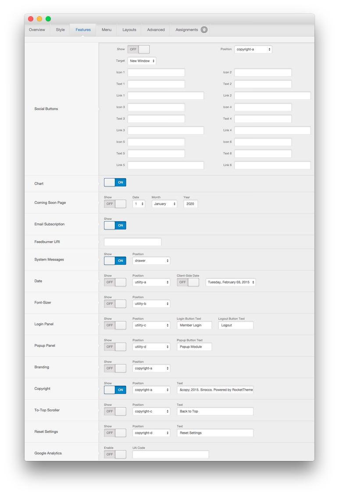
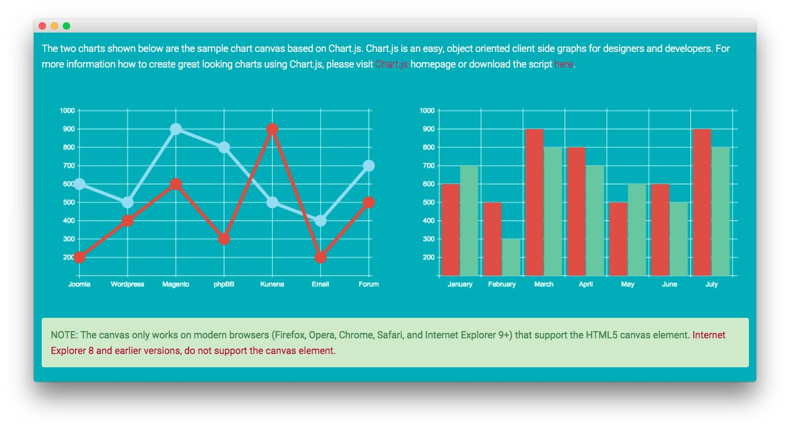

Introduction
-----

Sirocco supports chart creation and management. 

[Chart.js][chartjs] support built in to Sirocco allows you to create rich and infinitely useful charts within a **mod_custom (Custom HTML)** module, or injected directly in an article to add a powerful visual element to your written information.

>> NOTE: This feature is not currently supported in IE8. The Chart.js elements will not display correctly. Newer versions of IE, as well as updated Chrome, Firefox, Safari, Opera, and other popular standard-compliant browser options should work just fine.

Chart.js Support
-----

Sirocco includes built-in support for [Chart.js][chartjs]. This element allows you to quickly and easily create dynamic graphs that display information in a variety of ways. 

You can toggle this feature on and off by navigating to **Administrator -> Extensions -> Template Settings -> Sirocco -> Features -> Chart** and toggling the option there. If you have a Custom HTML and/or article with the Chart.js code present, and this option is off, nothing will appear in its place and your browser may indicate a JavaScript error.

Here is the code block that creates the graph that appears in the above image.

~~~ .html
<canvas id="myChart" height="320" width="977"></canvas>

~~~

You can find extensive documentation listing the different elements found here on the [official website][chartjs].

[chartjs]: http://chartjs.org
[fontawesome]: http://fortawesome.github.io/Font-Awesome/
[chart_1]: assets/page_services_4.jpeg
[chart_2]: assets/chart_2.jpeg
[list]: http://demo.rockettheme.com/joomla-templates/sirocco/features/typography