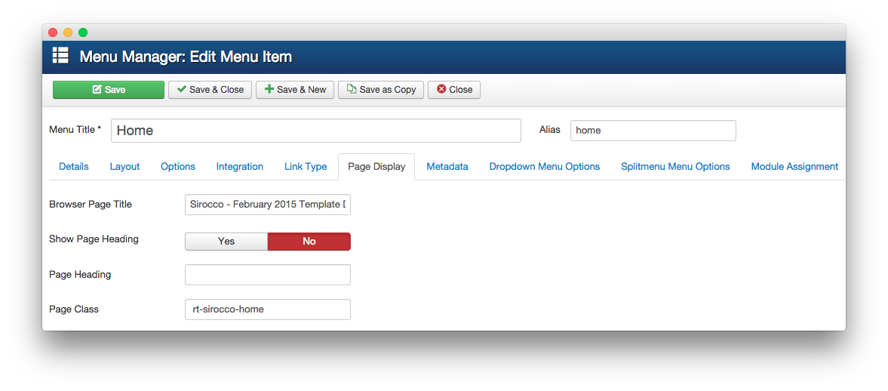

Introduction
-----

Recreating features of the demo site used to show off some of the more interesting aspects of Sirocco can be done fairly easily. All you need is the right extensions and settings, and you should be able to reproduce most (if not all) of the elements found in our demo site.

Below, we will break down some of these elements and give you the information you need to know to recreate them on your own site using the Sirocco Template.

Keep in mind that a lot of the detail that makes our demos look so good are the result of many hours of hard work by our team, and some of them will require a moderate level of experience working with the Joomla back end. We have added most of these elements into the template's core files in order to make them easily accessible without having to edit any code.

>> NOTE: We recommend downloading a copy of the RocketLauncher whenever you are attempting to replicate demo content. This allows easy referencing, whether on your site in a subdirectory, development server, or on a localhost. This will allow you to see all of our demo content in context, making it easier to replicate.

Module Settings
-----

Like any Gantry template, Sirocco allows you to assign modules to specific positions within selected overrides. This makes it possible to not only utilize the full power of the Gantry framework, but to make each area of your site uniquely suited to meet your user's needs.

Below, you will find the module placement and settings for the various module positions as they appear on the front page of our demo. Not all of these position assignments are unique to the front page.

:   1. **Showcase A - RokSprocket (Features)** [7%, 20%, se]
    2. **Utility A - RokSprocket (Headlines)** [13%, 20%, se]
    3. **Feature A - RokSprocket (Mosaic)** [16%, 20%, se]
    4. **Main Top A - Custom HTML** [36%, 40%, se]
    5. **Expanded Top A - RokSprocket (Features)** [39%, 20%, se]
    6. **Expanded Bottom A - Custom HTML** [48%, 20%, se]
    7. **Main Bottom A - Custom HTML** [53%, 20%, se]
    8. **ThirdFullWidth - RokSprocket (Features)** [61%, 20%, se]
    9. **Sidebar A - Custom HTML** [70%, 20%, se]
    10. **MainBody** [70%, 75%, sw]
    11. **Footer A - Custom HTML** [87%, 20%, se]
    12. **Footer B - Custom HTML** [87%, 35%, se]
    13. **Footer C - Custom HTML** [87%, 65%, se]
    14. **Copyright B - Menu** [92%, 65%, se]

We have detailed how to recreate the individual modules pictured above in the links below.

1. [Showcase A - RokSprocket (Features)](demo_module_1.md)
2. [Utility A - RokSprocket (Headlines)](demo_module_2.md)
3. [Feature A - RokSprocket (Mosaic)](demo_module_3.md)
4. [Main Top A - Custom HTML](demo_module_4.md)
5. [Expanded Top A - RokSprocket (Features)](demo_module_5.md)
6. [Expanded Bottom A - Custom HTML](demo_module_6.md)
7. [Main Bottom A - Custom HTML](demo_module_7.md)
8. [ThirdFullWidth - RokSprocket (Features)](demo_module_8.md)
9. [Sidebar A - Custom HTML](demo_module_9.md)
10. [MainBody](demo_module_10.md)
11. [Footer A - Custom HTML](demo_module_11.md)
12. [Footer B - Custom HTML](demo_module_12.md)
13. [Footer C - Custom HTML](demo_module_13.md)
14. [Copyright B - Menu](demo_module_14.md)

Recommended Extensions
-----

Here is a list of RocketTheme extensions used to create the demo version of Sirocco:

* [Gantry Template Framework](http://gantry-framework.org/download)
* [RokAjaxSearch](http://www.rockettheme.com/joomla/extensions/rokajaxsearch)
* [RokBox](http://www.rockettheme.com/joomla/extensions/rokbox)
* RokCommon Library (Installed with RokSprocket)
* [RokSprocket](http://www.rockettheme.com/joomla/extensions/roksprocket)
* [RokCandy](http://www.rockettheme.com/joomla/extensions/rokcandy)
* [RokNavMenu](http://www.rockettheme.com/joomla/extensions/roknavmenu)
* [RokBooster](http://www.rockettheme.com/joomla/extensions/rokbooster)

Many of these extensions are included with the Sirocco RocketLauncher, and can be downloaded and installed individually by going to the RocketTheme website.

Recreating the Front Page
-----

The front page of the Sirocco demo sits apart from the rest of the page layouts in that it features the latest and greatest features of the template. It is because of this that several module and layout overrides were done. In this section, we will break down the settings you will need to recreate elements present in the front page of the Sirocco demo.

Template Settings
-----

The first thing you will need to do in order to set your front page apart as it appears in the demo is to create a style override. This can be done by navigating to **Administrator -> Extensions -> Template Manager** and selecting the template you wish to change.  Once you have checked the box next to the template, you can click the **Duplicate** button to create a second copy of the template. This will become the Override while the primary copy of the template remains the designated Master.

Only options that are different from the Master copy will take hold on the menu items you have assigned to the override. In this case, you will be assigning the front page to the override as we have in the demo.

It would be a good idea for organization to name this override something like **Sirocco - Home** as it would be used only for the front page of your site.

Animation
-----

Support for animations is built in to this template, and can be added to modules and content to add an extra effect. These classes are either included in the **Module Class Suffix** or in-line in the content.

You can find a visual example as well as the class names of classes that are supported by Sirocco [on the Animate.css project site](http://daneden.github.io/animate.css/).

The element that triggers this animation during scrolling is explained in greater detail in the [WOW.js Documentation](http://mynameismatthieu.com/WOW/docs.html).

Animation must be enabled on the backend for them to load. You can find the setting by navigating to **Administrator -> Extensions -> Template Manager -> Advanced**.

Menu Settings
-----

In your site's main menu, you will want to make a couple of key changes in order for your home page to appear as it does in our demo.

You will need to change the **Page Class** setting under the Home menu item to ` rt-sirocco-home`.

>> NOTE: Make sure you leave a space before the class.

#### Assignments

The next step you will need to take in creating your Template Settings override is to assign the Front Page style to the site's home page. Under the **Main Menu** list, you will want to select **Home** in the Menu Assignments tab..

Doing this will assign the style to the home page. This will allow the style to cover all access scenarios that would lead a user to your site's main home page.

You can find more information about the entire override breakdown for both the front page and our default settings in the demo by visiting the [template style portion](demo_override.md) of this tutorial.
