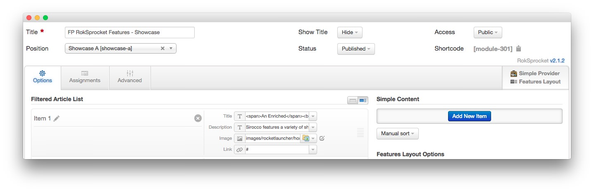
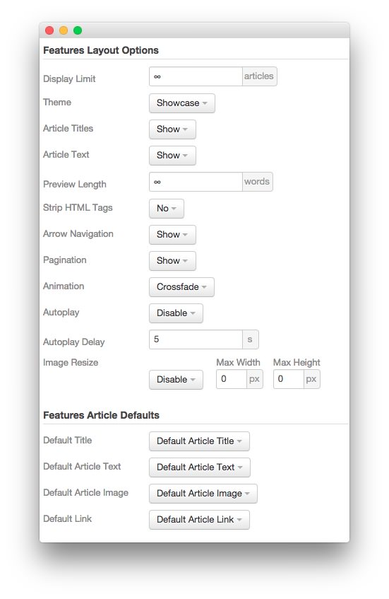
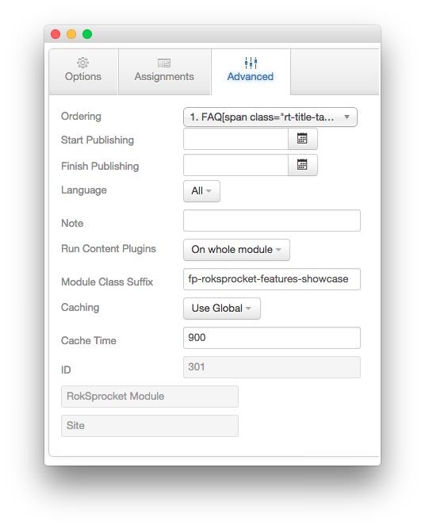

FP RokSprocket Features - Showcase
-----

The **RokSprocket Features** module used near the top of the front page is a great way to feature some of your site's more notable articles or areas of interest.

### Details

|      Option      |               Setting                |
| :--------------- | :----------------------------------- |
| Title            | `FP RokSprocket Features - Showcase` |
| Show Title       | Hide                                 |
| Access           | Public                               |
| Position         | showcase-a                           |
| Status           | Published                            |
| Content Provider | Simple                               |
| Type             | Features                             |

### Filtered Article List

We utilized the **Simple** Content Provider, allowing us to create custom content independent of full articles. The **Title**, **Description**, **Image**, and **Link** fields in each article have been altered. A few examples of these article changes can be found below.

#### Simple Item 1

|    Option   |                                              Setting                                               |
| :---------- | :------------------------------------------------------------------------------------------------- |
| Title       | `An Enriched Site Experience`                                       |
| Description | `Sirocco features a variety of sharp and elegant visual options for site content via RokSprocket.` |
| Image       | Custom                                                                                             |
| Link        | `#`                                                                                                |

#### Simple Item 2

|    Option   |                                          Setting                                           |
| :---------- | :----------------------------------------------------------------------------------------- |
| Title       | `Versatile Menu Controls`                                   |
| Description | `The template has two menu systems, Fusion and SplitMenu, with many configurable options.` |
| Image       | Custom                                                                                     |
| Link        | `#`                                                                                        |

#### Simple Item 3

|    Option   |                                                 Setting                                                  |
| :---------- | :------------------------------------------------------------------------------------------------------- |
| Title       | `The Popular Gantry Framework` |
| Description | `Gantry sits at the template core, providing the base for all the major features and capabilities.`      |
| Image       | Custom                                                                                                   |
| Link        | `#`                                                                                                      |

### Layout Options

|         Option        |        Setting        |
| :-------------------- | :-------------------- |
| Display Limit         | `∞`                   |
| Theme                 | Showcase              |
| Article Titles        | Show                  |
| Article Text          | Show                  |
| Preview Length        | `∞`                   |
| Strip HTML Tags       | No                    |
| Arrow Navigation      | Show                  |
| Pagination            | Show                  |
| Animation             | Crossfade             |
| Autoplay              | Disable               |
| Autoplay Delay        | `5`                   |
| Image Resize          | Disable               |
| Default Title         | Default Article Title |
| Default Article Text  | Default Article Text  |
| Default Article Image | Default Article Image |
| Default Link          | Default Article Link  |

### Advanced

|        Option       |              Setting               |
| :------------------ | :--------------------------------- |
| Module Class Suffix | `fp-roksprocket-features-showcase` |
