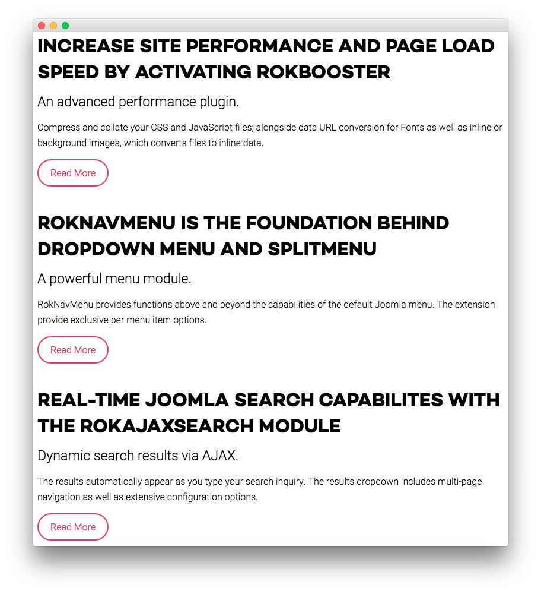
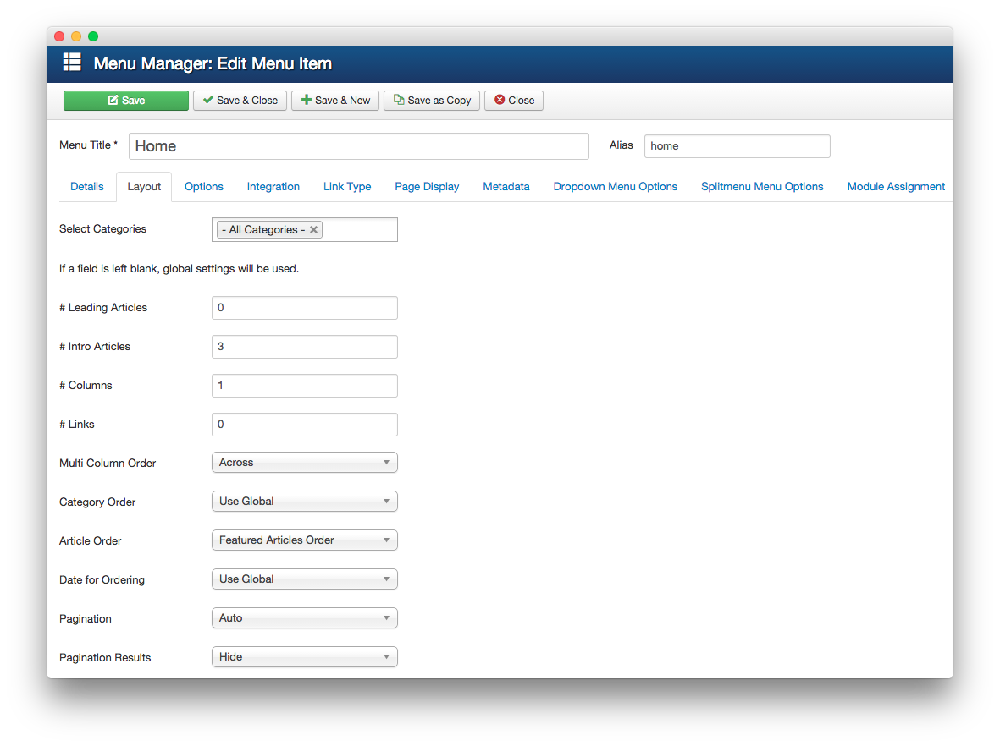

MainBody
-----

This area of the front page is the MainBody. Articles appear within the **Mainbody** area of the front page.

Turning on Mainbody Content
-----

This content appears on the front page because the **Mainbody Enabled** option has been turned on in the template settings. You can find these settings by navigating to **Administrator -> Extensions -> Templates Manager -> Sirocco -> Advanced**.

Once this is done, you can navigate to the **Menu Manager** by going to **Administrator -> Menus -> Menu Manager**. From here, you'll want to find the menu item for your home page and select it so you can access its settings. For our demo, it is located in **Main Menu -> Home**.

In order to show two featured articles on the front page, we placed a `3` in the **Intro Articles** setting within the **Layout Options** menu. The **Article Order** has been set to **Featured Articles Order**.

Article Properties
-----

The **Increase site performance and page load speed by activating RokBooster** article is a standard article with the **Featured** option turned on so it appears in the front page mainbody.

Here is the **Article Text** we used:

~~~ .html

An advanced performance plugin.

Compress and collate your CSS and JavaScript files; alongside data URL conversion for Fonts as well as inline or background images, which converts files to inline data.

<a href="index.php?option=com_content&amp;view=article&amp;id=1&amp;Itemid=111" class="readon">Read More</a>
~~~

Once this article is created and set to **Featured**, it should appear on the front page.

[demo]: assets/demo_12.jpeg
[advanced]: assets/advanced.jpeg
[menu]: assets/menu.jpeg