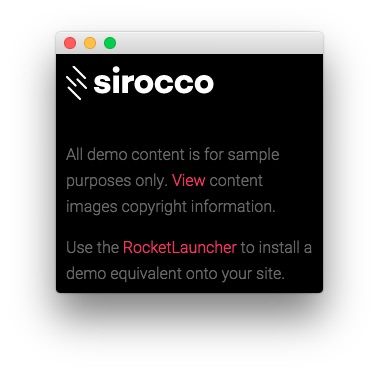
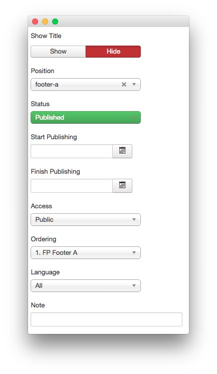
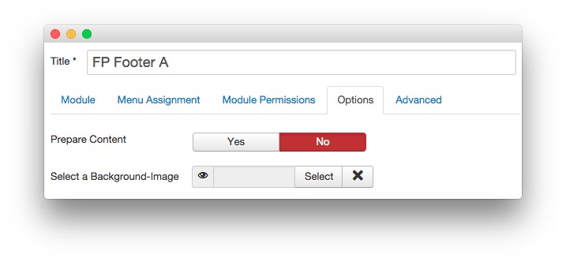
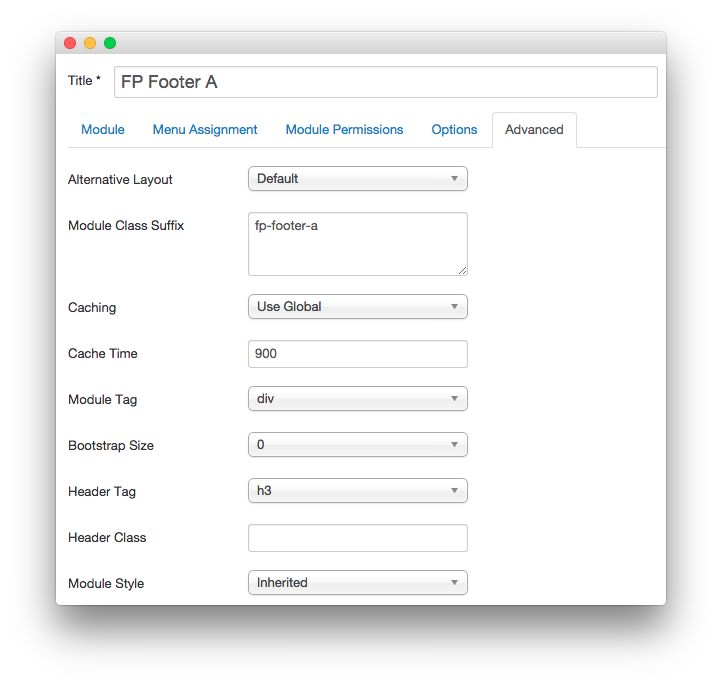

FP Footer A
-----

This area of the page is a **Custom HTML** module. You will find the settings used in our demo below.

>> Any **mod_custom** (Custom HTML) modules are best handled using either RokPad or no editor as a WYSIWYG editor can cause issues with any code that exists in the **Custom Output** field.

### Details

|   Option   |    Setting    |
| :--------- | :------------ |
| Title      | `FP Footer A` |
| Show Title | Hide          |
| Position   | footer-a      |
| Status     | Published     |
| Access     | Public        |

### Custom Output

~~~ .html

 

All demo content is for sample purposes only. <a data-rokbox data-rokbox-element="#rt-copyright-modal" href="#">View</a> content images copyright information.

 Use the <a href="http://www.rockettheme.com/joomla/templates/sirocco">RocketLauncher</a> to install a demo equivalent onto your site.

    

        
Below are links to the individual or repository sources for the content images used in the Sirocco Demo:

        <ul>
            <li><a href="http://www.unsplash.com">http://www.unsplash.com</a></li>
            <li><a href="http://www.pexels.com/photo/3158/">http://www.pexels.com/photo/3158/</a></li>
            <li><a href="http://picography.co/photos/long-road-ahead/">http://picography.co/photos/long-road-ahead/</a></li>
            <li><a href="http://en.wikipedia.org/wiki/File:Sagan_Viking.jpg">http://en.wikipedia.org/wiki/File:Sagan_Viking.jpg</a></li>
            <li><a href="http://en.wikipedia.org/wiki/File:Brian_Shul_in_the_cockpit_of_the_SR-71_Blackbird.jpg">http://en.wikipedia.org/wiki/File:Brian_Shul_in_the_cockpit_of_the_SR-71_Blackbird.jpg</a></li>
            <li><a href="http://en.wikipedia.org/wiki/File:Wernher_von_Braun.jpg">http://en.wikipedia.org/wiki/File:Wernher_von_Braun.jpg</a></li>
            <li><a href="http://www.splashbase.co/images">http://www.splashbase.co/images</a></li>
            <li><a href="http://www.gratisography.com/">http://www.gratisography.com/</a></li>
            <li><a href="http://pixabay.com/pt/o-kremlin-rio-inverno-moscou-610025/">http://pixabay.com/pt/o-kremlin-rio-inverno-moscou-610025/</a></li>
            <li><a href="http://pixabay.com/pt/meninas-dois-mulheres-retrato-487062/">http://pixabay.com/pt/meninas-dois-mulheres-retrato-487062/</a></li>
            <li><a href="http://picography.co/photos/statue/">http://picography.co/photos/statue/</a></li>
            <li><a href="https://randomuser.me/photos">https://randomuser.me/photos</a></li>
        </ul>
    

~~~

### Basic

|           Option          | Setting |
| :------------------------ | :------ |
| Prepare Content           | No      |
| Select a Background Image | Blank   |

### Advanced

|        Option       |    Setting    |
| :------------------ | :------------ |
| Module Class Suffix | `fp-footer-a` |
