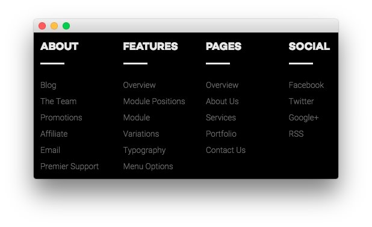
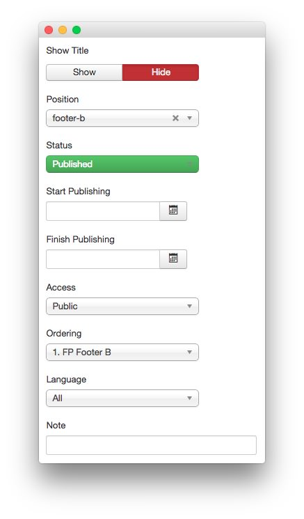
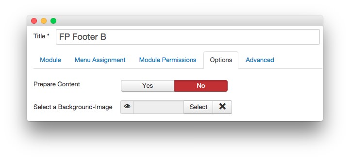
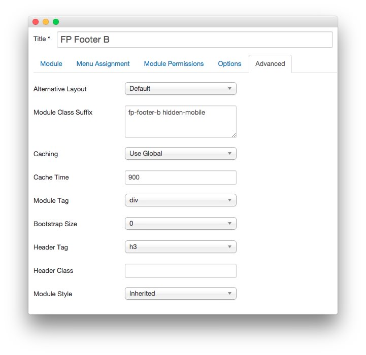

FP Footer B
-----

This area of the front page is a **Custom HTML** module. You will find the settings used in our demo below.

>> Any **mod_custom** (Custom HTML) modules are best handled using either RokPad or no editor as a WYSIWYG editor can cause issues with any code that exists in the **Custom Output** field.

### Details

|   Option   |    Setting    |
| :--------- | :------------ |
| Title      | `FP Footer B` |
| Show Title | Hide          |
| Position   | footer-b      |
| Status     | Published     |
| Access     | Public        |

### Custom Output

~~~ .html

    

        

            <h5>About</h5>
            <ul class="rt-noliststyle">
                <li><a href="http://www.rockettheme.com/blog">Blog</a></li>
                <li><a href="http://www.rockettheme.com/the-team">The Team</a></li>
                <li><a href="http://www.rockettheme.com/promotions">Promotions</a></li>
                <li><a href="http://www.shareasale.com/shareasale.cfm?merchantID=30300">Affiliate</a></li>
                <li><a href="http://www.rockettheme.com/contact-us">Email</a></li>
                <li><a href="http://www.rockettheme.com/purchase-premier-support">Premier Support</a></li>
            </ul>                       
        

    

    

        

            <h5>Features</h5>
            <ul class="rt-noliststyle">
                <li><a href="index.php?option=com_content&amp;view=article&amp;id=1&amp;Itemid=111">Overview</a></li>
                <li><a href="index.php?option=com_content&amp;view=article&amp;id=2&amp;Itemid=112">Module Positions</a></li>
                <li><a href="index.php?option=com_content&amp;view=article&amp;id=3&amp;Itemid=113">Module Variations</a></li>
                <li><a href="index.php?option=com_content&amp;view=article&amp;id=4&amp;Itemid=114">Typography</a></li>
                <li><a href="index.php?option=com_content&amp;view=article&amp;id=5&amp;Itemid=115">Menu Options</a></li>
            </ul>       
        

    

    
       
        

            <h5>Pages</h5>
            <ul class="rt-noliststyle">
                <li><a href="index.php?option=com_content&amp;view=article&amp;id=6&amp;Itemid=118">Overview</a></li>
                <li><a href="index.php?option=com_content&amp;view=article&amp;id=7&amp;Itemid=119">About Us</a></li>
                <li><a href="index.php?option=com_content&amp;view=article&amp;id=9&amp;Itemid=121">Services</a></li>
                <li><a href="index.php?option=com_content&amp;view=article&amp;id=11&amp;Itemid=123">Portfolio</a></li>
                <li><a href="index.php?option=com_contact&amp;view=contact&amp;id=1&amp;Itemid=126">Contact Us</a></li>             
            </ul>       
        

    
  
    
       
        

            <h5>Social</h5>
            <ul class="rt-noliststyle">
                <li><a href="https://www.facebook.com/RocketTheme">Facebook</a></li>
                <li><a href="https://twitter.com/rockettheme">Twitter</a></li>
                <li><a href="https://plus.google.com/+rockettheme/posts">Google+</a></li>
                <li><a href="http://www.rockettheme.com/product-updates?rss">RSS</a></li>
            </ul>   
        

    
              

  
~~~

### Basic

|           Option          | Setting |
| :------------------------ | :------ |
| Prepare Content           | No      |
| Select a Background Image | Blank   |

### Advanced

|        Option       |           Setting           |
| :------------------ | :-------------------------- |
| Module Class Suffix | `fp-footer-b hidden-mobile` |
