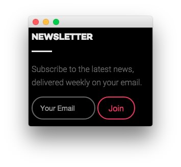
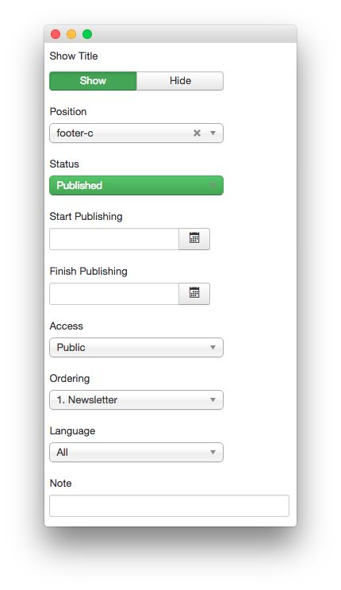
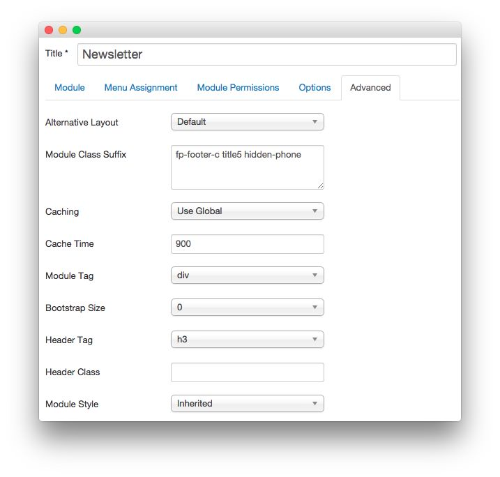

Newsletter
-----

This area of the front page is a **Custom HTML** module. You will find the settings used in our demo below.

>> Any **mod_custom** (Custom HTML) modules are best handled using either RokPad or no editor as a WYSIWYG editor can cause issues with any code that exists in the **Custom Output** field.

### Details

|   Option   |   Setting    |
| :--------- | :----------- |
| Title      | `Newsletter` |
| Show Title | Hide         |
| Position   | footer-c     |
| Status     | Published    |
| Access     | Public       |

### Custom Output

Enter the following in the **Custom Output** text editor.

~~~ .html

Subscribe to the latest news, delivered weekly on your email.

<form class="fp-bottom-form" onsubmit="window.open('http://feedburner.google.com/fb/a/mailverify?uri=rocketthemeblog', 'popupwindow', 'scrollbars=yes,width=550,height=520');return true" target="popupwindow" method="post" action="http://feedburner.google.com/fb/a/mailverify">
    <input type="text" name="email" class="inputbox" placeholder="Your Email" />
    <input type="hidden" name="uri" value="rocketthemeblog" />
    <input type="hidden" value="en_US" name="loc" />
    <input type="submit" value="Join" class="readon" name="Submit" />
</form>
~~~

### Basic

|           Option          | Setting |
| :------------------------ | :------ |
| Prepare Content           | No      |
| Select a Background Image | Blank   |

### Advanced

|        Option       |              Setting              |
| :------------------ | :-------------------------------- |
| Module Class Suffix | `fp-footer-c title5 hidden-phone` |
